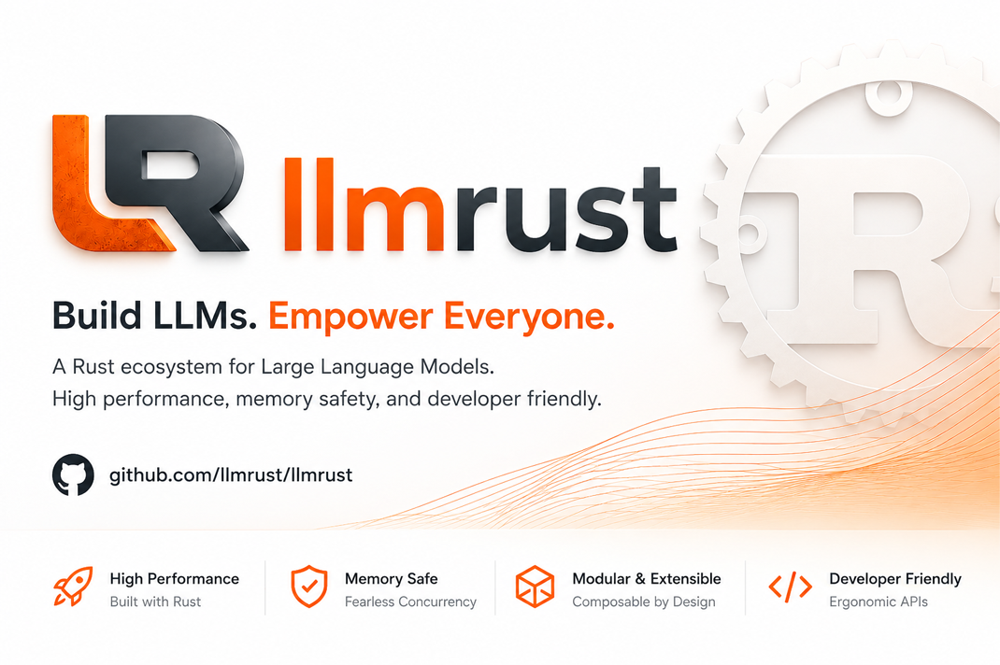

# llmrust



[](https://crates.io/crates/llmrust)
[](https://docs.rs/llmrust)
[](https://github.com/llmrust/llmrust)
[](https://github.com/llmrust/llmrust/actions)

**English** | [中文版](README.zh-CN.md)

---

> Call multiple LLM APIs with one unified Rust interface.

A high-performance, type-safe Rust library for calling multiple LLM providers through a unified interface. Inspired by Python's [LiteLLM](https://github.com/BerriAI/litellm), but built for Rust's performance and safety guarantees.

## Features

- **Unified API** — One interface for OpenAI, Anthropic, DeepSeek, Google Gemini, Ollama, and more
- **Streaming support** — First-class async streaming for all providers
- **Type-safe** — Full compile-time guarantees with serde and thiserror
- **High performance** — Built on reqwest + tokio, minimal overhead
- **Zero runtime dependencies** — Single binary, no Python/Node required

## Installation

Add llmrust to your `Cargo.toml`:

```toml
[dependencies]
llmrust = "0.1"
```

Or use `cargo add`:

```bash
cargo add llmrust
```

### Feature Flags

| Feature | Default | Description |
|---|---|---|
| *(none)* | ✅ | LLM client — all providers + streaming; tool calling & JSON mode on OpenAI-compatible providers |
| `proxy` | ❌ | Built-in OpenAI-compatible HTTP proxy server (adds `axum`) |

Enable the proxy server:

```toml
[dependencies]
llmrust = { version = "0.1", features = ["proxy"] }
```

Or:

```bash
cargo add llmrust --features proxy
```

## Quick Start

```rust
use llmrust::LmrsClient;

#[tokio::main]
async fn main() -> Result<(), Box<dyn std::error::Error>> {
    let llm = LmrsClient::new();

    // Register providers
    llm.set_openai("sk-...").await;
    llm.set_anthropic("sk-ant-...").await;
    llm.set_deepseek("sk-...").await;

    // Call any model with provider/model format
    let resp = llm.chat("openai/gpt-4o", "Hello, world!").await?;
    println!("{}", resp.content);

    Ok(())
}
```

## Supported Providers

| Provider | Models | Streaming | Tool calling | Status |
|---|---|---|---|---|
| OpenAI | gpt-4o, gpt-4o-mini, o1-preview | ✅ | ✅ | Stable |
| DeepSeek | deepseek-chat, deepseek-coder | ✅ | ✅ | Stable |
| Moonshot / Kimi | moonshot-v1-8k, kimi-latest | ✅ | ✅ | Stable |
| OpenRouter | any model via OpenRouter | ✅ | ✅ | Stable |
| Anthropic | claude-3.5-sonnet, claude-3-opus | ✅ | 🚧 planned (0.2) | Stable (chat) |
| Google Gemini | gemini-2.0-flash, gemini-1.5-pro | ✅ | 🚧 planned (0.2) | Stable (chat) |
| Ollama | llama3.2, qwen2.5, any local model | ✅ | ➖ | Stable (chat) |

> **Feature support notes**
>
> - **Tool calling / function calling** and **JSON mode** are currently wired through the OpenAI-compatible providers (OpenAI, DeepSeek, Moonshot, OpenRouter). Native Anthropic and Gemini tool calling is in progress and targeted for 0.2.
> - **Sampling parameters** beyond `temperature` / `max_tokens` / `top_p` (e.g. `stop`, `seed`, `presence_penalty`, `frequency_penalty`, `logprobs`, `n`, `response_format`) are sent to the OpenAI-compatible providers; Anthropic, Gemini, and Ollama currently honor the core sampling parameters only.

## Usage Examples

### Basic Chat

```rust
use llmrust::LmrsClient;

#[tokio::main]
async fn main() -> Result<(), Box<dyn std::error::Error>> {
    let llm = LmrsClient::new();
    llm.set_deepseek(std::env::var("DEEPSEEK_API_KEY")?).await;

    let response = llm.chat("deepseek/deepseek-chat", "Explain Rust ownership in one paragraph.").await?;
    println!("{}", response.content);
    println!("Tokens: {:?}", response.usage);

    Ok(())
}
```

### Streaming

```rust
use llmrust::LmrsClient;
use futures::StreamExt;

#[tokio::main]
async fn main() -> Result<(), Box<dyn std::error::Error>> {
    let llm = LmrsClient::new();
    llm.set_openai(std::env::var("OPENAI_API_KEY")?).await;

    let mut stream = llm.stream("openai/gpt-4o", "Write a haiku about Rust.").await?;

    while let Some(chunk) = stream.next().await {
        let chunk = chunk?;
        print!("{}", chunk.delta);
    }
    println!();

    Ok(())
}
```

### Advanced Configuration

```rust
use llmrust::{LmrsClient, ChatRequest};

#[tokio::main]
async fn main() -> Result<(), Box<dyn std::error::Error>> {
    let llm = LmrsClient::new();
    llm.set_anthropic(std::env::var("ANTHROPIC_API_KEY")?).await;

    let request = ChatRequest::new("claude-3-5-sonnet-20241022", "What is the meaning of life?")
        .with_system("You are a philosophical assistant.")
        .with_temperature(0.7)
        .with_max_tokens(1000);

    let response = llm.chat_with("anthropic/claude-3-5-sonnet-20241022", request).await?;
    println!("{}", response.content);

    Ok(())
}
```

### JSON Mode & Sampling Parameters

> JSON mode and the extended sampling parameters below are currently applied on the OpenAI-compatible providers (OpenAI, DeepSeek, Moonshot, OpenRouter).

```rust
use llmrust::ChatRequest;

let request = ChatRequest::new("gpt-4o", "List 3 cities as JSON")
    .with_json_mode()
    .with_seed(42)
    .with_temperature(0.2);
```

### HTTP Proxy Server

Run a local OpenAI-compatible API gateway (requires `features = ["proxy"]`):

```bash
export LLMRUST_OPENAI_KEY="sk-..."
export LLMRUST_DEEPSEEK_KEY="sk-..."
# Optional: enable bearer-token auth
export LLMRUST_PROXY_KEY="some-shared-secret"
cargo run --example proxy_server --features proxy
```

```bash
curl http://localhost:3000/v1/chat/completions \
  -H "Content-Type: application/json" \
  -H "Authorization: Bearer some-shared-secret" \
  -d '{
    "model": "deepseek/deepseek-chat",
    "messages": [{"role": "user", "content": "Hello!"}]
  }'
```

> **Security note:** Without `LLMRUST_PROXY_KEY` set, the proxy has no authentication. Run it on localhost or behind a reverse proxy.

## Provider Configuration

### OpenAI

```rust
llm.set_openai("sk-...").await;
// Custom base URL (Azure, local proxy, etc.)
llm.set_openai_compatible("sk-...", "https://your-proxy.com/v1").await;
```

### Anthropic

```rust
llm.set_anthropic("sk-ant-...").await;
```

### DeepSeek

```rust
llm.set_deepseek("sk-...").await;
```

### Google Gemini

```rust
llm.set_google("AIza...").await;
```

### Ollama (Local Models)

```rust
llm.set_ollama(None).await;  // Default: http://localhost:11434
llm.set_ollama(Some("http://your-server:11434")).await;
```

### Moonshot / Kimi

```rust
llm.set_moonshot("sk-...").await;
```

### OpenRouter

```rust
llm.set_openrouter("sk-or-...").await;
```

## Error Handling

```rust
use llmrust::{LmrsClient, LlmError};

match llm.chat("openai/gpt-4o", "Hello").await {
    Ok(response) => println!("{}", response.content),
    Err(LlmError::Api { status, message }) => {
        eprintln!("API error {}: {}", status, message);
    }
    Err(LlmError::UnknownProvider(name)) => {
        eprintln!("Provider '{}' not registered", name);
    }
    Err(e) => eprintln!("Error: {}", e),
}
```

## Performance

We have not yet published formal benchmarks. The library adds a thin async layer on top of `reqwest`, so overhead versus calling the HTTP API directly should be a few hundred microseconds per request at most.

## Comparison

| Feature | Python LiteLLM | llmrust |
|---|---|---|
| Startup time | ~hundreds ms (interpreter) | compiled binary, near-instant |
| Memory | Python runtime dependent | single static binary |
| Concurrency | asyncio | tokio (native) |
| Deployment | Python + venv | Single binary |
| Type safety | Runtime | Compile-time |
| Providers | 100+ | 7 (growing) |

## Roadmap

- [x] Core providers (OpenAI, Anthropic, DeepSeek)
- [x] Streaming support
- [x] Google Gemini, Ollama, Moonshot, OpenRouter
- [x] HTTP proxy server
- [x] Retry logic
- [x] Tool-use / Function calling (OpenAI-compatible; Anthropic & Gemini in progress)
- [x] JSON mode & sampling parameters (OpenAI-compatible providers)
- [ ] Embeddings API
- [ ] Batch API
- [ ] Rate limiting
- [ ] More providers (Cohere, Mistral, Groq, etc.)

## License

Licensed under either of:

- Apache License, Version 2.0 ([LICENSE-APACHE](LICENSE-APACHE) or http://www.apache.org/licenses/LICENSE-2.0)
- MIT license ([LICENSE-MIT](LICENSE-MIT) or http://opensource.org/licenses/MIT)

at your option.

## Contributing

Contributions welcome! Please open an issue or PR.

```bash
cargo build
cargo test
cargo clippy --all-targets -- -D warnings
cargo fmt --check
```
