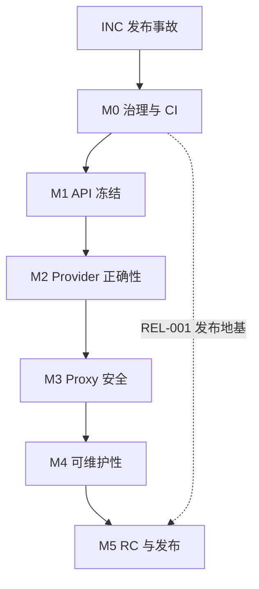

# llmrust SPCC 0.1.3 项目规格

> **文档编号**：`LLMRUST-SPCC-013`  
> **状态**：`ACTIVE SSOT — M2 DONE（10/10 封板，public API freeze 生效）；M3 DONE（5/5 封板）；M4 DONE（4/4 封板）；M5 DONE（5/5 封板）`  
> **目标版本**：`llmrust 0.1.3`  
> **审计基线**：GitHub `main` @ `3d0734ac711de3aadf16331c0f9c21b1634a83a8`  
> **规格版本**：`0.4`（SPEC-004：角色更换，架构师 Kimi → Notion AI）  
> **编制日期**：`2026-07-13`；**最近修订**：`2026-08-03`  
> **母规范**：`docs/spcc.md`（通用 SPCC 方法论 v1.0，2026-07-24 经 SPEC-002 登记入库）  
> **仓库路径**：`docs/SPCC-0.1.3.md`

本文件是 llmrust 0.1.3 的已批准项目级 SPCC。`SPEC-000` 合入仓库后，它成为仓库内的单一事实源（SSOT）。在入库前只允许执行无代码分支的 Incident 任务；不得创建业务实现分支或编写业务代码。

本文同时约束人类与 AI agent。任何参与者都不得以"自动生成""只是重构""顺手修复""先让 CI 绿"为理由绕过任务边界。

## 0.5 规格勘误表

| 编号 | 日期 | 事实 | 处置 | 责任任务 |
|---|---|---|---|---|
| `E-001` | 2026-07-24 | 全量审计发现：`proxy::tests::serve_starts_and_answers_health` 与 `serve_with_bearer_requires_auth` 使用 `reqwest::Client::new()`，在启用系统代理（含 Windows 注册表代理）的机器上回环请求被代理劫持，返回 502 造成环境性假失败；`.no_proxy()` 客户端可复现 200。不影响 CI（ubuntu 无系统代理），不影响生产代码。 | 记录为测试健壮性缺陷；修复并入架构/测试守卫任务，不单独开卡 | `CI-003`（或其实现期一并修复为 `no_proxy` 客户端） |
| `E-002` | 2026-07-24 | 全量审计发现：`RetryProvider` 每次重试都会重新进入 Provider，导致 `warn_if_unsupported_n` 的"n>1 一次性警告"被放大为逐次重试重复打印。纯日志噪音，无功能影响。 | 已修复（API-003，PR #111：`warn_if_unsupported_n` 进程级 `(provider,n)` 去重）；429 文档漂移同单对齐 | `API-003` |
| `E-003` | 2026-07-24 | 全量审计（Kimi，2026-07-24，fmt/clippy/全量测试复核）确认本规格 §14 审计问题映射依然成立：Anthropic/Gemini 流式吞错（`anthropic.rs` / `google.rs` 对 malformed data 返回空 Vec）、capabilities 与实现漂移（Gemini seed/penalties、Ollama top_p、Retry 429、Anthropic response_format 文档自相矛盾）、`ThinkingConfig` 请求侧无 Provider 落地、`/health` 认证行为与文档冲突、Router 单计数器跨组干扰。技术任务卡无需重排。 | 无新增任务；既有任务卡继续有效 | `STR-002A/G`、`CAP-001`、`API-003`、`REA-*`、`PRX-002`、`RTR-001` |
| `E-004` | 2026-07-24 | API-001 三方事实表确认：AGENTS.md 称 `FinishReason` 变体"cross-provider"暗示可扩展，但代码非 `#[non_exhaustive]`，0.1.x 内加变体 = 破坏性变更；且事后补 `#[non_exhaustive]` 对穷尽匹配的下游同样破坏。架构师裁定（PR #101）：改文档不改代码，措辞澄清为"变体语义跨 provider 共享、集合 0.1.x 冻结、扩展只能进 0.2"；`ChatResponse`/`ThinkingConfig` 同逻辑冻结，0.2 再评估。 | 文档措辞修正并入 DOC-001；0.2 评估项记技术债 | `DOC-001` |
| `E-005` | 2026-07-24 | 治理违规（架构师 Kimi 自查 + Owner 指正）：REL-001、API-002、API-003 三单均属 §10.1 定义的中大型任务（触及公开行为/安全默认值，diff >200 行），执行令却连续标注"CI-002 级、执行令代行设计小样"，系统性绕开设计小样闸门。事后评审证据链完整（各 MUST 条款均抓到真实问题），交付物质量不受影响，但"设计先行"闸门被架空。处置：① 三单追认交付有效，**逐案注明不设先例**；② API-003 立即停手补样（#106 评论 5071108701），设计小样 APPROVE 后方可提交实现 PR；③ §10.1 增防呆条款（见下）；④ 架构师状态汇报两次未核验失言（CI-002 期"未跟踪文件还在"、误报合并完成）一并入档。 | 本表登记 + §10.1 防呆条款 + API-003 补样流程 | `SPEC-003`（本 PR） |

---

## 0. 文档权威、适用范围与状态

### 0.1 适用范围

本规格覆盖：

- 0.1.3 安全事故处置与发布完整性恢复；
- Rust 公开 API 与 semver 治理；
- Provider 请求、响应、usage、tools、reasoning 与 streaming 契约；
- OpenAI/Anthropic 兼容代理的安全与协议行为；
- 模块职责、内部依赖允许清单与大文件治理；
- CI、供应链、发布、Issue、PR、评审、合并和回证流程；
- 0.1.3 的阶段、任务依赖、允许范围与验收标准。

### 0.2 权威顺序

出现冲突时按下列顺序处理：

1. Owner 对目标、范围和风险的书面裁定；
2. 母规范 `docs/spcc.md`（通用 SPCC 方法论，跨项目复用的程序性规则）；
3. 本规格最新已批准版本（项目 SSOT，含 0.1.3 专属范围、任务与验收）；
4. `docs/CONTRACTS.md` 与项目内已批准的专用协议规格；
5. 公开 API 测试、契约测试与 wire fixtures；
6. 代码实现；
7. README、示例、能力表和注释。

母规范与本规格冲突时，以本规格的项目化选择为准并显式注明；母规范中本规格原先未覆盖的程序性规则（设计小样、守恒清单、文档失实定级等）自 SPEC-002 起生效，落地条款见 §10.1 与 §13。

"代码现在就是这样"不构成保留错误行为的理由。发现上层与下层事实冲突时立即熔断，由架构师提出规格勘误或实现修复，不允许执行者自行选择解释。

外部供应商协议以对应供应商的官方版本化文档和真实响应证据为准。引用外部协议的任务必须记录核验日期；不得凭记忆实现。

### 0.3 规格变更

- 只有 Owner 能批准目标、非目标、阶段和任务范围变更。
- 架构师可提出规格 PR，但不能自行宣布生效。
- 任何新增任务、依赖边、例外或公开行为变更必须先修改本规格，再修改代码。
- 规格变更使用 `SPEC-*` 任务 ID；规格 PR 不得夹带业务实现。
- 已发生的事实和已合入历史不得重写；错误以勘误、补账或事故记录修正。

### 0.4 状态词

| 状态 | 含义 |
|---|---|
| `DRAFT` | 正在评审，尚未授权执行 |
| `READY` | 前置条件满足，可由架构师下发 |
| `ACTIVE` | 唯一执行者正在实施 |
| `BLOCKED` | 缺少外部条件或 Owner 裁定 |
| `REVIEW` | PR 已就绪，等待架构师裁决 |
| `DONE` | 已合入、回证完整且任务关闭 |
| `REJECTED` | 方案或实现被否决，不得继续沿用 |

---

## 1. 项目定位与 0.1.3 成功定义

### 1.1 项目定位

llmrust 是一个以 Rust 为核心的统一 LLM SDK，并可选提供 OpenAI/Anthropic 兼容 HTTP 代理。项目面向人类开发者与 AI agent 协作，优先保证：

- 公开行为清晰、可测试、可追溯；
- Provider 差异显式建模，不静默降级；
- 流式协议只有一种可理解的终止语义；
- 默认配置安全；
- 源码能够作为下一位维护者和 agent 的可靠文档；
- 发布物可从受保护的 Git 提交复现。

### 1.2 0.1.3 目标

| ID | 目标 | 可验证结果 |
|---|---|---|
| `G-01` | 恢复发布链可信度 | 0.1.3 只能由受保护 tag 流水线从干净提交发布；产物无秘密和本地杂项 |
| `G-02` | 冻结并守住 0.1.x Rust API | 完成公开 API 清单；0.1.3 不新增源码破坏；意外 semver 破坏由 CI 阻断 |
| `G-03` | 修复流式语义 | 每次成功流恰好一个 terminal chunk；terminal 汇总 finish、usage、tools 和 reasoning 状态 |
| `G-04` | 让 reasoning/cache 行为真实可信 | 现有类型可表达的路径完成闭环；不可无损表达的路径明确 Unsupported；不再静默忽略或丢数据 |
| `G-05` | 收紧代理默认安全 | 无认证默认无跨域；公网监听强制认证；健康检查和错误行为固定并测试 |
| `G-06` | 冻结维护热点并形成拆分蓝图 | 超大文件不再增加职责；proxy/provider/types/router 的后续拆分有逐任务方案，但 0.1.3 不夹带大规模搬迁 |
| `G-07` | 建立机器门禁 | 格式、lint、测试、MSRV、架构、供应链、secret、package、semver 和 release 全部不可绕过 |

### 1.3 0.1.3 非目标

在本规格关闭前，以下内容均不进入 0.1.3：

- 新增 Provider；
- 新增 Batch、Assistants、Realtime、Files 等上游产品 API；
- 新增 GUI、控制台或持久化数据库；
- 以性能为目的的大规模重写或更换 HTTP/异步运行时；
- 扩大代理为完整生产网关（计费、租户、数据库、复杂限流等）；
- 未直接服务于本规格的依赖升级或代码美化；
- 为追求目录"像某个标杆项目"而机械搬迁代码。

发现非目标需求时，记录到 0.3+ 候选清单，不得夹入整改 PR。

---

## 2. 治理结构与权限

### 2.1 三权分立

| 角色 | 唯一职责 | 禁止事项 |
|---|---|---|
| Owner | 决定目标、优先级、风险接受、规格生效、版本发布和最终否决 | 不在普通任务中直接写码、合并或替执行者修 CI |
| 架构师 | 唯一拆解任务、维护 SPCC、评审方案与实现 PR、裁定 APPROVE/CHANGES/REJECT、授权合并 | 不编写自己评审任务的产品代码或代替 Owner 扩范围 |
| 执行者 | 唯一进行实现任务内操作：写码、测试、推实现分支、建实现 PR、获授权后合并 | 不改 SPCC、不扩范围、不自行批准或提前合并 |

角色是权限而不是身份标签。同一人或同一 agent 可以在不同任务中切换角色，但**同一产品实现任务内不得兼任架构师与执行者**。SPCC 初次入库、规格勘误和合并后状态回证属于架构师治理职责，不属于产品实现；由架构师直接创建治理分支/PR并维护，执行者只提交实现和证据，不编辑 SPCC。每个阶段开始前由架构师维护本文件角色登记表，Owner 只确认方向性角色变更。

| 阶段 | Owner | 架构师 | 执行者 | 状态 |
|---|---|---|---|---|
| 事故处置 | llmrust Owner（用户） | Codex | Grok | `DONE` — `INC-001`、`INC-002` 均已通过 |
| Phase 0–2 | llmrust Owner（用户） | Notion AI | CodeBuddy | `DONE` — M0/M1/M2/M3 均封板 |
| Phase 3–5 | llmrust Owner（用户） | Notion AI | CodeBuddy | `DONE` — M4 4/4 封板；M5 5/5 封板（REL-003 已收口） |

本轮角色于 2026-07-13 由 Owner 指定，并于 2026-07-14 明确治理写权限。**2026-07-24 角色更换（SPEC-001，Owner 批准）**：前任架构师 Codex 的计划代理失效，Owner 指定 Kimi 接任唯一架构师，CodeBuddy 接任唯一执行者；历史任务（`INC-001`、`INC-002`、`SPEC-000`、`CI-001`）中 Codex/Grok 的裁定与回证继续有效，不回溯改写。自生效时起：Kimi 负责 SPCC 的持续更新、任务状态、里程碑、证据账本、规格勘误及对应治理 PR；CodeBuddy 负责 Kimi 下发的产品代码、配置、测试和实现文档任务。Kimi 不代写自己将要评审的产品实现，CodeBuddy 不修改 SPCC。若需更换任一角色，由 Owner 决定方向，Kimi 负责把决定写入本表并记录生效时间。**2026-08-02 角色更换（SPEC-004，Owner 指令）**：Kimi 卸任，Owner 指定 Notion AI 接任唯一架构师；历史任务中 Kimi 的裁定与回证继续有效，不回溯改写。自生效时起：Notion AI 负责 SPCC 的持续更新、任务状态、里程碑、证据账本、规格勘误及对应治理 PR；CodeBuddy 继续担任唯一执行者。Notion AI 不代写自己将要评审的产品实现，CodeBuddy 不修改 SPCC。后续角色更换由 Owner 决定方向，Notion AI 负责把决定写入本表并记录生效时间。

Owner 不填写技术审计模板、不运行技术命令、不解释 scanner/CI/依赖/API 细节，也不在多个实现方案之间代替架构师作技术选择。执行者负责产出技术证据，架构师负责把证据裁定为 PASS/BLOCKED/REJECT，并向 Owner 只汇报：结果、用户/业务影响、剩余风险和明确建议。只有方向、范围、发布时间、成本或风险接受发生实质变化时，才请求 Owner 裁决；请求必须使用非技术语言解释"这是什么、为什么需要决定、各选项后果、架构师建议"。

### 2.2 安全事故 Break-glass

凭证撤销、账户冻结和阻止正在发生的未授权发布不受"先建 Issue/PR"限制，因为这些动作不修改仓库代码且延迟会扩大损害。

Break-glass 规则：

1. 凭证或账户控制者立即止血；
2. 不在公开记录中复制秘密；
3. 24 小时内建立脱敏事故记录和补救任务；
4. 后续代码、CI、文档和发布流程变更仍必须走任务与 PR；
5. Break-glass 不能用于直推主干、跳过测试或发布未经审查的 crate。

### 2.3 熔断条件

满足任一条件立即暂停当前任务：

- 发现新秘密、未授权发布或未知 crates.io owner；
- 任务需要触碰允许范围外文件；
- 需要新增未批准内部依赖边；
- 公开行为与规格冲突且任务未授权改变该行为；
- CI 门禁缺失、失效或无法复现；
- PR 出现无法解释的额外 commit、脏工作区或来源不明生成物；
- 连续两个 PR 发生同类越界；
- 供应商官方协议与现有规格不一致。

熔断后只能：收集证据、报告、修正规格或补门禁。不得继续扩大实现。

---

## 3. 审计基线与发布冻结

### 3.1 已知基线

| 项目 | 审计事实 |
|---|---|
| GitHub 基线 | `main` @ `3d0734ac711de3aadf16331c0f9c21b1634a83a8` |
| 仓库版本 | `Cargo.toml = 0.1.1` |
| crates.io/docs.rs 最新发布 | `0.1.2` |
| 0.1.2 可追溯性 | 发布自 dirty 工作区；GitHub 无对应 `v0.1.2` tag |
| 安全事件 | 0.1.2 包含不应发布的日志，日志中出现 crates.io 发布凭证；本规格不复述凭证 |
| API 状态 | 0.1.2 对 `Usage`、`StreamChunk` 做了 patch 级源码破坏性变更 |
| 功能状态 | reasoning/cache 只部分落地，存在"公开 API 看似支持、Provider 实际忽略"的路径 |
| CI 状态 | 编译、测试、Clippy、rustdoc、fmt、dry-run、MSRV 已存在；缺安全、semver、secret、package 完整性和 tag-only release 门禁 |

基线证据：

- [llmrust GitHub 仓库](https://github.com/llmrust/llmrust)
- [crates.io/docs.rs 0.1.2 发布物目录](https://docs.rs/crate/llmrust/0.1.2/source/)
- [0.1.2 `.cargo_vcs_info.json`](https://docs.rs/crate/llmrust/0.1.2/source/.cargo_vcs_info.json)
- [引入 reasoning/cache 公开类型变更的 PR #80](https://github.com/llmrust/llmrust/pull/80)
- [Cargo 官方发布规则：已发布版本不能覆盖或删除](https://doc.rust-lang.org/cargo/reference/publishing.html)

安全证据只引用发布物目录，不在规格中直链或复述含凭证的日志内容。

### 3.2 版本处置原则

crates.io 上的 `0.1.2` 已永久占用，不能用干净产物覆盖重发。即使执行 yank，原始代码仍会保留；yank 只阻止新的依赖解析选择该版本，不破坏已经锁定它的 `Cargo.lock`。

因此本轮版本号确定为 **0.1.3**：它是 0.1.2 的干净纠偏版，不代表项目进入新的 0.2 产品阶段。0.1.2 作为事故版本保留事实记录，不补造事后 tag，不把其他提交冒充为原发布源码。

### 3.3 发布冻结

在 `INC-001`、`INC-002`、`CI-002`、`REL-001` 完成前：

- 禁止执行任何 `cargo publish`；
- 禁止创建新版本 tag 或 GitHub Release；
- 禁止使用 `--allow-dirty`；
- 禁止通过命令行参数传递 crates.io token；
- 禁止把 token、发布命令完整输出或事故原始日志复制到 Issue/PR；
- 允许执行不上传的 `cargo package`、`cargo publish --dry-run` 和本地扫描。

### 3.4 P0 关闭证据

Owner 已确认涉事 token 于 2026-07-13 撤销。`INC-001` 仍需补齐以下其余脱敏证据后才能关闭：

- crates.io owner 列表和近期版本已核验；
- 是否发现未授权动作；
- 其他复用位置已轮换；
- 原始 `.crate` 已留证并完成 secret scan。

Owner 已于 2026-07-13 明确授权 `yank 0.1.2`。`INC-002` 只有在 crates.io 显示该版本已 yanked，并记录执行时间与验证结果后才能关闭。yank 不会删除原始发布物；不得把它描述为删除或覆盖。

---

## 4. 架构职责与内部依赖允许清单

### 4.1 分层

| 层 | 目录/文件 | 唯一职责 |
|---|---|---|
| `L0 Domain` | `src/types.rs` | 跨 Provider 的稳定领域类型与序列化语义 |
| `L1 Contract` | `src/providers/mod.rs` | `Provider` trait、统一错误和 Provider 配置契约 |
| `L2 Transport` | `src/providers/*` | 上游 wire DTO、请求映射、HTTP/SSE/NDJSON 解析和 Provider 实现 |
| `L3 Orchestration` | `src/lib.rs`, `src/router.rs`, `src/pricing.rs`, `src/prelude.rs` | Provider 注册、模型路由、重试/故障转移、聚合和便利 API |
| `L4 Proxy` | `src/proxy/*` | 外部 OpenAI/Anthropic HTTP 边界、认证、CORS、DTO 转换和 SSE 输出 |
| `L5 Verification` | `tests/*`, `examples/*`, `docs/*`, `.github/*` | 契约验证、示例、能力声明、CI 和发布治理 |

### 4.2 允许边

内部依赖采用默认拒绝。允许边仅有：

| 来源 | 允许依赖 |
|---|---|
| `L0 Domain` | 无内部层；只可依赖标准库及已批准的轻量序列化类型 |
| `L1 Contract` | `L0 Domain` |
| `L2 Transport` | `L0 Domain`、`L1 Contract`、同层共享 `http`/`stream_util` |
| `L3 Orchestration` | `L0 Domain`、`L1 Contract`、按注册需要依赖 `L2 Transport`；`router` 可依赖 `LmrsClient` |
| `L4 Proxy` | `L0 Domain`、`L1 Contract`、`L3 Orchestration`、`proxy` 内部模块 |
| `L5 Verification` | 通过 crate 公开 API 验证所有层；架构检查可读取源码文本 |

### 4.3 明确禁止边

- `types.rs` 不得依赖 provider、client、router 或 proxy；
- Provider 不得依赖 proxy 或 router；
- `http.rs`、`stream_util.rs` 不得依赖具体 Provider；
- `lib.rs`、默认 feature 和核心类型不得依赖 Axum/Tower 等 proxy-only 依赖；
- 上游 wire DTO 不得进入 `types.rs`；
- proxy wire DTO 不得成为核心 Provider 契约；
- 文档或 capabilities 文件不得反向驱动运行时逻辑，除非另有生成任务批准；
- 新模块默认零允许边，必须先通过 `SPEC-*` 修改本表。

### 4.4 边界机器守卫

Phase 0 必须加入可证伪的架构测试，至少覆盖：

- 禁止层级 import；
- `default = []` 且默认构建不引入 proxy-only 依赖；
- 生产源码文件超过 800 行时禁止净增长，除非任务明确授权拆分过渡；
- `src/proxy/mod.rs`、`src/proxy/anthropic_proxy.rs`、`src/providers/compat.rs`、`src/providers/google.rs`、`src/types.rs`、`src/providers/anthropic.rs`、`src/router.rs` 纳入存量超限台账；台账只准减少；
- 人为加入一条禁止依赖或让超限文件增长时，CI 必须失败，并在测试中保存复现说明。

不得为了通过守卫创建新的 `common.rs`、`shared.rs` 或万能工具层。共享抽象必须有单一职责和至少两个真实消费者。

---

## 5. Rust 公开 API 与契约演进

### 5.1 基本规则

0.1.3 是恢复性 patch release，**不允许新增任何有意的 Rust 源码破坏或序列化形状破坏**。0.1.2 已经造成的兼容性问题作为事故事实单独记录，但不得在 0.1.3 中继续扩大。安全默认值、错误处理和"静默成功改为明确失败"等纠偏行为，只能限于本规格已列明的问题并在 CHANGELOG 中突出说明。需要重新设计公开类型的工作推迟到未来经 Owner 单独批准的版本。

以下均属于公开契约变更：

- 新增、删除或修改 public struct 字段；
- 新增 enum variant；
- 修改 trait 方法、约束、关联类型或 object safety；
- 修改构造器、builder、错误类型或 re-export；
- 修改 Serde 字段名、tag、默认值、缺省/未知字段策略；
- 修改 proxy JSON/SSE、环境变量、默认监听或认证行为；
- 修改 MSRV、default features 或默认依赖集合。

### 5.2 Rust 特有红线

- 给可穷尽公开 struct 新增字段是源码破坏，不得称为"additive 零破坏"；
- 给可穷尽 enum 新增 variant 可能破坏下游 `match`；
- 给 public trait 新增无默认实现的方法是破坏性变更；
- `#[serde(default)]` 只能改善部分反序列化兼容性，不代表 Rust API 或所有 JSON 消费者兼容；
- `#[non_exhaustive]`、私有字段、构造器/builder、新类型或带逃生口的 `Other(String)` 是可选演进手段，但必须逐类型裁定；
- 不得用 `#[allow]`、模糊泛型、`serde_json::Value` 或 `extra` 掩盖应当明确建模的跨 Provider 核心语义。

### 5.3 0.1.3 类型冻结策略

`API-001` 必须产出完整 public API 清单并逐项分类。0.1.3 的最低要求：

- 保留已发布 0.1.2 的 `Usage`、`ChatResponse`、`StreamChunk` 字段和序列化形状，不删除、不改名、不改变既有字段语义；
- 0.1.3 不通过新增 `#[non_exhaustive]`、私有化字段或替换类型制造新的下游编译失败；
- 可以添加不破坏现有调用的构造器、builder、测试和文档；
- 对扩展频繁但当前不可安全演进的响应类型建立技术债台账，在 0.1.x 内冻结字段集合；
- `FinishReason` 等可能扩展的 enum 保留未知值逃生口，并测试未知值往返；
- `Provider` trait 的变更必须同时验证所有原生 Provider、OpenAI-compatible 包装器和 `RetryProvider`；
- proxy DTO 是否属于承诺的 Rust API 必须明确；不承诺时应缩小可见性，承诺时纳入 semver 检查。

0.1.3 新增 `COMPATIBILITY-0.1.3.md`，说明 0.1.1、受污染的 0.1.2 与干净 0.1.3 的关系，并明确"0.1.3 不要求新的源码迁移"。若实际出现必须迁移的变化，任务立即熔断并回到 Owner，而不是补写迁移文档把破坏合理化。

### 5.4 Semver 门禁

- 0.1.3 开发期：同时以 0.1.1 干净源码与 crates.io 0.1.2 发布物生成 API 差异报告；
- 相对 0.1.2 不允许新增破坏；相对 0.1.1 的既有差异只记录为继承事故，不得继续扩大；
- `SPEC-000` 合入即冻结 public API；任何新增破坏必须回到 Owner，并默认移出 0.1.3；
- 0.1.3 发布后：CI 以 0.1.3 为 baseline 运行 `cargo-semver-checks`，失败即阻断；
- patch 版本不得包含工具判定的 major/minor 级破坏；不得以"CI 其他项全绿"覆盖 semver 红灯。

---

## 6. Provider、Reasoning、Usage 与 Streaming 契约

### 6.1 字段处理三态

对 `ChatRequest` 的每一个可选字段，每个 Provider 必须且只能选择一种状态：

1. `Mapped`：映射到已核验的上游字段，并有请求 fixture 测试；
2. `Unsupported`：在发起网络请求前返回 `LlmError::Unsupported`；
3. `NotApplicable`：语义对该 Provider 不适用，且 API 层不允许用户对其设置。

**禁止静默忽略已设置字段。** 兼容端点的 `extra` 是显式逃生口，不得用于伪装一等能力，也不得自动传播到 Anthropic、Gemini、Ollama。

### 6.2 Provider 能力声明

能力声明必须区分：

- `implemented`：llmrust 已映射并有本地契约测试；
- `verified`：在指定日期通过真实上游或官方 fixture 验证；
- `model_dependent`：端点支持但模型可能不支持；
- `unsupported`：主动返回 Unsupported；
- `passthrough_only`：仅可通过显式 `extra` 使用，不算一等支持。

README 中的 ✅ 只能用于 `implemented=true`；"已支持"不得仅凭字段存在、Serde 能解析或上游理论支持。

### 6.3 Reasoning/Thinking 契约

0.1.3 使用统一概念名 `reasoning`；provider wire 层可继续使用 `thinking`、`reasoning_content` 等官方字段名。禁止把某一供应商字段名直接提升为跨 Provider 语义。

0.1.3 不为 reasoning 再次修改公开响应类型。必须满足：

- 设置 reasoning 后，支持的 Provider 必须真正写入请求体；不支持的 Provider 必须返回 Unsupported；
- `ChatResponse` 当前不能无损表达独立 reasoning，因此 0.1.3 的非流 `chat` 在 reasoning 启用时必须于发网前返回 Unsupported；不得把 reasoning 混入普通 content；
- 原始 `stream` 可使用 0.1.2 已发布的 `StreamChunk.thinking`/`thinking_done` 返回 reasoning，顺序不得重排；
- reasoning 结束最多标记一次；terminal 之后不得出现 reasoning；
- `stream_collect_full` 发现 reasoning 时不得丢弃；在现有 `ChatResponse` 无法承载时返回明确错误，并引导调用方消费原始 stream；
- OpenAI 与 Anthropic proxy 只有在不改变已承诺 Rust DTO 且目标 wire 能无损表达时才可透传 reasoning；否则请求必须返回协议一致的 Unsupported 错误；
- reasoning token 只在上游明确报告时填充，不推算、不与普通 completion token 重复计算；
- 每个 Provider 的请求、非流 Unsupported、原始流、usage、聚合拒绝和 proxy 六条路径必须分别测试；
- 未核验的 OpenAI-compatible 第三方端点不得继承 OpenAI 的 reasoning 支持声明。

供应商具体映射必须在实施任务中根据官方协议核验。未完成核验前，能力表保持 `unsupported` 或 `passthrough_only`，不得猜测。

### 6.4 Usage 契约

- `prompt_tokens`、`completion_tokens`、`total_tokens` 沿用既有语义；
- `cache_read_tokens`、`cache_write_tokens`、`reasoning_tokens` 只映射供应商明确字段；
- 缺失值用 `None`，真实零值用 `Some(0)`，不得混淆；
- 若上游 total 与分项不相等，保留上游 total，不自行修正，并允许 debug 级结构化告警，但不得记录内容；
- non-stream 与 stream_collect_full 对同一 fixture 的最终 usage 必须一致；
- proxy usage 转换不得丢失协议允许表达的字段；协议无法表达时必须在契约和能力表中明确，而不是静默宣称等价。

### 6.5 成功流状态机

成功流必须遵循：

```text
START -> CONTENT/REASONING/TOOL (0..N) -> TERMINAL (恰好 1 次) -> CLOSED
```

约束：

- terminal 前可有零个或多个内容、reasoning 或 tool 增量；
- terminal chunk 必须 `done = true`，并汇总可用的 `finish_reason`、`usage`、完整 tool calls 和 reasoning 完成状态；
- 所有非 terminal chunk 必须 `done = false`；
- terminal 后不得再产出成功 chunk；
- `[DONE]`、`finish_reason` chunk、usage-only chunk 和供应商 stop event 都只是上游信号，不得各自生成多个 llmrust terminal；
- 消费者在看到唯一 terminal 后即可安全停止，不会错过 usage；
- 空增量可以承载有意义的协议状态，但不得用空成功 chunk 掩盖解析失败；
- SSE 同时接受合法的 `data:` 与 `data: `；ping/comment 等协议允许事件必须显式分类。

### 6.6 错误流

- 建连时 4xx/5xx 直接返回 `Err`，不得伪装为成功 stream；
- 中途 malformed JSON 返回 `LlmError::Parse`；
- 上游显式 error event 映射为 `Api` 或 `Stream`；
- 禁止 Anthropic/Gemini 或任何 Provider 对无法解析的 data event 返回空 Vec；
- error 后流关闭，不再产生 terminal success；
- proxy 将中途错误输出为对应协议 error SSE，然后结束连接；不得输出成功 completion。

### 6.7 Provider 最低契约测试矩阵

每个 Provider 至少覆盖：

| 路径 | 必测项 |
|---|---|
| request | model、system、sampling、tools、reasoning、extra/unsupported |
| chat | 多文本块、finish reason、tools、usage、reasoning、错误体 |
| stream | 文本、reasoning、tool fragments、usage 时序、唯一 terminal、malformed data |
| embeddings | 支持时顺序/usage/错误；不支持时统一 Unsupported |
| logging | key、prompt、response、tool args、图片、向量和完整 URL 均不泄露 |
| proxy | Provider 结果到 OpenAI/Anthropic wire 的无损或已声明有损转换 |

本地 fixture 测试是 PR 必需项；真实 Provider smoke test 是发布前与定时验证项，不能代替本地测试。

---

## 7. Proxy 安全与线协议

### 7.1 默认安全

- `router()` 无认证模式默认**不发送允许跨域的 CORS 响应头**；
- CORS 必须通过显式配置启用，默认 allowlist 为空；
- `Access-Control-Allow-Origin: *` 仅在认证开启且 Owner 明确接受风险时允许；
- 无认证仅允许 loopback bind；公网或非 loopback bind 必须配置非空认证 token；
- 空 token、纯空白 token 或无法安全解析的 token 在启动时失败；
- token 比较使用成熟、经审查的常数时间实现，不自造不完整密码学辅助函数；
- 默认示例监听 `127.0.0.1:3000`，公开监听必须显式设置地址与 token；
- proxy 设定请求体上限，并对超限返回协议一致的 4xx；
- TLS 不由 llmrust 内建终止；公网部署文档必须要求受信 reverse proxy/TLS。

### 7.2 `/health` 契约

0.1.3 选择公开 liveness：

- `/health` 无需认证；
- 只返回进程存活和固定版本信息，不返回 Provider 名称、模型、key 状态、上游连通性或配置；
- `/health` 不触发任何上游请求；
- 其他业务端点遵循认证配置；
- router、middleware、文档和集成测试必须一致。

若未来需要 readiness，另设受保护端点，不扩展 `/health` 的敏感含义。

### 7.3 OpenAI/Anthropic 代理契约

- `model` 继续使用 `provider/model`，分隔符不变；
- OpenAI chat 的 `n` 只接受缺省或 1，其他值在请求上游前返回 400；
- OpenAI stream 的 role 只在首个 delta 输出；使用 `[DONE]` 结束；usage-only chunk 只在请求包含 `include_usage` 时产生；
- Anthropic stream 事件顺序必须满足其消息/content block 生命周期；
- tool call id、arguments 和 content block index 必须稳定；
- reasoning 若目标协议可以表达则按官方格式映射；无法表达时返回明确 Unsupported 或记录为已声明有损路径；
- 错误体、HTTP 状态和 SSE error 均有 golden fixtures；
- proxy 不得把服务器端 key、完整上游 URL、prompt 或响应正文写入日志。

---

## 8. 文档、能力元数据与可观察性

### 8.1 文档同 PR

改变公开 API、协议、能力、环境变量、feature、默认值或安全行为时，同一 PR 必须更新：

- `README.md` 与适用时的 `README.zh-CN.md`；
- `CHANGELOG.md`；
- `docs/CONTRACTS.md`；
- `docs/CAPABILITIES.md`；
- `llmrust.capabilities.json`；
- 相关示例和 rustdoc；
- 0.1.3 期间的 `COMPATIBILITY-0.1.3.md`。

不适用项必须在 PR 中说明，不允许默默省略。

### 8.2 能力元数据

- `llmrust.capabilities.json` 的 schema 版本与 crate 版本分开；
- crate version 必须与 `Cargo.toml` 一致；
- Retry 策略、Provider 字段支持、reasoning 和 embeddings 声明必须由测试验证；
- 人类表格与机器 JSON 至少有一条自动一致性检查；
- 能力声明包含 `implemented`、`verified_at`、`model_dependent` 和说明，不再用单一布尔值掩盖条件支持；
- 0.1.3 发布前不得存在"代码未映射但能力表写支持"的条目。

### 8.3 日志红线

永不记录：API key、认证 header、prompt、message content、response text、request body、tool arguments、图片数据、embedding 输入/向量、完整 URL、reasoning 内容。

允许记录：Provider 标识、脱敏 model、状态码、耗时、计数、长度、错误种类、retry attempt、router group。自定义 `Debug` 必须掩码所有 secret-bearing 字段。

---

## 9. CI、供应链与发布门禁

### 9.1 PR 必过门禁

| 门禁 | 最低要求 |
|---|---|
| Format | `cargo fmt --check` |
| Build | `cargo build --all-targets --all-features` 与默认 feature build |
| Test | `cargo test`、`cargo test --all-features` |
| Lint | `cargo clippy --all-targets --all-features -- -D warnings` |
| Docs | `RUSTDOCFLAGS=-D warnings cargo doc --no-deps --all-features` |
| MSRV | 固定 Rust 1.86，覆盖 all targets；MSRV 变更必须是独立任务 |
| Architecture | 依赖允许边、default feature、超大文件台账、文档一致性 |
| Supply chain | RustSec、许可/来源策略、锁文件一致性；所有豁免带到期条件 |
| Secrets | 全历史增量与工作树扫描；合成凭证 fixture 能让门禁失败 |
| Package | `cargo package --list` allowlist、`cargo package`、解包后二次 secret scan |
| Semver | 同时对比 0.1.1/0.1.2；相对 0.1.2 零新增破坏；0.1.3 发布后以其为新 baseline |

工作流必须取消同分支旧 run。所有 GitHub Actions 固定到完整 commit SHA，并用注释标出对应版本。工具链版本写入仓库，不允许 `stable` 漂移成为唯一依据。

### 9.2 发布包允许内容

允许模式只包含：

- Cargo 清单与锁文件；
- `src/**`、经批准的 `tests/**`、`examples/**`、`docs/**`；
- README、CHANGELOG、许可证、SECURITY、CONTRIBUTING、AGENT 文档；
- `llmrust.capabilities.json`；
- 明确批准的构建元数据。

明确禁止：

- `*.log`、`.env*`、shell history、编辑器文件、临时报告、coverage 原始文件；
- token、key、Authorization 值和带 secret 的命令行；
- `.git/**`、本地 target、未追踪文件；
- 与 tag 提交不一致的本地 `Cargo.toml.orig`。

allowlist 变更必须作为独立、可审查 diff；禁止为了让未知文件通过而扩大为 `**/*`。

### 9.3 Tag-only 发布

0.1.3 发布必须满足：

1. 版本 PR 更新 Cargo.toml、锁文件、CHANGELOG、capabilities、兼容性说明和 release checklist；
2. 主干 CI 全绿且工作区可由 commit 完整重建；
3. Owner 授权创建受保护的 annotated `v0.1.3` tag；
4. Release workflow 验证 tag、crate version、CHANGELOG 和 capabilities version 一致；
5. workflow 从 tag checkout，验证 `git diff --exit-code` 和无未追踪文件；
6. 生成 crate、内容清单、hash、SBOM/provenance，并执行 secret scan；
7. 只使用平台 secret 或受支持的短期/可信发布身份；禁止 `cargo publish --token ...` 出现在日志或脚本；
8. 发布后验证 crates.io/docs.rs 对应 tag SHA，并创建 GitHub Release；
9. 任一步失败不得用本地手工 publish 补发。

### 9.4 豁免

安全公告、依赖来源、文件大小或工具误报的豁免必须包含：

- 风险描述；
- 为什么当前不能修；
- 影响范围；
- Owner 批准；
- 责任任务；
- 明确到期条件和复议日期。

无期限豁免禁止合入；台账只准减少。

---

## 10. 任务、分支、PR 与合并纪律

### 10.1 开工条件

任务必须同时满足：

- 状态为 `READY`；
- 前置任务为 `DONE`；
- Issue 已镜像自包含执行令；
- 执行者从 `fetch` 后的最新 `origin/main` 创建分支；
- 工作区干净；
- 架构师明确下发任务。

中大型任务必须先完成推演报告。推演只允许读取和记录证据，不建实现分支、不写业务代码。

**设计小样闸门（SPEC-002 起生效，吸收自母规范 §五）**：中大型任务（预计人工 diff >200 行，或触及公开行为、wire 协议、安全默认值的任务）在写码前，执行者必须向架构师报审设计小样，获准 APPROVE 后方可建分支写码。设计小样必须包含：

**防呆条款（SPEC-003 起生效，E-005 教训）**：每份执行令头部必须显式标注**规模分级**（`S` / `M` / `L`，对齐 §10.3）与**是否触发设计小样闸门**（触发/豁免 + 一句理由）；"CI-002 级"这类类比措辞一律视为无效分级。架构师发令时自查，Owner 与执行者可随时以此条款要求停手补样。

- **问题陈述**：要修什么，第一手证据（文件:行号、复现路径）；
- **方案形状**：关键函数/数据结构/控制流的具体形状，精确到可核验；
- **测试计划**：编号化测试（T-1、T-2…），每条写明场景与断言口径；
- **预算自估**：功能/测试/其他三分解，总量对齐 §10.3 行数预算；
- **守恒清单**：显式列出本次改动**不**改变的公开 API、行为语义与协议承诺；
- **上线影响表**：各 Provider/协议/平台的行为差异如实申报。

架构师裁决可附 MUST 条款与非阻塞观察项；实现 PR 报审时必须逐条回证。未经核准的形状差异 = 偏离，push 前必报。**文档失实**（CHANGELOG、PR Summary、设计文档与最终实现不一致）为阻塞项，与代码缺陷同级处理。小型任务（如 CI-002 级）以执行令自带的执行步骤与 DoD 代行设计小样，不重复报审。

### 10.2 分支与并行

- 一个实现任务 = 一个实现分支 = 一个实现 PR；分支名必须等于任务卡指定值；
- 每个实现 PR 合并后必须再有一个仅更新状态与回证的 `STATE-<任务ID>` PR；这是治理闭环，不计作第二个实现 PR；
- Phase 0–3 因依赖高度耦合，默认严格串行，只允许一个活动实现 PR；
- Phase 4–5 只有依赖完全独立且 Owner 批准时可并行，最多两个活动 PR；
- 无论是否允许实现并行，某任务处于 `MERGED_PENDING_STATE` 时不得下发新的实现任务；
- 新分支必须直接来自最新 `origin/main`，不得从旧 squash 分支派生；
- 特性分支允许 rebase + force-push；主干永久禁止改写和直推，包括 hotfix。

### 10.3 Diff 与大文件

- 手写 diff 目标不超过 400 行；
- 401–800 行必须在开工前提交拆分说明并获架构师批准；
- 超过 800 行默认 REJECT，自动生成物、golden fixtures 或机械迁移必须单独说明；
- 已超过 800 行的生产文件不准增加新职责；触碰时生产代码净行数原则上不得增长，除非任务明确以"先测试后拆分"的短期步骤授权；
- 临时桥、re-export、TODO、lint allow 必须关联拆除任务与截止阶段。

### 10.4 PR 必填内容

每个 PR body 必须包含：

1. 任务 ID；实现 PR 使用 `Refs #N`，状态回证 PR 才使用 `Closes #N`；
2. Summary；
3. 行为变化，或明确写 `none`；
4. 触碰模块与文件清单；
5. 新增内部依赖边及规格条款，或明确写 `none`；
6. 范围外文件及逐项理由，正常情况必须为 `none`；
7. 临时物、拆除任务和期限，或明确写 `none`；
8. 测试与失败先行证据；
9. 本地命令及结果；
10. AI agent、执行者、架构师身份；
11. 安全与日志自查；
12. 文档同步清单；
13. 守恒清单逐条核验（适用设计小样闸门的任务）与文档真实性核对（CHANGELOG/Summary 与最终实现逐字对齐）。

### 10.5 评审与合并

架构师依次检查：范围、依赖、契约、质量、测试、文档、安全、临时物和 CI。范围越界直接 REJECT，不进入代码风格讨论。

只有以下条件全部满足才能授权 squash merge：

- 架构师留下明确 `APPROVE + AUTHORIZE MERGE`；
- 必需 checks 全绿且对应最新 PR head；
- 没有未解决 review thread；
- 本地 HEAD = 远端分支头 = PR head；
- squash subject 明确为 `[任务ID] 短描述 (#PR号)`。

**合并执行口径（SPEC-002 项目化选择，对母规范 §四第 6 条的显式偏离）**：合并令只能由架构师下发（`APPROVE + AUTHORIZE MERGE`），但 squash merge 的按钮动作由执行者在授权后完成；执行者严禁在未获合并令时自行合并。此口径与 §11.1.1 `MERGE_AUTHORIZED` 状态一致。

实现 PR 合并后，任务状态变为 `MERGED_PENDING_STATE`，尚不算 Done。架构师必须从最新主干创建 `state/<任务ID>-closeout`，只允许修改本规格的里程碑仪表盘、任务状态登记表和完成回证账本，并在 PR body 提供：实现 CI run 编号、实现 PR head、merge SHA、主干前进区间、Issue、GitHub Milestone和执行者工作区干净证据。执行者负责提交这些事实证据，但不写状态 PR。

架构师核验实现证据后创建并合并状态 PR。状态 PR 使用 `Closes #N`，squash subject 为 `[STATE-任务ID] Close 任务ID (#PR号)`。状态 PR 合并后，任务才变为 `DONE`，Issue 自动关闭，里程碑计数前进。**状态 PR 是架构师治理动作，不再递归产生新的状态 PR。**

缺少状态回证、Issue 未关闭、里程碑未更新或 SPCC 主干状态不一致，均按流程 bug 处理，并阻断下一个任务。

---

## 11. 0.1.3 阶段与任务清单

### 11.1 状态机与更新责任

#### 11.1.1 任务状态

| 状态 | 谁裁定 | 含义 | 允许动作 |
|---|---|---|---|
| `PLANNED` | 架构师 | 已列入规格但前置未核验 | 只读推演 |
| `BLOCKED` | 架构师 | 有明确阻断条件 | 只处理阻断，不得实现 |
| `READY` | 架构师 | 前置、范围、DoD 和执行令已完整 | 等待正式下发 |
| `ACTIVE` | 架构师下发、执行者回执 | 执行者已从指定基线开工 | 只做任务范围内工作 |
| `REVIEW` | 执行者提交、架构师确认 | 实现 PR 已就绪 | 评审、修订、重跑 CI |
| `MERGE_AUTHORIZED` | 架构师 | 最新 head 已批准合并 | 执行者只能按授权 squash merge |
| `MERGED_PENDING_STATE` | 合并事实触发 | 实现已进主干但状态账未闭合 | 只能创建状态回证 PR |
| `DONE` | 架构师核验、状态 PR 合入 | 代码、证据、Issue、里程碑和 SPCC 一致 | 可解锁后继任务 |
| `REJECTED` | 架构师或 Owner | 方案不可继续 | 关闭分支，必要时重做推演 |

架构师负责**决定并写入状态**。执行者负责提供实现证据，不得编辑 SPCC，也不得自行把任务标为 READY、MERGE_AUTHORIZED 或 DONE。架构师可执行且只执行 SPCC、状态账、规格勘误和治理元数据相关的 GitHub 写操作；产品实现仍由执行者独立完成。

#### 11.1.2 GitHub Milestone 结构

架构师在治理初始化中建立并维护下列七个 GitHub Milestones。每个任务 Issue 只能属于一个 Milestone；实现 PR 使用 `Refs #N`，状态 PR 使用 `Closes #N`。Milestone 的关闭 Issue 数是外部实时进度，本表是主干内的版本化进度。

> **治理状态同步（SPEC-001，2026-07-24）**：前任架构师任期内未实际创建 GitHub Milestones（远端为 0 个），`CI-002` 亦未建立执行令 Issue。Kimi 接任后已于 2026-07-24 补建下列七个 Milestones 并回填既有进度；下表主干记录与 GitHub 侧自该日起保持一致。

| Milestone | 目标 | 完成/总数 | 进度 | 当前状态 | 下一任务 | 退出判据 |
|---|---|---:|---:|---|---|---|
| `0.1.3 / INC Incident` | 清除发布事故影响 | 2/2 | 100% | `DONE` | — | 账户/产物核验完成且 0.1.2 已 yank |
| `0.1.3 / M0 Foundation` | 建立不可绕过的治理与发布门禁 | 5/5 | 100% | `DONE` | — | 五项任务 DONE，负向门禁证据齐全 |
| `0.1.3 / M1 API Freeze` | 冻结 0.1.x 公开 API | 4/4 | 100% | `DONE` | —（已收口） | 相对 0.1.2 零新增破坏，兼容性说明完成 |
| `0.1.3 / M2 Provider Correctness` | 修复流、reasoning、usage 契约 | 10/10 | 100% | `DONE` | — | 十项任务 DONE，能力声明与 fixture 一致 |
| `0.1.3 / M3 Proxy Security` | 收紧代理默认安全与 wire 行为 | 5/5 | 100% | `DONE` | — | 五项任务 DONE，安全负例全部通过 |
| `0.1.3 / M4 Maintainability` | 冻结热点、修正 Router 状态并形成拆分蓝图 | 4/4 | 100% | `DONE` | — | 热点守卫、Router 隔离、拆分设计和文档一致性完成 |
| `0.1.3 / M5 Release` | 审计并发布干净 0.1.3 | 5/5 | 100% | `DONE` | — | crates.io/docs.rs/GitHub tag 三方一致 |

进度只按 `DONE / 总任务数` 计算，不按代码行、PR 数或主观百分比估算。Milestone 中任何 P0/P1 回归都会把状态改回 `BLOCKED`，即使百分比已经达到 100%。



#### 11.1.3 任务状态登记表

本表是任务当前状态的唯一主干记录。下方任务卡中的"初始状态"只描述本草案建立时的起点，不参与后续状态判断。

| ID | Milestone | 状态 | 前置 | Issue | 实现 PR | Merge SHA | 状态 PR |
|---|---|---|---|---|---|---|---|
| `INC-001` | INC | `DONE` | 无 | N/A（入库前） | N/A（报告 + 补充扫描） | N/A | N/A（入库前） |
| `INC-002` | INC | `DONE` | `INC-001` | N/A（入库前） | N/A（只读验证） | N/A | N/A（入库前） |
| `SPEC-000` | M0 | `DONE` | INC DONE | N/A（架构治理） | [#81](https://github.com/llmrust/llmrust/pull/81) | `4b9d7cac865db8645cba1946673a172162d739e4` | [#82](https://github.com/llmrust/llmrust/pull/82) |
| `CI-001` | M0 | `DONE` | `SPEC-000` | [#83](https://github.com/llmrust/llmrust/issues/83) | [#85](https://github.com/llmrust/llmrust/pull/85) | `c01239d548d50df4b299e166d67f5faf86d2f24c` | [#86](https://github.com/llmrust/llmrust/pull/86) |
| `SPEC-001` | M0（治理，不计入 M0 任务数） | `DONE` | `CI-001` | N/A（架构治理） | [#87](https://github.com/llmrust/llmrust/pull/87) | `693b705ed29d62eb40b4584c44790a1d80b7a172` | [#89](https://github.com/llmrust/llmrust/pull/89) |
| `SPEC-002` | M0（治理，不计入 M0 任务数） | `DONE` | `SPEC-001` | N/A（架构治理） | [#90](https://github.com/llmrust/llmrust/pull/90) | `541f6725f9a67341905c3a3b05d80768051ea900` | STATE-SPEC-002（本 PR） |
| `SPEC-003` | M1（治理，不计入 M1 任务数） | `DONE` | 无（治理自查） | N/A（架构治理） | [#107](https://github.com/llmrust/llmrust/pull/107) | `725007371dcd453a0978a8aeae759ee88391d9c9` | STATE-SPEC-003（本 PR） |
| `SPEC-004` | M2（治理，不计入 M2 任务数） | `DONE` | 无（治理角色更换） | N/A（架构治理） | [#139](https://github.com/llmrust/llmrust/pull/139) | `2038c7a550794f696c02a14e8099dad4c1946950` | STATE-SPEC-004（本 PR） |
| `CI-002` | M0 | `DONE` | `CI-001`,`INC-001` | [#88](https://github.com/llmrust/llmrust/issues/88) | [#92](https://github.com/llmrust/llmrust/pull/92) | `dcb4407879e593bc34a8e75d9c97af2e2f7f4bf3` | STATE-CI-002（本 PR） |
| `CI-003` | M0 | `DONE` | `CI-001` | [#94](https://github.com/llmrust/llmrust/issues/94) | [#95](https://github.com/llmrust/llmrust/pull/95) | `5d79224ad2d4b50f1abdd4ca874df94746d7fb69` | STATE-CI-003（本 PR） |
| `REL-001` | M0 | `DONE` | `CI-002`,`CI-003`,`INC-002` | [#97](https://github.com/llmrust/llmrust/issues/97) | [#98](https://github.com/llmrust/llmrust/pull/98) | `415f20b53b874f06d66914455401db579ebad1c6` | STATE-REL-001（本 PR） |
| `API-001` | M1 | `DONE` | M0 DONE | [#100](https://github.com/llmrust/llmrust/issues/100) | [#101](https://github.com/llmrust/llmrust/pull/101) | `5480a136816b9ad7fa3b8c20093225f89de423ed` | STATE-API-001（本 PR） |
| `API-002` | M1 | `DONE` | `API-001` | [#103](https://github.com/llmrust/llmrust/issues/103) | [#104](https://github.com/llmrust/llmrust/pull/104) | `732fae6299ff6c7a74e4ddad72f420e6befeaa37` | STATE-API-002（本 PR） |
| `API-003` | M1 | `DONE` | `API-001` | [#106](https://github.com/llmrust/llmrust/issues/106) | [#111](https://github.com/llmrust/llmrust/pull/111) | `16cb312b43508fee5a444ef862cb29f168bc8719` | STATE-API-003（本 PR） |
| `DOC-001` | M1 | `DONE` | `API-002`,`API-003` | [#113](https://github.com/llmrust/llmrust/issues/113) | [#114](https://github.com/llmrust/llmrust/pull/114) | `1dabbbd81048ddf2709013e8a46d37275ad25e7a` | STATE-DOC-001（本 PR） |
| `STR-001` | M2 | `DONE` | M1 DONE | [#116](https://github.com/llmrust/llmrust/issues/116) | [#117](https://github.com/llmrust/llmrust/pull/117) | `767ff20f04bc513e6d92e932bccfb2d24149a53e` | STATE-STR-001（本 PR） |
| `STR-002A` | M2 | `DONE` | `STR-001` | [#119](https://github.com/llmrust/llmrust/issues/119) | [#120](https://github.com/llmrust/llmrust/pull/120) | `eb6676da47b3d1b795a33507a249683238ea9f61` | STATE-STR-002A（本 PR） |
| `STR-002G` | M2 | `DONE` | `STR-002A` | [#124](https://github.com/llmrust/llmrust/issues/124) | [#125](https://github.com/llmrust/llmrust/pull/125) | `f326fa77a9783bea4f0dc1b51b29a4a1a04417b8` | STATE-STR-002G（本 PR） |
| `REA-001` | M2 | `DONE` | `API-001` | [#127](https://github.com/llmrust/llmrust/issues/127) | [#128](https://github.com/llmrust/llmrust/pull/128) | `ea1aa091c282c6dc582923410f0621a31e58323f` | STATE-REA-001（本 PR） |
| `REA-002` | M2 | `DONE` | `REA-001`,`STR-001` | [#130](https://github.com/llmrust/llmrust/issues/130) | [#131](https://github.com/llmrust/llmrust/pull/131) | `eaf5a7a0a79f61ea7c89d2bf65f04c7e54d7fd46` | STATE-REA-002（本 PR） |
| `REA-003` | M2 | `DONE` | `REA-002` | [#133](https://github.com/llmrust/llmrust/issues/133) | [#134](https://github.com/llmrust/llmrust/pull/134) | `41118ddd3b55a10d151a1761362724f3b30f8607` | STATE-REA-003（本 PR） |
| `REA-004G` | M2 | `DONE` | `REA-003`,`STR-002G` | [#136](https://github.com/llmrust/llmrust/issues/136) | [#137](https://github.com/llmrust/llmrust/pull/137) | `8f34bede3688ab69f6c3c8fc53fb334fa645c92e` | STATE-REA-004G（本 PR） |
| `REA-004O` | M2 | `DONE` | `REA-004G` | [#141](https://github.com/llmrust/llmrust/issues/141) | [#142](https://github.com/llmrust/llmrust/pull/142) | `3c3cde00efa3a8c8bc633c3f0f99baa3e889688d` | STATE-REA-004O（本 PR） |
| `STR-003` | M2 | `DONE` | `REA-002`,`REA-003`,`REA-004G`,`REA-004O` | [#144](https://github.com/llmrust/llmrust/issues/144) | [#145](https://github.com/llmrust/llmrust/pull/145) | `3ed23c3923961efdffed9283e3759964f2968ad8` | STATE-STR-003（本 PR） |
| `CAP-001` | M2 | `DONE` | `STR-003` | [#147](https://github.com/llmrust/llmrust/issues/147) | [#148](https://github.com/llmrust/llmrust/pull/148) | `62a867ae5911a52aa179181896f0f8fb9599beda` | STATE-CAP-001（本 PR） |
| `PRX-001` | M3 | `DONE` | M2 DONE | [#150](https://github.com/llmrust/llmrust/issues/150) | [#152](https://github.com/llmrust/llmrust/pull/152) | `7776d9cdd8f77a61abddddef37c95b6f075eefaf` | STATE-PRX-001（本 PR） |
| `PRX-002` | M3 | `DONE` | `PRX-001` | [#154](https://github.com/llmrust/llmrust/issues/154) | [PR #155](https://github.com/llmrust/llmrust/pull/155) | `f8ebf7582f1b7dadc02ebf1d873c3bf594b12c00` | STATE-PRX-002（本 PR） |
| `PRX-003` | M3 | `DONE` | `STR-003`,`REA-003` | [#157](https://github.com/llmrust/llmrust/issues/157) | [#158](https://github.com/llmrust/llmrust/pull/158) | `aff47ecc8033389d012ffa667cbb3cbd750e6fd1` | STATE-PRX-003（本 PR） |
| `PRX-004` | M3 | `DONE` | `STR-003`,`REA-002` | [#160](https://github.com/llmrust/llmrust/issues/160) | [#161](https://github.com/llmrust/llmrust/pull/161) | `96d45ff5cc40b2444aebb61db3736c3fce96bf37` | STATE-PRX-004（本 PR） |
| `PRX-005` | M3 | `DONE` | `PRX-002`,`PRX-003`,`PRX-004` | [#163](https://github.com/llmrust/llmrust/issues/163) | [#164](https://github.com/llmrust/llmrust/pull/164) | `fd2ee1aea0fe8beaced220c6f97dc2c87f1c07eb` | STATE-PRX-005（本 PR） |
| `ARC-001` | M4 | `DONE` | M3 DONE, `CI-003` | [#167](https://github.com/llmrust/llmrust/issues/167) | [#168](https://github.com/llmrust/llmrust/pull/168) | `9b8edeaf6130da3614c67d5b4b341126d25a9c0b` | STATE-ARC-001（本 PR） |
| `ARC-002` | M4 | `DONE` | M3 DONE, `CI-003` | [#170](https://github.com/llmrust/llmrust/issues/170) | [#172](https://github.com/llmrust/llmrust/pull/172) | `7324ea7bbd14977d7367ec7480f3ce27f2b52651` | STATE-ARC-002（本 PR） |
| `RTR-001` | M4 | `DONE` | M3 DONE, `CI-003` | [#174](https://github.com/llmrust/llmrust/issues/174) | [#175](https://github.com/llmrust/llmrust/pull/175) | `3ee385a75795978c17dd1d1be529156388bc6c71` | STATE-RTR-001（本 PR） |
| `DOC-002` | M4 | `DONE` | `ARC-001`,`ARC-002`,`RTR-001`,`CAP-001` | [#177](https://github.com/llmrust/llmrust/issues/177) | [#178](https://github.com/llmrust/llmrust/pull/178) | `86d2c9c66029b3e9dc4c33d67d196a6eeba2f7ff` | STATE-DOC-002（本 PR） |
| `E2E-001` | M5 | `DONE` | M4 DONE | [#181](https://github.com/llmrust/llmrust/issues/181) | [#182](https://github.com/llmrust/llmrust/pull/182) | `75a265086cee0633ccd5bd832efdf6f30759f1e6` | STATE-E2E-001（本 PR） |
| `RC-001` | M5 | `DONE` | M4 DONE, `E2E-001` | [#184](https://github.com/llmrust/llmrust/issues/184) | [#185](https://github.com/llmrust/llmrust/pull/185) | `787d2ed0af5540b6b3c2bf84a8ab90d0eba09edc` | STATE-RC-001（本 PR） |
| `REL-002` | M5 | `DONE` | `RC-001` GO + Owner 授权 | [#187](https://github.com/llmrust/llmrust/issues/187) | [#188](https://github.com/llmrust/llmrust/pull/188) | `7e190375e929700b630621ccc0810c5a8f0cc3ab` | STATE-REL-002（本 PR） |
| `REL-003A` | M5 | `DONE` | REL-002 + Owner 打标授权 | [#191](https://github.com/llmrust/llmrust/issues/191) | [#192](https://github.com/llmrust/llmrust/pull/192) | `80214d6673ea2b7e83974c3e3503657b0e2d1695` | STATE-REL-003A（本 PR） |
| `REL-003` | M5 | `DONE` | `REL-001`,`REL-002`,`REL-003A` | [#194](https://github.com/llmrust/llmrust/issues/194) | N/A（tag `v0.1.3` 打标发布，不建实现分支；过程中 3 起 Incident 修复分别见 [PR #195](https://github.com/llmrust/llmrust/pull/195), [PR #196](https://github.com/llmrust/llmrust/pull/196), [PR #197](https://github.com/llmrust/llmrust/pull/197)） | `a4f77ef8a3a1fc01e39ec689ca9d54c8577d9987` | STATE-REL-003（本 PR） |

#### 11.1.4 合并后状态回证账本

每个任务完成后由对应 `STATE-*` PR追加一行；禁止预填、改写或删除历史行。

| 任务 | Issue | 实现 PR / 外部动作 | CI run | Merge SHA / 动作时间 | 状态 PR | Milestone 进度 | 架构师裁定 |
|---|---|---|---|---|---|---|---|
| `INC-001` | N/A（入库前） | Grok `INC-001 REPORT` + `SUPPLEMENT` | N/A | 2026-07-14 架构裁定 | N/A（入库前） | INC 1/2（50%） | `PASS` — Codex |
| `INC-002` | N/A（入库前） | Grok `INC-002 REPORT`（registry + fresh Cargo resolution） | N/A | 2026-07-14 架构裁定 | N/A（入库前） | INC 2/2（100%） | `PASS` — Codex |
| `SPEC-000` | N/A（架构治理） | [PR #81](https://github.com/llmrust/llmrust/pull/81) | CI run `29264874941`（MSRV、Test 全绿） | `4b9d7cac865db8645cba1946673a172162d739e4` | [PR #82](https://github.com/llmrust/llmrust/pull/82) | M0 1/5（20%） | `DONE` — Codex |
| `CI-001` | [#83](https://github.com/llmrust/llmrust/issues/83) | [PR #85](https://github.com/llmrust/llmrust/pull/85) | CI run `29268965499`（MSRV、Test 全绿；run `29268920362` 提供真实取消证据） | `c01239d548d50df4b299e166d67f5faf86d2f24c`（2026-07-14 01:38 CST） | [PR #86](https://github.com/llmrust/llmrust/pull/86) | M0 2/5（40%） | `DONE` — Codex |
| `SPEC-001` | N/A（架构治理） | [PR #87](https://github.com/llmrust/llmrust/pull/87)（角色更换 + 勘误 E-001~E-003 + 补建七个 GitHub Milestones） | CI run `30064509301`（MSRV、Test 全绿） | `693b705ed29d62eb40b4584c44790a1d80b7a172`（2026-07-24） | [PR #89](https://github.com/llmrust/llmrust/pull/89) | M0 2/5（40%，治理任务不计数） | `DONE` — Kimi |
| `SPEC-002` | N/A（架构治理） | [PR #90](https://github.com/llmrust/llmrust/pull/90)（母规范 `docs/spcc.md` 入库登记 + 设计小样闸门/守恒清单吸收 + 合并口径项目化注明） | CI run `30068734484`（MSRV、Test 全绿） | `541f6725f9a67341905c3a3b05d80768051ea900`（2026-07-24） | STATE-SPEC-002（本 PR） | M0 2/5（40%，治理任务不计数） | `DONE` — Kimi |
| `CI-002` | [#88](https://github.com/llmrust/llmrust/issues/88) | [PR #92](https://github.com/llmrust/llmrust/pull/92)（security workflow + `deny.toml` + gitleaks CLI + 豁免台账） | 基线绿 run `30072158172`；负例 run F `30072626770`（license `rejected`）、run G `30072776530`（git 源 `source-not-allowed`）；终态绿 run `30072993097`；MUST-1 修复后 run `30077886022` 全绿 | `dcb4407879e593bc34a8e75d9c97af2e2f7f4bf3`（2026-07-24） | STATE-CI-002（本 PR） | M0 3/5（60%） | `DONE` — Kimi |
| `CI-003` | [#94](https://github.com/llmrust/llmrust/issues/94) | [PR #95](https://github.com/llmrust/llmrust/pull/95)（依赖边守卫 + 热点台账 + package allowlist + E-001 `no_proxy` 修复） | 三负例本地可证伪（禁止依赖注入/热点净增长/`publish.log` 入包均 FAILED 并还原）；CI 真实战功：run `30081352628` 守卫抓住执行者自身 fmt 重排违规（+9 行）；MUST-1 台账特批调整 2573→2582 后 head `08ea8fd` 六项检查全绿 | `5d79224ad2d4b50f1abdd4ca874df94746d7fb69`（2026-07-24） | STATE-CI-003（本 PR） | M0 4/5（80%） | `DONE` — Kimi |
| `REL-001` | [#97](https://github.com/llmrust/llmrust/issues/97) | [PR #98](https://github.com/llmrust/llmrust/pull/98)（tag-only dry-run 流水线 + 四闸校验脚本 + 发布清单/安全段落） | 四负例（非 tag/版本错配/脏树/禁止文件）FAILED 证据 + 正向四闸全过 + `cargo publish --dry-run` 零上传；MUST-1 provenance 持久化 + MUST-2 gate4 机制注释纠偏后 head `5079884d` 六项检查全绿；M0 收官 | `415f20b53b874f06d66914455401db579ebad1c6`（2026-07-24） | STATE-REL-001（本 PR） | M0 5/5（100%） | `DONE` — Kimi |
| `API-001` | [#100](https://github.com/llmrust/llmrust/issues/100) | [PR #101](https://github.com/llmrust/llmrust/pull/101)（三方 API 事实表 + 32 符号清单 + 漂移裁定） | 0.1.2 基线取自 crates.io 真实发布物（sha256 `1DFB0E…79C481`，红线守住）；0.1.2→main 差异空集、0.1.1→0.1.2 唯一差异 ThinkingConfig 加法引入；七项裁定（D1–D7）架构师逐项落盘，head `18e88d3` 六项检查全绿 | `5480a136816b9ad7fa3b8c20093225f89de423ed`（2026-07-24） | STATE-API-001（本 PR） | M1 1/4（25%） | `DONE` — Kimi |
| `API-002` | [#103](https://github.com/llmrust/llmrust/issues/103) | [PR #104](https://github.com/llmrust/llmrust/pull/104)（双轨 semver 门禁 + 响应冻结测试 + 版本 bump 0.1.3） | 轨① cargo-semver-checks vs 0.1.2 crates.io 基线 196/196 绿（yanked 基线改 `--baseline-root` + SHA-256 校验，MUST-1）；轨② `api_freeze`/`response_freeze` 分类与线形状断言；负例（Usage 加字段）两轨皆红已撤销；head `91c88e1` 七项检查全绿；合并提交漏带 `Closes #103`，架构师手动补关（流程偏差记录） | `732fae6299ff6c7a74e4ddad72f420e6befeaa37`（2026-07-24） | STATE-API-002（本 PR） | M1 2/4（50%） | `DONE` — Kimi |
| `SPEC-003` | N/A（架构治理） | [PR #107](https://github.com/llmrust/llmrust/pull/107)（E-005 违规入档：REL-001/API-002/API-003 设计闸门误豁免，追认不设先例 + §10.1 防呆条款 + API-003 停手补样令） | CI 七项检查全绿（含 semver gate） | `725007371dcd453a0978a8aeae759ee88391d9c9`（2026-07-24） | STATE-SPEC-003（本 PR） | M1 2/4（50%，治理任务不计数） | `DONE` — Kimi |
| `SPEC-004` | N/A（架构治理） | [PR #139](https://github.com/llmrust/llmrust/pull/139)（角色更换：架构师 Kimi → Notion AI；§2.1 角色表与更换段落、§15 第 3 条与裁定记录、§13 模板登记；规格版本 0.3→0.4） | CI run `30737145321`/`30737145295` 七项全绿（head `dd36e37`） | `2038c7a550794f696c02a14e8099dad4c1946950`（2026-08-02） | STATE-SPEC-004（本 PR） | M2 7/10（70%，治理任务不计数） | `DONE` — Notion AI |
| `API-003` | [#106](https://github.com/llmrust/llmrust/issues/106) | [PR #111](https://github.com/llmrust/llmrust/pull/111)（E-002 警告进程级去重 + 429 文档对齐 + Provider 契约冻结测试） | 整改后首张全流程卡：任务令 v2 标 M 级 + 闸门触发 → 设计小样 APPROVE + 2 MUST → PR #110 裁需修改（F-1 分支名 `task/API-003-retry-contract` 违规改回任务卡指定值、F-2 `capabilities.json` 缩进漂移）→ 返修 PR #111；合并前 title/body 预检机制首次实战运转；head `6dabb39` 七项检查全绿（含 semver gate） | `16cb312b43508fee5a444ef862cb29f168bc8719`（2026-07-25） | STATE-API-003（本 PR） | M1 3/4（75%） | `DONE` — Kimi |
| `DOC-001` | [#113](https://github.com/llmrust/llmrust/issues/113) | [PR #114](https://github.com/llmrust/llmrust/pull/114)（COMPATIBILITY-0.1.3.md + CAPABILITIES ThinkingConfig 登记 + CHANGELOG D7 句 + AGENTS E-004 + README 双语） | 设计小样 APPROVE + 2 MUST（D4 落全 CAPABILITIES、CHANGELOG 不定稿日期）→ PR #114 裁需修改（F-1 CAPABILITIES "serializes/forwards" 失实收窄为"无 provider 落地"、F-2 README 现在时断言改前瞻式）→ 返修 head `a42bd9a` 七项检查全绿；合并预检机制运转；`src/` 零生产改动 | `1dabbbd81048ddf2709013e8a46d37275ad25e7a`（2026-07-25） | STATE-DOC-001（本 PR） | M1 4/4（100%）— **封板，public API freeze 生效** | `DONE` — Kimi |
| `STR-001` | [#116](https://github.com/llmrust/llmrust/issues/116) | [PR #117](https://github.com/llmrust/llmrust/pull/117)（`stream_state.rs` 惰性 terminal 状态机 + `stream()` 出口包裹 + 9 fixture） | 设计小样一审裁需修改（G-1"首发即射"与 T-1 自相矛盾、DoD2 不可达——`google.rs` usage 晚于 finish 真实时序印证）→ 修订为惰性 terminal 后 APPROVE；实现 PR 裁 APPROVE + 2 MUST（CHANGELOG 无关空格还原、失败先行负例证据：朴素透传下 T-1/T-3/T-5/T-6 全红→还原 9/9 绿）；head `b89c7de` 七项检查全绿。架构师范围授权两项：`src/lib.rs` 集成点、`CHANGELOG.md` 登记（均记台账、不构成先例）。**过程偏差两记入档**：① 预算 453 vs 自估 330（+37%），小样承诺的"超 400 先报审"未履行；② 合并提交标题与合并令逐字标题不符（执行时误用预检包装文件，预检机制被绕过）——新增防呆：合并后执行者必须核验 merge commit 标题 == 合并令逐字标题方可报回执。偏差不影响交付内容正确性 | `767ff20f04bc513e6d92e932bccfb2d24149a53e`（2026-07-25） | STATE-STR-001（本 PR） | M2 1/10（10%） | `DONE` — Kimi |
| `STR-002A` | [#119](https://github.com/llmrust/llmrust/issues/119) | [PR #120](https://github.com/llmrust/llmrust/pull/120)（Anthropic malformed/truncated JSON→Parse、error 事件→Stream、`message_delta.usage` 补译 + 4 fixture 1 守卫） | 设计小样 APPROVE（三待裁决点拍板：未知事件可忽略、error→`LlmError::Stream`、usage 补译纳入——范围授权记台账）→ 实现 PR 裁 APPROVE + 1 MUST（hotspot 台账归属更正：基线 972→1105 实质追认，但"design APPROVE 批任务范围 ≠ 批基线"）。**追认与防呆入档**：① `errored` 关流标志省略的设计偏差追认（共享层 error 优先兜底，消费者 DoD 成立）；② **新防呆：热点基线调整=架构师专属动作**（执行者自改基线=拆报警器）；③ 合并标题第二关核验首次实战通过（merge commit 标题逐字==合并令）。流程细化：`gh pr merge --squash` 默认拼接 commit 消息为 body，今后合并令要求 `--body-file` 传入预检干净 body，保证 commit body 首行 `Closes #N` | `eb6676da47b3d1b795a33507a249683238ea9f61`（2026-07-25） | STATE-STR-002A（本 PR） | M2 2/10（20%） | `DONE` — Kimi |
| `STR-002G` | [#124](https://github.com/llmrust/llmrust/issues/124) | [PR #125](https://github.com/llmrust/llmrust/pull/125)（Gemini malformed/truncated SSE→Parse、error envelope→Stream + 5 fixture；google.rs 热点基线 1221→1297 架构师授权登记） | 失败先行证据（旧代码 3 红 2 绿）；CI run `30704408686`/`30704408677` 七项检查全绿（含 semver gate）；本地 clippy/fmt/220 测试全绿；执行与评审由 Codex 按 Owner 2026-08-01 指令代行（角色融合向 Owner 明示） | `f326fa7b26445772c7525079385cf29d61f54a54`（2026-08-01） | STATE-STR-002G（本 PR） | M2 3/10（30%） | `DONE` — Kimi（Codex 代行） |
| `REA-001` | [#127](https://github.com/llmrust/llmrust/issues/127) | [PR #128](https://github.com/llmrust/llmrust/pull/128)（`docs/REASONING-CONTRACT.md`：六路径裁定表 + 官方证据 URL + 核验日期 2026-08-01 + 开放问题 O-1~O-5 去向） | 纯文档任务；官方证据直读（openai-openapi / anthropic-sdk-typescript / Gemini v1beta discovery / ollama api.md）；CI run `30704988935`/`30704988863` 七项全绿；本地 220 测试无回归 | `ea1aa091c282c6dc582923410f0621a31e58323f`（2026-08-01） | STATE-REA-001（本 PR） | M2 4/10（40%） | `DONE` — Kimi（Codex 代行） |
| `REA-002` | [#130](https://github.com/llmrust/llmrust/issues/130) | [PR #131](https://github.com/llmrust/llmrust/pull/131)（thinking 请求映射 + chat Unsupported 闸门 + signature/redacted 结束标记 + message_start usage 合并 + cache/reasoning usage 翻译 + 10 fixture；`message_delta` usage 容错修复；anthropic.rs 热点基线 1105→1484 架构师授权） | 失败先行（旧代码 3 fixture 全红）；预算偏差披露（自估 150 vs 实测 +373）；CI run `30705480795`/`30705480793` 七项全绿；本地 clippy/fmt/230 测试全绿 | `eaf5a7a0a79f61ea7c89d2bf65f04c7e54d7fd46`（2026-08-01） | STATE-REA-002（本 PR） | M2 5/10（50%） | `DONE` — Kimi（Codex 代行） |
| `REA-003` | [#133](https://github.com/llmrust/llmrust/issues/133) | [PR #134](https://github.com/llmrust/llmrust/pull/134)（reasoning_supported 能力开关 + OpenAI `reasoning_effort` 映射 + wrapper 全路径 Unsupported + `reasoning`/`reasoning_content` 容错 + cache/reasoning usage 翻译 + 10 fixture + build_body 重构；compat.rs 热点基线 1228→1455 架构师授权） | 失败先行（旧代码 2 fixture 全红）；CI run `30705960292`/`30705960289` 七项全绿；本地 clippy/fmt/239 测试全绿 | `41118ddd3b55a10d151a1761362724f3b30f8607`（2026-08-01） | STATE-REA-003（本 PR） | M2 6/10（60%） | `DONE` — Kimi（Codex 代行） |
| `REA-004G` | [#136](https://github.com/llmrust/llmrust/issues/136) | [PR #137](https://github.com/llmrust/llmrust/pull/137)（Gemini `thinkingConfig` 请求映射（`thinkingBudget` 缺省无损省略）+ chat 发网前 Unsupported 闸门 + thought part→thinking 增量 + 终块 `thinking_done` 至多一次 + `thoughtsTokenCount`→`reasoning_tokens` 双路径翻译 + 8 fixture；google.rs 热点基线 1297→1524 架构师追认登记 2026-08-02） | 评审四项 MUST 回证齐全：REASONING-CONTRACT §4 O-1 括注回退、#136 设计依据回证评论 5155715775、热点台账追认更正、失败先行证据分支 `rea004g-red-evidence` @ `41118dd`；CI run `30734570565`/`30734570566` 七项全绿（head `b16deac`）；执行侧报本地 fmt/clippy/332 测试全绿（以 CI 为准） | `8f34bede3688ab69f6c3c8fc53fb334fa645c92e`（2026-08-02） | STATE-REA-004G（本 PR） | M2 7/10（70%） | `DONE` — Notion AI（架构师） |
| `REA-004O` | [#141](https://github.com/llmrust/llmrust/issues/141) | [PR #142](https://github.com/llmrust/llmrust/pull/142)（Ollama reasoning 发网前 Unsupported 闸门：`thinking_enabled` 辅助 + chat/stream 双入口构造请求体前检查，Enabled→`LlmError::Unsupported` 零网络，Disabled/None 放行；4 fixture 含 `counting_server` 零网络证明；ollama.rs 不在热点台账） | 设计依据回证前置（#141 comment 5156508045，开工前）；失败先行红→绿（`0f82f88` 红 2 failed → 绿 17/17）；预算偏差两笔追认（测试 154>90 零网络基建、实现 35>15 可读性投入，总 189≤195，不设先例）；CI run `30740018493`/`30740018498` 七项全绿（head `6fb3a9d`） | `3c3cde00efa3a8c8bc633c3f0f99baa3e889688d`（2026-08-02） | STATE-REA-004O（本 PR） | M2 8/10（80%） | `DONE` — Notion AI（架构师） |
| `STR-003` | [#144](https://github.com/llmrust/llmrust/issues/144) | [PR #145](https://github.com/llmrust/llmrust/pull/145)（`stream_collect`/`stream_collect_full` 聚合遇 reasoning 闸门：共享 `reject_reasoning` 辅助（thinking 增量非空或 `thinking_done == true` → `LlmError::Unsupported` 并引导原始 `stream()`），`chunk?` 解包后聚合前插入、零部分泄漏；lib.rs 新增测试模块（`SequenceProvider`/`ParseErrorProvider` mock 基建）+ 6 fixture；lib.rs 不在热点台账） | 设计依据回证前置（#144 comment 5156726807，开工前）；失败先行红→绿（`9adb4f4` 红 3 failed → 绿 6/6，守恒 3 保持绿）；预算偏差一笔追认（测试 210>160 mock 基建，总 235≤280，不设先例）；CI run `30741591998`/`30741591981` 七项全绿（head `7d4b96e`） | `3ed23c3923961efdffed9283e3759964f2968ad8`（2026-08-02） | STATE-STR-003（本 PR） | M2 9/10（90%） | `DONE` — Notion AI（架构师） |
| `CAP-001` | [#147](https://github.com/llmrust/llmrust/issues/147) | [PR #148](https://github.com/llmrust/llmrust/pull/148)（能力与契约矩阵收口：JSON 7 provider 回填 `reasoning` 分层声明（status/verified_at/chat/aggregate/notes）+ 各 provider `verified_at`；CAPABILITIES.md 失实段重写 + matrix reasoning 行 + Ollama 补列；README 双语 Reasoning 列；CONTRACTS.md stream 契约第 7 条；REASONING-CONTRACT §3 落地标注；`EXPECTED_REASONING_STATUS` 严格映射可证伪断言；src/ 零业务 diff） | 设计依据 + 全量 drift 清单 D1–D8 前置（#147 comment 5156936757，开工前）；失败先行红→绿（`eb7c3be` 红 4 断言 → 绿 17/17）；可证伪负例（Ollama 错写 implemented 必红 → 撤销）在案；CI run `30742687962`/`30742687960` 七项全绿（head `0c36c79`） | `62a867ae5911a52aa179181896f0f8fb9599beda`（2026-08-02） | STATE-CAP-001（本 PR） | M2 10/10（100%）— **封板** | `DONE` — Notion AI（架构师） |
| `PRX-001` | [#150](https://github.com/llmrust/llmrust/issues/150) | [PR #152](https://github.com/llmrust/llmrust/pull/152)（CORS 三态落地：`router()`/`router_with_auth()` 不再默认发送 CORS allow 头、`default_cors()` 删除、`Any` import 移除；示例默认 `127.0.0.1:3000` + `LLMRUST_PROXY_ADDR` 覆盖、横幅与监听一致；README 双语 + SECURITY.md + CHANGELOG 同步；proxy/mod.rs 热点基线 2582→2684 架构师预批，本 PR 修正为实际 2671） | 设计依据回证前置（#150 comment 5157368987，开工前）；失败先行红→绿（`702c547` 红 2 CORS Any → `c3b7623` 绿 4/4 + 261 lib 零回归）；CI run `30747837059`/`30747837052` 七项全绿（head `c3b7623`）；评审 MUST-1（横幅花括号）经执行侧逐字节举证熔断复核撤销——代码自始无缺陷，畸变在架构师通道渲染侧，**执行侧熔断裁定为正确纪律、记正面先例**；SHOULD-1（zh-CN 安全注记）同提交修复；预算 192≤250 | `7776d9cdd8f77a61abddddef37c95b6f075eefaf`（2026-08-02） | STATE-PRX-001（本 PR） | M3 1/5（20%） | `DONE` — Notion AI（架构师） |
| `PRX-002` | [#154](https://github.com/llmrust/llmrust/issues/154) | [PR #155](https://github.com/llmrust/llmrust/pull/155)（/health 豁免认证：`/health` 在 auth 层之后注册（方案 A）；自造 `constant_time_eq` 删除、`subtle::ConstantTimeEq` 替换（架构师预批唯一新依赖边，optional + proxy feature，cargo-deny 通过）；空白/空 token 双层拒绝（构造 panic + serve() 启动 io error，有效 key trim 后使用——footgun 修复记档）；README 双语 + SECURITY.md + CHANGELOG 同步；proxy/mod.rs 台账 2671→2875 写实际值） | 设计依据回证前置（#154 comment 5158114483，开工前）；失败先行红→绿（`3a6181c` 红 5 靶 → `82ddb25` 绿 6/6 + 267 lib 零回归）；CI run `30750361171`/`30750361162` 七项全绿（head `82ddb25`）；预算偏差一笔追认（红测试 193>140：timeout 基建 + token 矩阵，总上限 220→300、实测 285，不设先例）；生产净 +11 核准（三项授权改动无赘肉）；方案 A 权威挂载顺序澄清在案（评论示意图不构成实现依据） | `f8ebf7582f1b7dadc02ebf1d873c3bf594b12c00`（2026-08-02） | STATE-PRX-002（本 PR） | M3 2/5（40%） | `DONE` — Notion AI（架构师） |
| `PRX-003` | [#157](https://github.com/llmrust/llmrust/issues/157) | [PR #158](https://github.com/llmrust/llmrust/pull/158)（reasoning 请求边界拒绝：handler 原始 body → `serde_json::Value` 预解析，顶层含 `reasoning_effort`/`reasoning`/`thinking` 任一键 → 400 `invalid_request_error` 零上行，未命中照常反序列化；JSON 语法错误路径经共享 `invalid_json_response` 辅助保持既有语义；reasoning 增量守卫：非空 `thinking` 或 `thinking_done == Some(true)` → 恰好一个 `stream_error` 事件后 `[DONE]`，与错误臂同构；CONTRACTS 第 11 条 + README 双语 + CHANGELOG 同步；proxy/mod.rs 台账 2875→3097 写实际值） | 设计依据回证前置（#157 comment 5158422082，开工前）；失败先行红→绿（`2e0913b` 红 5 靶 → `98c7041` 绿 6/6 + 273 lib 零回归，13 既有 stream 测试零修改零回归）；CI run `30751894979`/`30751894948` 七项全绿（head `98c7041`）；预算偏差一笔追认（总上限 250→275、实测 266：文档+台账 45 vs 预估 20，DoD 文档一致性强制内容，不设先例）；SHOULD-1（chat completions content-type 415→400 放宽）架构师裁接受记档；台账 3097 经 hunk 数学独立验算闭合（2875+55+167） | `aff47ecc8033389d012ffa667cbb3cbd750e6fd1`（2026-08-02） | STATE-PRX-003（本 PR） | M3 3/5（60%） | `DONE` — Notion AI（架构师） |
| `PRX-004` | [#160](https://github.com/llmrust/llmrust/issues/160) | [PR #161](https://github.com/llmrust/llmrust/pull/161)（thinking 块映射：非空 `thinking` → `content_block_start` type `thinking` + `thinking_delta`，`thinking_done`/转段/终态先关后开，不发 `signature_delta`（StreamChunk 无 signature，CONTRACTS 声明有损路径）；工具片段重组：`active_tool` 状态机按 id 跟踪，同 id 追加 `input_json_delta` 到同一 index，换 id 先关后开，终态段补关恰好一次；截流错误化：`flush()` 仅产 `event: error`（`api_error`）与 Some(Err) 错误臂同构、不补发块关闭，不再伪造 end_turn；thinking 请求边界拒绝：raw Value 预解析查 `thinking` 键 → 400 Anthropic 形状 `invalid_request_error` 零上行，JSON 语法错误路径经 `invalid_json_body_response` 辅助保持既有语义；CONTRACTS 第 5-8 条 + README 双语 + CHANGELOG 同步；anthropic_proxy.rs 台账 1520→1864 写实际值） | 设计依据回证前置（#160 comment 5158648393，开工前）；失败先行红→绿（`e6d25e6` 红 5 靶 → `1786c04` 绿 5/5 + 278 lib 零回归，9 既有 stream-state 测试零修改零回归）；CI run `30753641765`/`30753641715` 七项全绿（head `1786c04`，执行侧直查回证）；预算裁决 350→≤500（实测 495，§10.3 401-800 档，原子性说明入档，不设先例）；SHOULD-1（malformed-JSON 错误体转 Anthropic 形状，顺带修复 P2-4 两协议不对称）与靶③断言硬化（只数 event: 行避免误计 JSON type）均架构师裁接受记档；评审/合并令经 Owner 聊天中继、PR 无 APPROVE 留痕（与 #158 同型，根治列入 GOV 卡方案）；台账 1864 经 hunk 数学独立验算闭合（1520+142+202） | `96d45ff5cc40b2444aebb61db3736c3fce96bf37`（2026-08-02） | STATE-PRX-004（本 PR） | M3 4/5（80%） | `DONE` — Notion AI（架构师） |
| `PRX-005` | [#163](https://github.com/llmrust/llmrust/issues/163) | [PR #164](https://github.com/llmrust/llmrust/pull/164)（请求体上限：两 router 挂 `DefaultBodyLimit::max(proxy_max_body_bytes())` 读时硬截断（禁止 `usize::MAX`）+ `map_body_limit_response` 中间件按路径重写协议形状 413（`/v1/messages` → Anthropic 形状），`LLMRUST_PROXY_MAX_BODY_BYTES` env 配置缺省 2 MiB、chunked 同样生效；错误归一：`Parse`→502 `api_error`（非 JSON 固定措辞）、`Http`→502 「upstream connection failed」、message 截断 ≤200 唯一机械规则、不伪造 error type，两协议同修正；SECURITY.md 部署章节（含 vision/base64 大载荷调高 env 指引）+ README 双语 + CONTRACTS 映射表 + CHANGELOG 同步；proxy/mod.rs 台账 3097→3327、anthropic_proxy.rs 1864→1884 写实际值） | 设计依据回证前置（#163 comment 5159073414，开工前）；架构师裁定留痕 #163 comment 5159108131（2 MiB/单一 env/映射表修正 Parse→502 + 截断 ≤200 唯一机械规则/预算 ≤400）；失败先行红→绿（`ccc274a`/`ab2bbff` 红 4 靶 → `a1df02f` 绿 5/5 + 283 lib 零回归）；评审 MUST-FIX-1（usize::MAX 禁