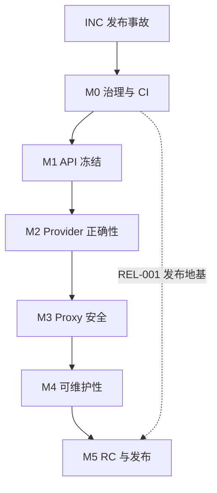

# llmrust SPCC 0.1.3 项目规格

> **文档编号**：`LLMRUST-SPCC-013`  
> **状态**：`ACTIVE SSOT — M1 DONE（public API freeze 生效）；0.1.3 发布决策（A 栏过堂）待 Owner 拍板`  
> **目标版本**：`llmrust 0.1.3`  
> **审计基线**：GitHub `main` @ `3d0734ac711de3aadf16331c0f9c21b1634a83a8`  
> **规格版本**：`0.3`（SPEC-002：登记母规范 `docs/spcc.md`，吸收设计小样与守恒清单制度）  
> **编制日期**：`2026-07-13`；**最近修订**：`2026-07-24`  
> **母规范**：`docs/spcc.md`（通用 SPCC 方法论 v1.0，2026-07-24 经 SPEC-002 登记入库）  
> **仓库路径**：`docs/SPCC-0.1.3.md`

本文件是 llmrust 0.1.3 的已批准项目级 SPCC。`SPEC-000` 合入仓库后，它成为仓库内的单一事实源（SSOT）。在入库前只允许执行无代码分支的 Incident 任务；不得创建业务实现分支或编写业务代码。

本文同时约束人类与 AI agent。任何参与者都不得以“自动生成”“只是重构”“顺手修复”“先让 CI 绿”为理由绕过任务边界。

## 0.5 规格勘误表

| 编号 | 日期 | 事实 | 处置 | 责任任务 |
|---|---|---|---|---|
| `E-001` | 2026-07-24 | 全量审计发现：`proxy::tests::serve_starts_and_answers_health` 与 `serve_with_bearer_requires_auth` 使用 `reqwest::Client::new()`，在启用系统代理（含 Windows 注册表代理）的机器上回环请求被代理劫持，返回 502 造成环境性假失败；`.no_proxy()` 客户端可复现 200。不影响 CI（ubuntu 无系统代理），不影响生产代码。 | 记录为测试健壮性缺陷；修复并入架构/测试守卫任务，不单独开卡 | `CI-003`（或其实现期一并修复为 `no_proxy` 客户端） |
| `E-002` | 2026-07-24 | 全量审计发现：`RetryProvider` 每次重试都会重新进入 Provider，导致 `warn_if_unsupported_n` 的"n>1 一次性警告"被放大为逐次重试重复打印。纯日志噪音，无功能影响。 | 已修复（API-003，PR #111：`warn_if_unsupported_n` 进程级 `(provider,n)` 去重）；429 文档漂移同单对齐 | `API-003` |
| `E-003` | 2026-07-24 | 全量审计（Kimi，2026-07-24，fmt/clippy/全量测试复核）确认本规格 §14 审计问题映射依然成立：Anthropic/Gemini 流式吞错（`anthropic.rs` / `google.rs` 对 malformed data 返回空 Vec）、capabilities 与实现漂移（Gemini seed/penalties、Ollama top_p、Retry 429、Anthropic response_format 文档自相矛盾）、`ThinkingConfig` 请求侧无 Provider 落地、`/health` 认证行为与文档冲突、Router 单计数器跨组干扰。技术任务卡无需重排。 | 无新增任务；既有任务卡继续有效 | `STR-002A/G`、`CAP-001`、`API-003`、`REA-*`、`PRX-002`、`RTR-001` |
| `E-004` | 2026-07-24 | API-001 三方事实表确认：AGENTS.md 称 `FinishReason` 变体"cross-provider"暗示可扩展，但代码非 `#[non_exhaustive]`，0.1.x 内加变体 = 破坏性变更；且事后补 `#[non_exhaustive]` 对穷尽匹配的下游同样破坏。架构师裁定（PR #101）：改文档不改代码，措辞澄清为"变体语义跨 provider 共享、集合 0.1.x 冻结、扩展只能进 0.2"；`ChatResponse`/`ThinkingConfig` 同逻辑冻结，0.2 再评估。 | 文档措辞修正并入 DOC-001；0.2 评估项记技术债 | `DOC-001` |
| `E-005` | 2026-07-24 | 治理违规（架构师 Kimi 自查 + Owner 指正）：REL-001、API-002、API-003 三单均属 §10.1 定义的中大型任务（触及公开行为/安全默认值，diff >200 行），执行令却连续标注"CI-002 级、执行令代行设计小样"，系统性绕开设计小样闸门。事后评审证据链完整（各 MUST 条款均抓到真实问题），交付物质量不受影响，但"设计先行"闸门被架空。处置：① 三单追认交付有效，**逐案注明不设先例**；② API-003 立即停手补样（#106 评论 5071108701），设计小样 APPROVE 后方可提交实现 PR；③ §10.1 增防呆条款（见下）；④ 架构师状态汇报两次未核验失言（CI-002 期"未跟踪文件还在"、误报合并完成）一并入档。 | 本表登记 + §10.1 防呆条款 + API-003 补样流程 | `SPEC-003`（本 PR） |

---

## 0. 文档权威、适用范围与状态

### 0.1 适用范围

本规格覆盖：

- 0.1.3 安全事故处置与发布完整性恢复；
- Rust 公开 API 与 semver 治理；
- Provider 请求、响应、usage、tools、reasoning 与 streaming 契约；
- OpenAI/Anthropic 兼容代理的安全与协议行为；
- 模块职责、内部依赖允许清单与大文件治理；
- CI、供应链、发布、Issue、PR、评审、合并和回证流程；
- 0.1.3 的阶段、任务依赖、允许范围与验收标准。

### 0.2 权威顺序

出现冲突时按下列顺序处理：

1. Owner 对目标、范围和风险的书面裁定；
2. 母规范 `docs/spcc.md`（通用 SPCC 方法论，跨项目复用的程序性规则）；
3. 本规格最新已批准版本（项目 SSOT，含 0.1.3 专属范围、任务与验收）；
4. `docs/CONTRACTS.md` 与项目内已批准的专用协议规格；
5. 公开 API 测试、契约测试与 wire fixtures；
6. 代码实现；
7. README、示例、能力表和注释。

母规范与本规格冲突时，以本规格的项目化选择为准并显式注明；母规范中本规格原先未覆盖的程序性规则（设计小样、守恒清单、文档失实定级等）自 SPEC-002 起生效，落地条款见 §10.1 与 §13。

“代码现在就是这样”不构成保留错误行为的理由。发现上层与下层事实冲突时立即熔断，由架构师提出规格勘误或实现修复，不允许执行者自行选择解释。

外部供应商协议以对应供应商的官方版本化文档和真实响应证据为准。引用外部协议的任务必须记录核验日期；不得凭记忆实现。

### 0.3 规格变更

- 只有 Owner 能批准目标、非目标、阶段和任务范围变更。
- 架构师可提出规格 PR，但不能自行宣布生效。
- 任何新增任务、依赖边、例外或公开行为变更必须先修改本规格，再修改代码。
- 规格变更使用 `SPEC-*` 任务 ID；规格 PR 不得夹带业务实现。
- 已发生的事实和已合入历史不得重写；错误以勘误、补账或事故记录修正。

### 0.4 状态词

| 状态 | 含义 |
|---|---|
| `DRAFT` | 正在评审，尚未授权执行 |
| `READY` | 前置条件满足，可由架构师下发 |
| `ACTIVE` | 唯一执行者正在实施 |
| `BLOCKED` | 缺少外部条件或 Owner 裁定 |
| `REVIEW` | PR 已就绪，等待架构师裁决 |
| `DONE` | 已合入、回证完整且任务关闭 |
| `REJECTED` | 方案或实现被否决，不得继续沿用 |

---

## 1. 项目定位与 0.1.3 成功定义

### 1.1 项目定位

llmrust 是一个以 Rust 为核心的统一 LLM SDK，并可选提供 OpenAI/Anthropic 兼容 HTTP 代理。项目面向人类开发者与 AI agent 协作，优先保证：

- 公开行为清晰、可测试、可追溯；
- Provider 差异显式建模，不静默降级；
- 流式协议只有一种可理解的终止语义；
- 默认配置安全；
- 源码能够作为下一位维护者和 agent 的可靠文档；
- 发布物可从受保护的 Git 提交复现。

### 1.2 0.1.3 目标

| ID | 目标 | 可验证结果 |
|---|---|---|
| `G-01` | 恢复发布链可信度 | 0.1.3 只能由受保护 tag 流水线从干净提交发布；产物无秘密和本地杂项 |
| `G-02` | 冻结并守住 0.1.x Rust API | 完成公开 API 清单；0.1.3 不新增源码破坏；意外 semver 破坏由 CI 阻断 |
| `G-03` | 修复流式语义 | 每次成功流恰好一个 terminal chunk；terminal 汇总 finish、usage、tools 和 reasoning 状态 |
| `G-04` | 让 reasoning/cache 行为真实可信 | 现有类型可表达的路径完成闭环；不可无损表达的路径明确 Unsupported；不再静默忽略或丢数据 |
| `G-05` | 收紧代理默认安全 | 无认证默认无跨域；公网监听强制认证；健康检查和错误行为固定并测试 |
| `G-06` | 冻结维护热点并形成拆分蓝图 | 超大文件不再增加职责；proxy/provider/types/router 的后续拆分有逐任务方案，但 0.1.3 不夹带大规模搬迁 |
| `G-07` | 建立机器门禁 | 格式、lint、测试、MSRV、架构、供应链、secret、package、semver 和 release 全部不可绕过 |

### 1.3 0.1.3 非目标

在本规格关闭前，以下内容均不进入 0.1.3：

- 新增 Provider；
- 新增 Batch、Assistants、Realtime、Files 等上游产品 API；
- 新增 GUI、控制台或持久化数据库；
- 以性能为目的的大规模重写或更换 HTTP/异步运行时；
- 扩大代理为完整生产网关（计费、租户、数据库、复杂限流等）；
- 未直接服务于本规格的依赖升级或代码美化；
- 为追求目录“像某个标杆项目”而机械搬迁代码。

发现非目标需求时，记录到 0.3+ 候选清单，不得夹入整改 PR。

---

## 2. 治理结构与权限

### 2.1 三权分立

| 角色 | 唯一职责 | 禁止事项 |
|---|---|---|
| Owner | 决定目标、优先级、风险接受、规格生效、版本发布和最终否决 | 不在普通任务中直接写码、合并或替执行者修 CI |
| 架构师 | 唯一拆解任务、维护 SPCC、评审方案与实现 PR、裁定 APPROVE/CHANGES/REJECT、授权合并 | 不编写自己评审任务的产品代码或代替 Owner 扩范围 |
| 执行者 | 唯一进行实现任务内操作：写码、测试、推实现分支、建实现 PR、获授权后合并 | 不改 SPCC、不扩范围、不自行批准或提前合并 |

角色是权限而不是身份标签。同一人或同一 agent 可以在不同任务中切换角色，但**同一产品实现任务内不得兼任架构师与执行者**。SPCC 初次入库、规格勘误和合并后状态回证属于架构师治理职责，不属于产品实现；由架构师直接创建治理分支/PR并维护，执行者只提交实现和证据，不编辑 SPCC。每个阶段开始前由架构师维护本文件角色登记表，Owner 只确认方向性角色变更。

| 阶段 | Owner | 架构师 | 执行者 | 状态 |
|---|---|---|---|---|
| 事故处置 | llmrust Owner（用户） | Codex | Grok | `DONE` — `INC-001`、`INC-002` 均已通过 |
| Phase 0–2 | llmrust Owner（用户） | Kimi | CodeBuddy | `M1 DONE` — public API freeze 生效；0.1.3 发布决策待 Owner 过堂 |
| Phase 3–5 | llmrust Owner（用户） | Kimi | CodeBuddy | `BLOCKED` — 等待前置阶段 |

本轮角色于 2026-07-13 由 Owner 指定，并于 2026-07-14 明确治理写权限。**2026-07-24 角色更换（SPEC-001，Owner 批准）**：前任架构师 Codex 的计划代理失效，Owner 指定 Kimi 接任唯一架构师，CodeBuddy 接任唯一执行者；历史任务（`INC-001`、`INC-002`、`SPEC-000`、`CI-001`）中 Codex/Grok 的裁定与回证继续有效，不回溯改写。自生效时起：Kimi 负责 SPCC 的持续更新、任务状态、里程碑、证据账本、规格勘误及对应治理 PR；CodeBuddy 负责 Kimi 下发的产品代码、配置、测试和实现文档任务。Kimi 不代写自己将要评审的产品实现，CodeBuddy 不修改 SPCC。若需更换任一角色，由 Owner 决定方向，Kimi 负责把决定写入本表并记录生效时间。

Owner 不填写技术审计模板、不运行技术命令、不解释 scanner/CI/依赖/API 细节，也不在多个实现方案之间代替架构师作技术选择。执行者负责产出技术证据，架构师负责把证据裁定为 PASS/BLOCKED/REJECT，并向 Owner 只汇报：结果、用户/业务影响、剩余风险和明确建议。只有方向、范围、发布时间、成本或风险接受发生实质变化时，才请求 Owner 裁决；请求必须使用非技术语言解释“这是什么、为什么需要决定、各选项后果、架构师建议”。

### 2.2 安全事故 Break-glass

凭证撤销、账户冻结和阻止正在发生的未授权发布不受“先建 Issue/PR”限制，因为这些动作不修改仓库代码且延迟会扩大损害。

Break-glass 规则：

1. 凭证或账户控制者立即止血；
2. 不在公开记录中复制秘密；
3. 24 小时内建立脱敏事故记录和补救任务；
4. 后续代码、CI、文档和发布流程变更仍必须走任务与 PR；
5. Break-glass 不能用于直推主干、跳过测试或发布未经审查的 crate。

### 2.3 熔断条件

满足任一条件立即暂停当前任务：

- 发现新秘密、未授权发布或未知 crates.io owner；
- 任务需要触碰允许范围外文件；
- 需要新增未批准内部依赖边；
- 公开行为与规格冲突且任务未授权改变该行为；
- CI 门禁缺失、失效或无法复现；
- PR 出现无法解释的额外 commit、脏工作区或来源不明生成物；
- 连续两个 PR 发生同类越界；
- 供应商官方协议与现有规格不一致。

熔断后只能：收集证据、报告、修正规格或补门禁。不得继续扩大实现。

---

## 3. 审计基线与发布冻结

### 3.1 已知基线

| 项目 | 审计事实 |
|---|---|
| GitHub 基线 | `main` @ `3d0734ac711de3aadf16331c0f9c21b1634a83a8` |
| 仓库版本 | `Cargo.toml = 0.1.1` |
| crates.io/docs.rs 最新发布 | `0.1.2` |
| 0.1.2 可追溯性 | 发布自 dirty 工作区；GitHub 无对应 `v0.1.2` tag |
| 安全事件 | 0.1.2 包含不应发布的日志，日志中出现 crates.io 发布凭证；本规格不复述凭证 |
| API 状态 | 0.1.2 对 `Usage`、`StreamChunk` 做了 patch 级源码破坏性变更 |
| 功能状态 | reasoning/cache 只部分落地，存在“公开 API 看似支持、Provider 实际忽略”的路径 |
| CI 状态 | 编译、测试、Clippy、rustdoc、fmt、dry-run、MSRV 已存在；缺安全、semver、secret、package 完整性和 tag-only release 门禁 |

基线证据：

- [llmrust GitHub 仓库](https://github.com/llmrust/llmrust)
- [crates.io/docs.rs 0.1.2 发布物目录](https://docs.rs/crate/llmrust/0.1.2/source/)
- [0.1.2 `.cargo_vcs_info.json`](https://docs.rs/crate/llmrust/0.1.2/source/.cargo_vcs_info.json)
- [引入 reasoning/cache 公开类型变更的 PR #80](https://github.com/llmrust/llmrust/pull/80)
- [Cargo 官方发布规则：已发布版本不能覆盖或删除](https://doc.rust-lang.org/cargo/reference/publishing.html)

安全证据只引用发布物目录，不在规格中直链或复述含凭证的日志内容。

### 3.2 版本处置原则

crates.io 上的 `0.1.2` 已永久占用，不能用干净产物覆盖重发。即使执行 yank，原始代码仍会保留；yank 只阻止新的依赖解析选择该版本，不破坏已经锁定它的 `Cargo.lock`。

因此本轮版本号确定为 **0.1.3**：它是 0.1.2 的干净纠偏版，不代表项目进入新的 0.2 产品阶段。0.1.2 作为事故版本保留事实记录，不补造事后 tag，不把其他提交冒充为原发布源码。

### 3.3 发布冻结

在 `INC-001`、`INC-002`、`CI-002`、`REL-001` 完成前：

- 禁止执行任何 `cargo publish`；
- 禁止创建新版本 tag 或 GitHub Release；
- 禁止使用 `--allow-dirty`；
- 禁止通过命令行参数传递 crates.io token；
- 禁止把 token、发布命令完整输出或事故原始日志复制到 Issue/PR；
- 允许执行不上传的 `cargo package`、`cargo publish --dry-run` 和本地扫描。

### 3.4 P0 关闭证据

Owner 已确认涉事 token 于 2026-07-13 撤销。`INC-001` 仍需补齐以下其余脱敏证据后才能关闭：

- crates.io owner 列表和近期版本已核验；
- 是否发现未授权动作；
- 其他复用位置已轮换；
- 原始 `.crate` 已留证并完成 secret scan。

Owner 已于 2026-07-13 明确授权 `yank 0.1.2`。`INC-002` 只有在 crates.io 显示该版本已 yanked，并记录执行时间与验证结果后才能关闭。yank 不会删除原始发布物；不得把它描述为删除或覆盖。

---

## 4. 架构职责与内部依赖允许清单

### 4.1 分层

| 层 | 目录/文件 | 唯一职责 |
|---|---|---|
| `L0 Domain` | `src/types.rs` | 跨 Provider 的稳定领域类型与序列化语义 |
| `L1 Contract` | `src/providers/mod.rs` | `Provider` trait、统一错误和 Provider 配置契约 |
| `L2 Transport` | `src/providers/*` | 上游 wire DTO、请求映射、HTTP/SSE/NDJSON 解析和 Provider 实现 |
| `L3 Orchestration` | `src/lib.rs`, `src/router.rs`, `src/pricing.rs`, `src/prelude.rs` | Provider 注册、模型路由、重试/故障转移、聚合和便利 API |
| `L4 Proxy` | `src/proxy/*` | 外部 OpenAI/Anthropic HTTP 边界、认证、CORS、DTO 转换和 SSE 输出 |
| `L5 Verification` | `tests/*`, `examples/*`, `docs/*`, `.github/*` | 契约验证、示例、能力声明、CI 和发布治理 |

### 4.2 允许边

内部依赖采用默认拒绝。允许边仅有：

| 来源 | 允许依赖 |
|---|---|
| `L0 Domain` | 无内部层；只可依赖标准库及已批准的轻量序列化类型 |
| `L1 Contract` | `L0 Domain` |
| `L2 Transport` | `L0 Domain`、`L1 Contract`、同层共享 `http`/`stream_util` |
| `L3 Orchestration` | `L0 Domain`、`L1 Contract`、按注册需要依赖 `L2 Transport`；`router` 可依赖 `LmrsClient` |
| `L4 Proxy` | `L0 Domain`、`L1 Contract`、`L3 Orchestration`、`proxy` 内部模块 |
| `L5 Verification` | 通过 crate 公开 API 验证所有层；架构检查可读取源码文本 |

### 4.3 明确禁止边

- `types.rs` 不得依赖 provider、client、router 或 proxy；
- Provider 不得依赖 proxy 或 router；
- `http.rs`、`stream_util.rs` 不得依赖具体 Provider；
- `lib.rs`、默认 feature 和核心类型不得依赖 Axum/Tower 等 proxy-only 依赖；
- 上游 wire DTO 不得进入 `types.rs`；
- proxy wire DTO 不得成为核心 Provider 契约；
- 文档或 capabilities 文件不得反向驱动运行时逻辑，除非另有生成任务批准；
- 新模块默认零允许边，必须先通过 `SPEC-*` 修改本表。

### 4.4 边界机器守卫

Phase 0 必须加入可证伪的架构测试，至少覆盖：

- 禁止层级 import；
- `default = []` 且默认构建不引入 proxy-only 依赖；
- 生产源码文件超过 800 行时禁止净增长，除非任务明确授权拆分过渡；
- `src/proxy/mod.rs`、`src/proxy/anthropic_proxy.rs`、`src/providers/compat.rs`、`src/providers/google.rs`、`src/types.rs`、`src/providers/anthropic.rs`、`src/router.rs` 纳入存量超限台账；台账只准减少；
- 人为加入一条禁止依赖或让超限文件增长时，CI 必须失败，并在测试中保存复现说明。

不得为了通过守卫创建新的 `common.rs`、`shared.rs` 或万能工具层。共享抽象必须有单一职责和至少两个真实消费者。

---

## 5. Rust 公开 API 与契约演进

### 5.1 基本规则

0.1.3 是恢复性 patch release，**不允许新增任何有意的 Rust 源码破坏或序列化形状破坏**。0.1.2 已经造成的兼容性问题作为事故事实单独记录，但不得在 0.1.3 中继续扩大。安全默认值、错误处理和“静默成功改为明确失败”等纠偏行为，只能限于本规格已列明的问题并在 CHANGELOG 中突出说明。需要重新设计公开类型的工作推迟到未来经 Owner 单独批准的版本。

以下均属于公开契约变更：

- 新增、删除或修改 public struct 字段；
- 新增 enum variant；
- 修改 trait 方法、约束、关联类型或 object safety；
- 修改构造器、builder、错误类型或 re-export；
- 修改 Serde 字段名、tag、默认值、缺省/未知字段策略；
- 修改 proxy JSON/SSE、环境变量、默认监听或认证行为；
- 修改 MSRV、default features 或默认依赖集合。

### 5.2 Rust 特有红线

- 给可穷尽公开 struct 新增字段是源码破坏，不得称为“additive 零破坏”；
- 给可穷尽 enum 新增 variant 可能破坏下游 `match`；
- 给 public trait 新增无默认实现的方法是破坏性变更；
- `#[serde(default)]` 只能改善部分反序列化兼容性，不代表 Rust API 或所有 JSON 消费者兼容；
- `#[non_exhaustive]`、私有字段、构造器/builder、新类型或带逃生口的 `Other(String)` 是可选演进手段，但必须逐类型裁定；
- 不得用 `#[allow]`、模糊泛型、`serde_json::Value` 或 `extra` 掩盖应当明确建模的跨 Provider 核心语义。

### 5.3 0.1.3 类型冻结策略

`API-001` 必须产出完整 public API 清单并逐项分类。0.1.3 的最低要求：

- 保留已发布 0.1.2 的 `Usage`、`ChatResponse`、`StreamChunk` 字段和序列化形状，不删除、不改名、不改变既有字段语义；
- 0.1.3 不通过新增 `#[non_exhaustive]`、私有化字段或替换类型制造新的下游编译失败；
- 可以添加不破坏现有调用的构造器、builder、测试和文档；
- 对扩展频繁但当前不可安全演进的响应类型建立技术债台账，在 0.1.x 内冻结字段集合；
- `FinishReason` 等可能扩展的 enum 保留未知值逃生口，并测试未知值往返；
- `Provider` trait 的变更必须同时验证所有原生 Provider、OpenAI-compatible 包装器和 `RetryProvider`；
- proxy DTO 是否属于承诺的 Rust API 必须明确；不承诺时应缩小可见性，承诺时纳入 semver 检查。

0.1.3 新增 `COMPATIBILITY-0.1.3.md`，说明 0.1.1、受污染的 0.1.2 与干净 0.1.3 的关系，并明确“0.1.3 不要求新的源码迁移”。若实际出现必须迁移的变化，任务立即熔断并回到 Owner，而不是补写迁移文档把破坏合理化。

### 5.4 Semver 门禁

- 0.1.3 开发期：同时以 0.1.1 干净源码与 crates.io 0.1.2 发布物生成 API 差异报告；
- 相对 0.1.2 不允许新增破坏；相对 0.1.1 的既有差异只记录为继承事故，不得继续扩大；
- `SPEC-000` 合入即冻结 public API；任何新增破坏必须回到 Owner，并默认移出 0.1.3；
- 0.1.3 发布后：CI 以 0.1.3 为 baseline 运行 `cargo-semver-checks`，失败即阻断；
- patch 版本不得包含工具判定的 major/minor 级破坏；不得以“CI 其他项全绿”覆盖 semver 红灯。

---

## 6. Provider、Reasoning、Usage 与 Streaming 契约

### 6.1 字段处理三态

对 `ChatRequest` 的每一个可选字段，每个 Provider 必须且只能选择一种状态：

1. `Mapped`：映射到已核验的上游字段，并有请求 fixture 测试；
2. `Unsupported`：在发起网络请求前返回 `LlmError::Unsupported`；
3. `NotApplicable`：语义对该 Provider 不适用，且 API 层不允许用户对其设置。

**禁止静默忽略已设置字段。** 兼容端点的 `extra` 是显式逃生口，不得用于伪装一等能力，也不得自动传播到 Anthropic、Gemini、Ollama。

### 6.2 Provider 能力声明

能力声明必须区分：

- `implemented`：llmrust 已映射并有本地契约测试；
- `verified`：在指定日期通过真实上游或官方 fixture 验证；
- `model_dependent`：端点支持但模型可能不支持；
- `unsupported`：主动返回 Unsupported；
- `passthrough_only`：仅可通过显式 `extra` 使用，不算一等支持。

README 中的 ✅ 只能用于 `implemented=true`；“已支持”不得仅凭字段存在、Serde 能解析或上游理论支持。

### 6.3 Reasoning/Thinking 契约

0.1.3 使用统一概念名 `reasoning`；provider wire 层可继续使用 `thinking`、`reasoning_content` 等官方字段名。禁止把某一供应商字段名直接提升为跨 Provider 语义。

0.1.3 不为 reasoning 再次修改公开响应类型。必须满足：

- 设置 reasoning 后，支持的 Provider 必须真正写入请求体；不支持的 Provider 必须返回 Unsupported；
- `ChatResponse` 当前不能无损表达独立 reasoning，因此 0.1.3 的非流 `chat` 在 reasoning 启用时必须于发网前返回 Unsupported；不得把 reasoning 混入普通 content；
- 原始 `stream` 可使用 0.1.2 已发布的 `StreamChunk.thinking`/`thinking_done` 返回 reasoning，顺序不得重排；
- reasoning 结束最多标记一次；terminal 之后不得出现 reasoning；
- `stream_collect_full` 发现 reasoning 时不得丢弃；在现有 `ChatResponse` 无法承载时返回明确错误，并引导调用方消费原始 stream；
- OpenAI 与 Anthropic proxy 只有在不改变已承诺 Rust DTO 且目标 wire 能无损表达时才可透传 reasoning；否则请求必须返回协议一致的 Unsupported 错误；
- reasoning token 只在上游明确报告时填充，不推算、不与普通 completion token 重复计算；
- 每个 Provider 的请求、非流 Unsupported、原始流、usage、聚合拒绝和 proxy 六条路径必须分别测试；
- 未核验的 OpenAI-compatible 第三方端点不得继承 OpenAI 的 reasoning 支持声明。

供应商具体映射必须在实施任务中根据官方协议核验。未完成核验前，能力表保持 `unsupported` 或 `passthrough_only`，不得猜测。

### 6.4 Usage 契约

- `prompt_tokens`、`completion_tokens`、`total_tokens` 沿用既有语义；
- `cache_read_tokens`、`cache_write_tokens`、`reasoning_tokens` 只映射供应商明确字段；
- 缺失值用 `None`，真实零值用 `Some(0)`，不得混淆；
- 若上游 total 与分项不相等，保留上游 total，不自行修正，并允许 debug 级结构化告警，但不得记录内容；
- non-stream 与 stream_collect_full 对同一 fixture 的最终 usage 必须一致；
- proxy usage 转换不得丢失协议允许表达的字段；协议无法表达时必须在契约和能力表中明确，而不是静默宣称等价。

### 6.5 成功流状态机

成功流必须遵循：

```text
START -> CONTENT/REASONING/TOOL (0..N) -> TERMINAL (恰好 1 次) -> CLOSED
```

约束：

- terminal 前可有零个或多个内容、reasoning 或 tool 增量；
- terminal chunk 必须 `done = true`，并汇总可用的 `finish_reason`、`usage`、完整 tool calls 和 reasoning 完成状态；
- 所有非 terminal chunk 必须 `done = false`；
- terminal 后不得再产出成功 chunk；
- `[DONE]`、`finish_reason` chunk、usage-only chunk 和供应商 stop event 都只是上游信号，不得各自生成多个 llmrust terminal；
- 消费者在看到唯一 terminal 后即可安全停止，不会错过 usage；
- 空增量可以承载有意义的协议状态，但不得用空成功 chunk 掩盖解析失败；
- SSE 同时接受合法的 `data:` 与 `data: `；ping/comment 等协议允许事件必须显式分类。

### 6.6 错误流

- 建连时 4xx/5xx 直接返回 `Err`，不得伪装为成功 stream；
- 中途 malformed JSON 返回 `LlmError::Parse`；
- 上游显式 error event 映射为 `Api` 或 `Stream`；
- 禁止 Anthropic/Gemini 或任何 Provider 对无法解析的 data event 返回空 Vec；
- error 后流关闭，不再产生 terminal success；
- proxy 将中途错误输出为对应协议 error SSE，然后结束连接；不得输出成功 completion。

### 6.7 Provider 最低契约测试矩阵

每个 Provider 至少覆盖：

| 路径 | 必测项 |
|---|---|
| request | model、system、sampling、tools、reasoning、extra/unsupported |
| chat | 多文本块、finish reason、tools、usage、reasoning、错误体 |
| stream | 文本、reasoning、tool fragments、usage 时序、唯一 terminal、malformed data |
| embeddings | 支持时顺序/usage/错误；不支持时统一 Unsupported |
| logging | key、prompt、response、tool args、图片、向量和完整 URL 均不泄露 |
| proxy | Provider 结果到 OpenAI/Anthropic wire 的无损或已声明有损转换 |

本地 fixture 测试是 PR 必需项；真实 Provider smoke test 是发布前与定时验证项，不能代替本地测试。

---

## 7. Proxy 安全与线协议

### 7.1 默认安全

- `router()` 无认证模式默认**不发送允许跨域的 CORS 响应头**；
- CORS 必须通过显式配置启用，默认 allowlist 为空；
- `Access-Control-Allow-Origin: *` 仅在认证开启且 Owner 明确接受风险时允许；
- 无认证仅允许 loopback bind；公网或非 loopback bind 必须配置非空认证 token；
- 空 token、纯空白 token 或无法安全解析的 token 在启动时失败；
- token 比较使用成熟、经审查的常数时间实现，不自造不完整密码学辅助函数；
- 默认示例监听 `127.0.0.1:3000`，公开监听必须显式设置地址与 token；
- proxy 设定请求体上限，并对超限返回协议一致的 4xx；
- TLS 不由 llmrust 内建终止；公网部署文档必须要求受信 reverse proxy/TLS。

### 7.2 `/health` 契约

0.1.3 选择公开 liveness：

- `/health` 无需认证；
- 只返回进程存活和固定版本信息，不返回 Provider 名称、模型、key 状态、上游连通性或配置；
- `/health` 不触发任何上游请求；
- 其他业务端点遵循认证配置；
- router、middleware、文档和集成测试必须一致。

若未来需要 readiness，另设受保护端点，不扩展 `/health` 的敏感含义。

### 7.3 OpenAI/Anthropic 代理契约

- `model` 继续使用 `provider/model`，分隔符不变；
- OpenAI chat 的 `n` 只接受缺省或 1，其他值在请求上游前返回 400；
- OpenAI stream 的 role 只在首个 delta 输出；使用 `[DONE]` 结束；usage-only chunk 只在请求包含 `include_usage` 时产生；
- Anthropic stream 事件顺序必须满足其消息/content block 生命周期；
- tool call id、arguments 和 content block index 必须稳定；
- reasoning 若目标协议可以表达则按官方格式映射；无法表达时返回明确 Unsupported 或记录为已声明有损路径；
- 错误体、HTTP 状态和 SSE error 均有 golden fixtures；
- proxy 不得把服务器端 key、完整上游 URL、prompt 或响应正文写入日志。

---

## 8. 文档、能力元数据与可观察性

### 8.1 文档同 PR

改变公开 API、协议、能力、环境变量、feature、默认值或安全行为时，同一 PR 必须更新：

- `README.md` 与适用时的 `README.zh-CN.md`；
- `CHANGELOG.md`；
- `docs/CONTRACTS.md`；
- `docs/CAPABILITIES.md`；
- `llmrust.capabilities.json`；
- 相关示例和 rustdoc；
- 0.1.3 期间的 `COMPATIBILITY-0.1.3.md`。

不适用项必须在 PR 中说明，不允许默默省略。

### 8.2 能力元数据

- `llmrust.capabilities.json` 的 schema 版本与 crate 版本分开；
- crate version 必须与 `Cargo.toml` 一致；
- Retry 策略、Provider 字段支持、reasoning 和 embeddings 声明必须由测试验证；
- 人类表格与机器 JSON 至少有一条自动一致性检查；
- 能力声明包含 `implemented`、`verified_at`、`model_dependent` 和说明，不再用单一布尔值掩盖条件支持；
- 0.1.3 发布前不得存在“代码未映射但能力表写支持”的条目。

### 8.3 日志红线

永不记录：API key、认证 header、prompt、message content、response text、request body、tool arguments、图片数据、embedding 输入/向量、完整 URL、reasoning 内容。

允许记录：Provider 标识、脱敏 model、状态码、耗时、计数、长度、错误种类、retry attempt、router group。自定义 `Debug` 必须掩码所有 secret-bearing 字段。

---

## 9. CI、供应链与发布门禁

### 9.1 PR 必过门禁

| 门禁 | 最低要求 |
|---|---|
| Format | `cargo fmt --check` |
| Build | `cargo build --all-targets --all-features` 与默认 feature build |
| Test | `cargo test`、`cargo test --all-features` |
| Lint | `cargo clippy --all-targets --all-features -- -D warnings` |
| Docs | `RUSTDOCFLAGS=-D warnings cargo doc --no-deps --all-features` |
| MSRV | 固定 Rust 1.86，覆盖 all targets；MSRV 变更必须是独立任务 |
| Architecture | 依赖允许边、default feature、超大文件台账、文档一致性 |
| Supply chain | RustSec、许可/来源策略、锁文件一致性；所有豁免带到期条件 |
| Secrets | 全历史增量与工作树扫描；合成凭证 fixture 能让门禁失败 |
| Package | `cargo package --list` allowlist、`cargo package`、解包后二次 secret scan |
| Semver | 同时对比 0.1.1/0.1.2；相对 0.1.2 零新增破坏；0.1.3 发布后以其为新 baseline |

工作流必须取消同分支旧 run。所有 GitHub Actions 固定到完整 commit SHA，并用注释标出对应版本。工具链版本写入仓库，不允许 `stable` 漂移成为唯一依据。

### 9.2 发布包允许内容

允许模式只包含：

- Cargo 清单与锁文件；
- `src/**`、经批准的 `tests/**`、`examples/**`、`docs/**`；
- README、CHANGELOG、许可证、SECURITY、CONTRIBUTING、AGENT 文档；
- `llmrust.capabilities.json`；
- 明确批准的构建元数据。

明确禁止：

- `*.log`、`.env*`、shell history、编辑器文件、临时报告、coverage 原始文件；
- token、key、Authorization 值和带 secret 的命令行；
- `.git/**`、本地 target、未追踪文件；
- 与 tag 提交不一致的本地 `Cargo.toml.orig`。

allowlist 变更必须作为独立、可审查 diff；禁止为了让未知文件通过而扩大为 `**/*`。

### 9.3 Tag-only 发布

0.1.3 发布必须满足：

1. 版本 PR 更新 Cargo.toml、锁文件、CHANGELOG、capabilities、兼容性说明和 release checklist；
2. 主干 CI 全绿且工作区可由 commit 完整重建；
3. Owner 授权创建受保护的 annotated `v0.1.3` tag；
4. Release workflow 验证 tag、crate version、CHANGELOG 和 capabilities version 一致；
5. workflow 从 tag checkout，验证 `git diff --exit-code` 和无未追踪文件；
6. 生成 crate、内容清单、hash、SBOM/provenance，并执行 secret scan；
7. 只使用平台 secret 或受支持的短期/可信发布身份；禁止 `cargo publish --token ...` 出现在日志或脚本；
8. 发布后验证 crates.io/docs.rs 对应 tag SHA，并创建 GitHub Release；
9. 任一步失败不得用本地手工 publish 补发。

### 9.4 豁免

安全公告、依赖来源、文件大小或工具误报的豁免必须包含：

- 风险描述；
- 为什么当前不能修；
- 影响范围；
- Owner 批准；
- 责任任务；
- 明确到期条件和复议日期。

无期限豁免禁止合入；台账只准减少。

---

## 10. 任务、分支、PR 与合并纪律

### 10.1 开工条件

任务必须同时满足：

- 状态为 `READY`；
- 前置任务为 `DONE`；
- Issue 已镜像自包含执行令；
- 执行者从 `fetch` 后的最新 `origin/main` 创建分支；
- 工作区干净；
- 架构师明确下发任务。

中大型任务必须先完成推演报告。推演只允许读取和记录证据，不建实现分支、不写业务代码。

**设计小样闸门（SPEC-002 起生效，吸收自母规范 §五）**：中大型任务（预计人工 diff >200 行，或触及公开行为、wire 协议、安全默认值的任务）在写码前，执行者必须向架构师报审设计小样，获准 APPROVE 后方可建分支写码。设计小样必须包含：

**防呆条款（SPEC-003 起生效，E-005 教训）**：每份执行令头部必须显式标注**规模分级**（`S` / `M` / `L`，对齐 §10.3）与**是否触发设计小样闸门**（触发/豁免 + 一句理由）；"CI-002 级"这类类比措辞一律视为无效分级。架构师发令时自查，Owner 与执行者可随时以此条款要求停手补样。

- **问题陈述**：要修什么，第一手证据（文件:行号、复现路径）；
- **方案形状**：关键函数/数据结构/控制流的具体形状，精确到可核验；
- **测试计划**：编号化测试（T-1、T-2…），每条写明场景与断言口径；
- **预算自估**：功能/测试/其他三分解，总量对齐 §10.3 行数预算；
- **守恒清单**：显式列出本次改动**不**改变的公开 API、行为语义与协议承诺；
- **上线影响表**：各 Provider/协议/平台的行为差异如实申报。

架构师裁决可附 MUST 条款与非阻塞观察项；实现 PR 报审时必须逐条回证。未经核准的形状差异 = 偏离，push 前必报。**文档失实**（CHANGELOG、PR Summary、设计文档与最终实现不一致）为阻塞项，与代码缺陷同级处理。小型任务（如 CI-002 级）以执行令自带的执行步骤与 DoD 代行设计小样，不重复报审。

### 10.2 分支与并行

- 一个实现任务 = 一个实现分支 = 一个实现 PR；分支名必须等于任务卡指定值；
- 每个实现 PR 合并后必须再有一个仅更新状态与回证的 `STATE-<任务ID>` PR；这是治理闭环，不计作第二个实现 PR；
- Phase 0–3 因依赖高度耦合，默认严格串行，只允许一个活动实现 PR；
- Phase 4–5 只有依赖完全独立且 Owner 批准时可并行，最多两个活动 PR；
- 无论是否允许实现并行，某任务处于 `MERGED_PENDING_STATE` 时不得下发新的实现任务；
- 新分支必须直接来自最新 `origin/main`，不得从旧 squash 分支派生；
- 特性分支允许 rebase + force-push；主干永久禁止改写和直推，包括 hotfix。

### 10.3 Diff 与大文件

- 手写 diff 目标不超过 400 行；
- 401–800 行必须在开工前提交拆分说明并获架构师批准；
- 超过 800 行默认 REJECT，自动生成物、golden fixtures 或机械迁移必须单独说明；
- 已超过 800 行的生产文件不准增加新职责；触碰时生产代码净行数原则上不得增长，除非任务明确以“先测试后拆分”的短期步骤授权；
- 临时桥、re-export、TODO、lint allow 必须关联拆除任务与截止阶段。

### 10.4 PR 必填内容

每个 PR body 必须包含：

1. 任务 ID；实现 PR 使用 `Refs #N`，状态回证 PR 才使用 `Closes #N`；
2. Summary；
3. 行为变化，或明确写 `none`；
4. 触碰模块与文件清单；
5. 新增内部依赖边及规格条款，或明确写 `none`；
6. 范围外文件及逐项理由，正常情况必须为 `none`；
7. 临时物、拆除任务和期限，或明确写 `none`；
8. 测试与失败先行证据；
9. 本地命令及结果；
10. AI agent、执行者、架构师身份；
11. 安全与日志自查；
12. 文档同步清单；
13. 守恒清单逐条核验（适用设计小样闸门的任务）与文档真实性核对（CHANGELOG/Summary 与最终实现逐字对齐）。

### 10.5 评审与合并

架构师依次检查：范围、依赖、契约、质量、测试、文档、安全、临时物和 CI。范围越界直接 REJECT，不进入代码风格讨论。

只有以下条件全部满足才能授权 squash merge：

- 架构师留下明确 `APPROVE + AUTHORIZE MERGE`；
- 必需 checks 全绿且对应最新 PR head；
- 没有未解决 review thread；
- 本地 HEAD = 远端分支头 = PR head；
- squash subject 明确为 `[任务ID] 短描述 (#PR号)`。

**合并执行口径（SPEC-002 项目化选择，对母规范 §四第 6 条的显式偏离）**：合并令只能由架构师下发（`APPROVE + AUTHORIZE MERGE`），但 squash merge 的按钮动作由执行者在授权后完成；执行者严禁在未获合并令时自行合并。此口径与 §11.1.1 `MERGE_AUTHORIZED` 状态一致。

实现 PR 合并后，任务状态变为 `MERGED_PENDING_STATE`，尚不算 Done。架构师必须从最新主干创建 `state/<任务ID>-closeout`，只允许修改本规格的里程碑仪表盘、任务状态登记表和完成回证账本，并在 PR body 提供：实现 CI run 编号、实现 PR head、merge SHA、主干前进区间、Issue、GitHub Milestone和执行者工作区干净证据。执行者负责提交这些事实证据，但不写状态 PR。

架构师核验实现证据后创建并合并状态 PR。状态 PR 使用 `Closes #N`，squash subject 为 `[STATE-任务ID] Close 任务ID (#PR号)`。状态 PR 合并后，任务才变为 `DONE`，Issue 自动关闭，里程碑计数前进。**状态 PR 是架构师治理动作，不再递归产生新的状态 PR。**

缺少状态回证、Issue 未关闭、里程碑未更新或 SPCC 主干状态不一致，均按流程 bug 处理，并阻断下一个任务。

---

## 11. 0.1.3 阶段与任务清单

### 11.1 状态机与更新责任

#### 11.1.1 任务状态

| 状态 | 谁裁定 | 含义 | 允许动作 |
|---|---|---|---|
| `PLANNED` | 架构师 | 已列入规格但前置未核验 | 只读推演 |
| `BLOCKED` | 架构师 | 有明确阻断条件 | 只处理阻断，不得实现 |
| `READY` | 架构师 | 前置、范围、DoD 和执行令已完整 | 等待正式下发 |
| `ACTIVE` | 架构师下发、执行者回执 | 执行者已从指定基线开工 | 只做任务范围内工作 |
| `REVIEW` | 执行者提交、架构师确认 | 实现 PR 已就绪 | 评审、修订、重跑 CI |
| `MERGE_AUTHORIZED` | 架构师 | 最新 head 已批准合并 | 执行者只能按授权 squash merge |
| `MERGED_PENDING_STATE` | 合并事实触发 | 实现已进主干但状态账未闭合 | 只能创建状态回证 PR |
| `DONE` | 架构师核验、状态 PR 合入 | 代码、证据、Issue、里程碑和 SPCC 一致 | 可解锁后继任务 |
| `REJECTED` | 架构师或 Owner | 方案不可继续 | 关闭分支，必要时重做推演 |

架构师负责**决定并写入状态**。执行者负责提供实现证据，不得编辑 SPCC，也不得自行把任务标为 READY、MERGE_AUTHORIZED 或 DONE。架构师可执行且只执行 SPCC、状态账、规格勘误和治理元数据相关的 GitHub 写操作；产品实现仍由执行者独立完成。

#### 11.1.2 GitHub Milestone 结构

架构师在治理初始化中建立并维护下列七个 GitHub Milestones。每个任务 Issue 只能属于一个 Milestone；实现 PR 使用 `Refs #N`，状态 PR 使用 `Closes #N`。Milestone 的关闭 Issue 数是外部实时进度，本表是主干内的版本化进度。

> **治理状态同步（SPEC-001，2026-07-24）**：前任架构师任期内未实际创建 GitHub Milestones（远端为 0 个），`CI-002` 亦未建立执行令 Issue。Kimi 接任后已于 2026-07-24 补建下列七个 Milestones 并回填既有进度；下表主干记录与 GitHub 侧自该日起保持一致。

| Milestone | 目标 | 完成/总数 | 进度 | 当前状态 | 下一任务 | 退出判据 |
|---|---|---:|---:|---|---|---|
| `0.1.3 / INC Incident` | 清除发布事故影响 | 2/2 | 100% | `DONE` | — | 账户/产物核验完成且 0.1.2 已 yank |
| `0.1.3 / M0 Foundation` | 建立不可绕过的治理与发布门禁 | 5/5 | 100% | `DONE` | — | 五项任务 DONE，负向门禁证据齐全 |
| `0.1.3 / M1 API Freeze` | 冻结 0.1.x 公开 API | 4/4 | 100% | `DONE` | —（已收口） | 相对 0.1.2 零新增破坏，兼容性说明完成 |
| `0.1.3 / M2 Provider Correctness` | 修复流、reasoning、usage 契约 | 0/10 | 0% | `BLOCKED` | `STR-001` | 十项任务 DONE，能力声明与 fixture 一致 |
| `0.1.3 / M3 Proxy Security` | 收紧代理默认安全与 wire 行为 | 0/5 | 0% | `BLOCKED` | `PRX-001` | 五项任务 DONE，安全负例全部通过 |
| `0.1.3 / M4 Maintainability` | 冻结热点、修正 Router 状态并形成拆分蓝图 | 0/4 | 0% | `BLOCKED` | `ARC-001` | 热点守卫、Router 隔离、拆分设计和文档一致性完成 |
| `0.1.3 / M5 Release` | 审计并发布干净 0.1.3 | 0/4 | 0% | `BLOCKED` | `E2E-001` | crates.io/docs.rs/GitHub tag 三方一致 |

进度只按 `DONE / 总任务数` 计算，不按代码行、PR 数或主观百分比估算。Milestone 中任何 P0/P1 回归都会把状态改回 `BLOCKED`，即使百分比已经达到 100%。



#### 11.1.3 任务状态登记表

本表是任务当前状态的唯一主干记录。下方任务卡中的“初始状态”只描述本草案建立时的起点，不参与后续状态判断。

| ID | Milestone | 状态 | 前置 | Issue | 实现 PR | Merge SHA | 状态 PR |
|---|---|---|---|---|---|---|---|
| `INC-001` | INC | `DONE` | 无 | N/A（入库前） | N/A（报告 + 补充扫描） | N/A | N/A（入库前） |
| `INC-002` | INC | `DONE` | `INC-001` | N/A（入库前） | N/A（只读验证） | N/A | N/A（入库前） |
| `SPEC-000` | M0 | `DONE` | INC DONE | N/A（架构治理） | [#81](https://github.com/llmrust/llmrust/pull/81) | `4b9d7cac865db8645cba1946673a172162d739e4` | [#82](https://github.com/llmrust/llmrust/pull/82) |
| `CI-001` | M0 | `DONE` | `SPEC-000` | [#83](https://github.com/llmrust/llmrust/issues/83) | [#85](https://github.com/llmrust/llmrust/pull/85) | `c01239d548d50df4b299e166d67f5faf86d2f24c` | [#86](https://github.com/llmrust/llmrust/pull/86) |
| `SPEC-001` | M0（治理，不计入 M0 任务数） | `DONE` | `CI-001` | N/A（架构治理） | [#87](https://github.com/llmrust/llmrust/pull/87) | `693b705ed29d62eb40b4584c44790a1d80b7a172` | [#89](https://github.com/llmrust/llmrust/pull/89) |
| `SPEC-002` | M0（治理，不计入 M0 任务数） | `DONE` | `SPEC-001` | N/A（架构治理） | [#90](https://github.com/llmrust/llmrust/pull/90) | `541f6725f9a67341905c3a3b05d80768051ea900` | STATE-SPEC-002（本 PR） |
| `SPEC-003` | M1（治理，不计入 M1 任务数） | `DONE` | 无（治理自查） | N/A（架构治理） | [#107](https://github.com/llmrust/llmrust/pull/107) | `725007371dcd453a0978a8aeae759ee88391d9c9` | STATE-SPEC-003（本 PR） |
| `CI-002` | M0 | `DONE` | `CI-001`,`INC-001` | [#88](https://github.com/llmrust/llmrust/issues/88) | [#92](https://github.com/llmrust/llmrust/pull/92) | `dcb4407879e593bc34a8e75d9c97af2e2f7f4bf3` | STATE-CI-002（本 PR） |
| `CI-003` | M0 | `DONE` | `CI-001` | [#94](https://github.com/llmrust/llmrust/issues/94) | [#95](https://github.com/llmrust/llmrust/pull/95) | `5d79224ad2d4b50f1abdd4ca874df94746d7fb69` | STATE-CI-003（本 PR） |
| `REL-001` | M0 | `DONE` | `CI-002`,`CI-003`,`INC-002` | [#97](https://github.com/llmrust/llmrust/issues/97) | [#98](https://github.com/llmrust/llmrust/pull/98) | `415f20b53b874f06d66914455401db579ebad1c6` | STATE-REL-001（本 PR） |
| `API-001` | M1 | `DONE` | M0 DONE | [#100](https://github.com/llmrust/llmrust/issues/100) | [#101](https://github.com/llmrust/llmrust/pull/101) | `5480a136816b9ad7fa3b8c20093225f89de423ed` | STATE-API-001（本 PR） |
| `API-002` | M1 | `DONE` | `API-001` | [#103](https://github.com/llmrust/llmrust/issues/103) | [#104](https://github.com/llmrust/llmrust/pull/104) | `732fae6299ff6c7a74e4ddad72f420e6befeaa37` | STATE-API-002（本 PR） |
| `API-003` | M1 | `DONE` | `API-001` | [#106](https://github.com/llmrust/llmrust/issues/106) | [#111](https://github.com/llmrust/llmrust/pull/111) | `16cb312b43508fee5a444ef862cb29f168bc8719` | STATE-API-003（本 PR） |
| `DOC-001` | M1 | `DONE` | `API-002`,`API-003` | [#113](https://github.com/llmrust/llmrust/issues/113) | [#114](https://github.com/llmrust/llmrust/pull/114) | `1dabbbd81048ddf2709013e8a46d37275ad25e7a` | STATE-DOC-001（本 PR） |
| `STR-001` | M2 | `READY` | M1 DONE | — | — | — | — |
| `STR-002A` | M2 | `BLOCKED` | `STR-001` | — | — | — | — |
| `STR-002G` | M2 | `BLOCKED` | `STR-002A` | — | — | — | — |
| `REA-001` | M2 | `BLOCKED` | `API-001` | — | — | — | — |
| `REA-002` | M2 | `BLOCKED` | `REA-001`,`STR-001` | — | — | — | — |
| `REA-003` | M2 | `BLOCKED` | `REA-002` | — | — | — | — |
| `REA-004G` | M2 | `BLOCKED` | `REA-003`,`STR-002G` | — | — | — | — |
| `REA-004O` | M2 | `BLOCKED` | `REA-004G` | — | — | — | — |
| `STR-003` | M2 | `BLOCKED` | `REA-002`,`REA-003`,`REA-004G`,`REA-004O` | — | — | — | — |
| `CAP-001` | M2 | `BLOCKED` | `STR-003` | — | — | — | — |
| `PRX-001` | M3 | `BLOCKED` | M2 DONE | — | — | — | — |
| `PRX-002` | M3 | `BLOCKED` | `PRX-001` | — | — | — | — |
| `PRX-003` | M3 | `BLOCKED` | `STR-003`,`REA-003` | — | — | — | — |
| `PRX-004` | M3 | `BLOCKED` | `STR-003`,`REA-002` | — | — | — | — |
| `PRX-005` | M3 | `BLOCKED` | `PRX-002`,`PRX-003`,`PRX-004` | — | — | — | — |
| `ARC-001` | M4 | `BLOCKED` | M3 DONE, `CI-003` | — | — | — | — |
| `ARC-002` | M4 | `BLOCKED` | M3 DONE, `CI-003` | — | — | — | — |
| `RTR-001` | M4 | `BLOCKED` | M3 DONE, `CI-003` | — | — | — | — |
| `DOC-002` | M4 | `BLOCKED` | `ARC-001`,`ARC-002`,`RTR-001`,`CAP-001` | — | — | — | — |
| `E2E-001` | M5 | `BLOCKED` | M4 DONE | — | — | — | — |
| `RC-001` | M5 | `BLOCKED` | M4 DONE, `E2E-001` | — | — | — | — |
| `REL-002` | M5 | `BLOCKED` | `RC-001` | — | — | — | — |
| `REL-003` | M5 | `BLOCKED` | `REL-001`,`REL-002` | — | — | — | — |

#### 11.1.4 合并后状态回证账本

每个任务完成后由对应 `STATE-*` PR追加一行；禁止预填、改写或删除历史行。

| 任务 | Issue | 实现 PR / 外部动作 | CI run | Merge SHA / 动作时间 | 状态 PR | Milestone 进度 | 架构师裁定 |
|---|---|---|---|---|---|---|---|
| `INC-001` | N/A（入库前） | Grok `INC-001 REPORT` + `SUPPLEMENT` | N/A | 2026-07-14 架构裁定 | N/A（入库前） | INC 1/2（50%） | `PASS` — Codex |
| `INC-002` | N/A（入库前） | Grok `INC-002 REPORT`（registry + fresh Cargo resolution） | N/A | 2026-07-14 架构裁定 | N/A（入库前） | INC 2/2（100%） | `PASS` — Codex |
| `SPEC-000` | N/A（架构治理） | [PR #81](https://github.com/llmrust/llmrust/pull/81) | CI run `29264874941`（MSRV、Test 全绿） | `4b9d7cac865db8645cba1946673a172162d739e4` | [PR #82](https://github.com/llmrust/llmrust/pull/82) | M0 1/5（20%） | `DONE` — Codex |
| `CI-001` | [#83](https://github.com/llmrust/llmrust/issues/83) | [PR #85](https://github.com/llmrust/llmrust/pull/85) | CI run `29268965499`（MSRV、Test 全绿；run `29268920362` 提供真实取消证据） | `c01239d548d50df4b299e166d67f5faf86d2f24c`（2026-07-14 01:38 CST） | [PR #86](https://github.com/llmrust/llmrust/pull/86) | M0 2/5（40%） | `DONE` — Codex |
| `SPEC-001` | N/A（架构治理） | [PR #87](https://github.com/llmrust/llmrust/pull/87)（角色更换 + 勘误 E-001~E-003 + 补建七个 GitHub Milestones） | CI run `30064509301`（MSRV、Test 全绿） | `693b705ed29d62eb40b4584c44790a1d80b7a172`（2026-07-24） | [PR #89](https://github.com/llmrust/llmrust/pull/89) | M0 2/5（40%，治理任务不计数） | `DONE` — Kimi |
| `SPEC-002` | N/A（架构治理） | [PR #90](https://github.com/llmrust/llmrust/pull/90)（母规范 `docs/spcc.md` 入库登记 + 设计小样闸门/守恒清单吸收 + 合并口径项目化注明） | CI run `30068734484`（MSRV、Test 全绿） | `541f6725f9a67341905c3a3b05d80768051ea900`（2026-07-24） | STATE-SPEC-002（本 PR） | M0 2/5（40%，治理任务不计数） | `DONE` — Kimi |
| `CI-002` | [#88](https://github.com/llmrust/llmrust/issues/88) | [PR #92](https://github.com/llmrust/llmrust/pull/92)（security workflow + `deny.toml` + gitleaks CLI + 豁免台账） | 基线绿 run `30072158172`；负例 run F `30072626770`（license `rejected`）、run G `30072776530`（git 源 `source-not-allowed`）；终态绿 run `30072993097`；MUST-1 修复后 run `30077886022` 全绿 | `dcb4407879e593bc34a8e75d9c97af2e2f7f4bf3`（2026-07-24） | STATE-CI-002（本 PR） | M0 3/5（60%） | `DONE` — Kimi |
| `CI-003` | [#94](https://github.com/llmrust/llmrust/issues/94) | [PR #95](https://github.com/llmrust/llmrust/pull/95)（依赖边守卫 + 热点台账 + package allowlist + E-001 `no_proxy` 修复） | 三负例本地可证伪（禁止依赖注入/热点净增长/`publish.log` 入包均 FAILED 并还原）；CI 真实战功：run `30081352628` 守卫抓住执行者自身 fmt 重排违规（+9 行）；MUST-1 台账特批调整 2573→2582 后 head `08ea8fd` 六项检查全绿 | `5d79224ad2d4b50f1abdd4ca874df94746d7fb69`（2026-07-24） | STATE-CI-003（本 PR） | M0 4/5（80%） | `DONE` — Kimi |
| `REL-001` | [#97](https://github.com/llmrust/llmrust/issues/97) | [PR #98](https://github.com/llmrust/llmrust/pull/98)（tag-only dry-run 流水线 + 四闸校验脚本 + 发布清单/安全段落） | 四负例（非 tag/版本错配/脏树/禁止文件）FAILED 证据 + 正向四闸全过 + `cargo publish --dry-run` 零上传；MUST-1 provenance 持久化 + MUST-2 gate4 机制注释纠偏后 head `5079884d` 六项检查全绿；M0 收官 | `415f20b53b874f06d66914455401db579ebad1c6`（2026-07-24） | STATE-REL-001（本 PR） | M0 5/5（100%） | `DONE` — Kimi |
| `API-001` | [#100](https://github.com/llmrust/llmrust/issues/100) | [PR #101](https://github.com/llmrust/llmrust/pull/101)（三方 API 事实表 + 32 符号清单 + 漂移裁定） | 0.1.2 基线取自 crates.io 真实发布物（sha256 `1DFB0E…79C481`，红线守住）；0.1.2→main 差异空集、0.1.1→0.1.2 唯一差异 ThinkingConfig 加法引入；七项裁定（D1–D7）架构师逐项落盘，head `18e88d3` 六项检查全绿 | `5480a136816b9ad7fa3b8c20093225f89de423ed`（2026-07-24） | STATE-API-001（本 PR） | M1 1/4（25%） | `DONE` — Kimi |
| `API-002` | [#103](https://github.com/llmrust/llmrust/issues/103) | [PR #104](https://github.com/llmrust/llmrust/pull/104)（双轨 semver 门禁 + 响应冻结测试 + 版本 bump 0.1.3） | 轨① cargo-semver-checks vs 0.1.2 crates.io 基线 196/196 绿（yanked 基线改 `--baseline-root` + SHA-256 校验，MUST-1）；轨② `api_freeze`/`response_freeze` 分类与线形状断言；负例（Usage 加字段）两轨皆红已撤销；head `91c88e1` 七项检查全绿；合并提交漏带 `Closes #103`，架构师手动补关（流程偏差记录） | `732fae6299ff6c7a74e4ddad72f420e6befeaa37`（2026-07-24） | STATE-API-002（本 PR） | M1 2/4（50%） | `DONE` — Kimi |
| `SPEC-003` | N/A（架构治理） | [PR #107](https://github.com/llmrust/llmrust/pull/107)（E-005 违规入档：REL-001/API-002/API-003 设计闸门误豁免，追认不设先例 + §10.1 防呆条款 + API-003 停手补样令） | CI 七项检查全绿（含 semver gate） | `725007371dcd453a0978a8aeae759ee88391d9c9`（2026-07-24） | STATE-SPEC-003（本 PR） | M1 2/4（50%，治理任务不计数） | `DONE` — Kimi |
| `API-003` | [#106](https://github.com/llmrust/llmrust/issues/106) | [PR #111](https://github.com/llmrust/llmrust/pull/111)（E-002 警告进程级去重 + 429 文档对齐 + Provider 契约冻结测试） | 整改后首张全流程卡：任务令 v2 标 M 级 + 闸门触发 → 设计小样 APPROVE + 2 MUST → PR #110 裁需修改（F-1 分支名 `task/API-003-retry-contract` 违规改回任务卡指定值、F-2 `capabilities.json` 缩进漂移）→ 返修 PR #111；合并前 title/body 预检机制首次实战运转；head `6dabb39` 七项检查全绿（含 semver gate） | `16cb312b43508fee5a444ef862cb29f168bc8719`（2026-07-25） | STATE-API-003（本 PR） | M1 3/4（75%） | `DONE` — Kimi |
| `DOC-001` | [#113](https://github.com/llmrust/llmrust/issues/113) | [PR #114](https://github.com/llmrust/llmrust/pull/114)（COMPATIBILITY-0.1.3.md + CAPABILITIES ThinkingConfig 登记 + CHANGELOG D7 句 + AGENTS E-004 + README 双语） | 设计小样 APPROVE + 2 MUST（D4 落全 CAPABILITIES、CHANGELOG 不定稿日期）→ PR #114 裁需修改（F-1 CAPABILITIES "serializes/forwards" 失实收窄为"无 provider 落地"、F-2 README 现在时断言改前瞻式）→ 返修 head `a42bd9a` 七项检查全绿；合并预检机制运转；`src/` 零生产改动 | `1dabbbd81048ddf2709013e8a46d37275ad25e7a`（2026-07-25） | STATE-DOC-001（本 PR） | M1 4/4（100%）— **封板，public API freeze 生效** | `DONE` — Kimi |

状态 PR必须同时更新：§11.1.2 Milestone 计数、§11.1.3 任务状态与引用、§11.1.4 回证账本。三处不一致直接 REJECT。

每个 `STATE-<任务ID>` PR还必须完成以下动作：

1. 将已合并任务从 `MERGED_PENDING_STATE` 改为 `DONE`；
2. 填入真实 Issue、实现 PR、merge SHA、状态 PR编号；
3. 把对应 Milestone 的完成数加一并重新计算整数百分比；
4. 更新 Milestone 的“当前状态”和“下一任务”；
5. 若且仅若一个后继任务的全部前置已满足，由架构师指定后将其改为 `READY`；
6. 在回证账本追加不可变历史行；
7. 使用 `Closes #N` 关闭当前任务 Issue，核对 GitHub Milestone 进度与 SPCC 一致。

状态 PR不得修改任务目标、范围、DoD、生产代码或历史回证。若合并事实暴露规格错误，应另开 `SPEC-*`，不能在 closeout 中顺手改规则。

`INC-001` 与 `INC-002` 是 SPCC 入库前的外部处置任务，不存在实现 PR，也不伪造 `STATE-*` PR。Grok 提交脱敏回证后，由 Codex 裁定状态并更新本批准副本；`SPEC-000` 必须把已裁定的 Incident 状态、证据摘要和完成账本原样带入仓库。`SPEC-000` 是一次性的架构治理基线任务，由 Codex 入库并用后续状态 PR记录自身 merge SHA；此后所有产品实现任务无例外执行“Grok 实现、Codex 评审、Codex 状态回证”的闭环。

### 11.2 Milestone INC — 发布事故处置

**入口**：Owner 已撤销泄露 token。  
**出口**：`INC-001`、`INC-002` 均为 DONE；0.1.2 已 yanked；没有未知 owner 或未授权版本；脱敏证据进入回证账本。  
**硬阻断**：INC 未退出前禁止任何发布和 `REL-001` 合入。

#### `INC-001` — 账户、发布物与复用面核验

- **初始状态/分支/规模**：`READY`；不建代码分支；外部核验任务。
- **派发记录**：Codex 于 2026-07-14 下发给 Grok；Grok 已回执 `ACK INC-001`；Codex 已裁定状态为 `ACTIVE` 并授权开工。
- **中间评审记录（2026-07-14）**：收到首份脱敏报告后，接受以下事实：0.1.2 原包 SHA-256 为 `1dfb0e25b02af20ad562fdf4c8c4492b71bdb37d9a66b6dc181a951b4879c481` 且与 registry checksum 一致；公开 owner 仅 `bishuan`；未发现额外版本/tag；`publish.log` 是唯一确认的敏感包装文件；报告观察到 `yanked=true`。当时要求用固定版本的标准 secret scanner 补充复核，不能只以自定义 PowerShell pattern scan 作为最终全量扫描证据。
- **最终裁定（2026-07-14）**：Grok 使用 gitleaks 8.21.2 对同 checksum 原包完成补充扫描；6 个命中均为 README/examples 中的 Authorization 占位文本，未发现第二类有效秘密。gitleaks 未识别已知 `publish.log`，该结果记录为 scanner rule gap，不据此宣称发布包干净。结合 token 已撤销、owner/版本/tag 正常、人工 pattern scan 与标准 scanner 双重证据，Codex 裁定 `INC-001 PASS / DONE`。历史复用位置不可从公开证据证明，但旧 token 已失效，不构成继续阻断的活动风险。
- **任务目标**：在不复制秘密的前提下，确认泄露 token 的影响范围已经封闭。
- **输入证据**：0.1.2 `.crate` 原包、crates.io owner 列表、版本时间线、Owner 的 token 撤销确认。
- **允许操作**：只读检查 crates.io/GitHub 账户；下载原始发布物到隔离临时目录；本地 secret scan；编写脱敏结果。
- **禁止操作**：公开原 token、原始 `publish.log` 内容、账户私密审计信息；修改仓库；发布或 yank 版本。
- **执行步骤**：①核对全部 crate owner；②核对 0.1.0–0.1.2 发布者和时间；③扫描 `.crate` 全内容；④确认 token 是否在其他机器/CI/脚本复用；⑤发现异常时立即开新的 `INC-*`，不得继续正常流程。
- **DoD**：token 撤销、owner 核验、版本核验、复用面轮换、原包扫描五项均有脱敏结论；没有未处置异常。
- **回证要求**：检查时间、检查人、工具版本、原包 SHA-256、结论；不得含 secret 片段。

#### `INC-002` — Yank 0.1.2

- **初始状态/分支/规模**：`BLOCKED`，等待 `INC-001`；不建实现分支。
- **派发记录**：`INC-001` 已于 2026-07-14 通过；Codex 同日下发验证任务；Grok 已回执 `ACK INC-002`；Codex 已裁定状态为 `ACTIVE` 并授权只读验证。
- **最终裁定（2026-07-14）**：registry 返回 0.1.2 `yanked=true`；全新临时 Cargo 项目使用 `llmrust = "0.1"` 时解析到 0.1.1，而非 0.1.2；owner/版本无异常；执行过程无仓库写入且未重复 yank。Codex 裁定 `INC-002 PASS / DONE`，Incident Milestone 关闭。
- **任务目标**：阻止新的依赖解析继续选择脏发布 0.1.2。
- **Owner 决策**：2026-07-13 已明确授权 yank。
- **允许操作**：Grok 在安全认证环境执行 crates.io yank；读取公开 registry 状态；创建状态回证 PR。
- **禁止操作**：把 token 放入命令参数、Issue、PR、日志或聊天；尝试删除/覆盖 0.1.2；补造 `v0.1.2` tag。
- **执行步骤**：①从 crates.io 官方页面/CLI核对当前未 yank；②执行 yank；③重新读取 registry 状态；④用全新临时解析环境确认 0.1.2 不再被自动选中；⑤记录时间和公开证据。
- **DoD**：crates.io 显示 0.1.2 yanked；新解析不选择它；既有 lockfile 语义记录正确；`STATE-INC-002` 合入并关闭 Issue。
- **失败处理**：认证失败不得新建宽权限长期 token凑数；报告阻断，由 Owner 处理凭证。

### 11.3 Milestone M0 — 治理与 CI 地基

**入口**：INC 完成，Owner 批准本规格。  
**出口**：五项任务 DONE；所有门禁在真实正例上全绿，并有至少一条可复现负例能使 CI 变红。  
**本阶段非目标**：不修业务代码、不改变 Provider/Proxy 行为。

#### `SPEC-000` — SPCC 入库、角色和 GitHub 治理面

- **初始状态/分支/规模**：`ACTIVE`，INC 已 DONE；`agent/spcc-013-governance`；只允许本规格单文件入库。
- **责任记录**：Owner 于 2026-07-14 明确 SPCC 应由架构师先入库并持续维护；Codex 接管本任务，不向 Grok 派发，也不要求 Grok 回执。
- **任务目标**：把批准后的本规格放入 `docs/SPCC-0.1.3.md`，让仓库和 GitHub 项目结构能够承载后续状态闭环。
- **允许文件/操作**：本次基线 PR 只允许 `docs/SPCC-0.1.3.md`。PR 模板、Issue 模板、Milestones 和 CODEOWNERS 属于后续独立治理操作，不得夹入基线 PR；没有真实 reviewer 身份时不创建 CODEOWNERS。
- **禁止范围**：`src/**`、`tests/**`、Cargo 依赖、业务文档内容修订、CI 功能修改。
- **执行步骤**：①Codex 核对最新 main；②从最新 main 建治理分支；③将批准规格写入 `docs/SPCC-0.1.3.md`；④创建仅含该文件的 PR；⑤核对 diff 与 checks；⑥合并后由 Codex 创建 `state/SPEC-000-closeout`，登记 PR、merge SHA、状态和 M0 进度。
- **DoD**：角色表显示 Owner/Codex/Grok及治理写权限；仓库没有业务 diff；文档链接可用；基线 PR 合入；状态 PR 合入后 `SPEC-000=DONE`、M0 为 1/5且 `CI-001=READY`。
- **验收证据**：文件列表、基线 PR URL、基线 merge SHA、状态 PR URL、对应 checks、主干文件读取结果。

#### `CI-001` — 固定工具链与基础工作流

- **初始状态/依赖/分支**：`BLOCKED`；`SPEC-000`；`task/CI-001-pin-ci-foundation`。
- **派发记录**：Codex 于 2026-07-14 创建 [Issue #83](https://github.com/llmrust/llmrust/issues/83)；Grok 完成 stale main 的 fast-forward 修复并回执有效 `ACK CI-001`；Codex 已裁定 `ACTIVE`，授权基线为 `92a942a8c0b5a3a135d38a9ab5757b988c42dc85`。
- **任务目标**：消除 action/toolchain 漂移，保留并明确现有 build/test/lint/doc/MSRV 基线。
- **允许范围**：`.github/workflows/ci.yml`、`rust-toolchain.toml` 或等效版本文件、与 CI 直接相关的缓存配置。
- **禁止范围**：业务源码、依赖升级、增加功能、修改 MSRV 1.86。
- **执行步骤**：固定 actions 完整 SHA并注释版本；增加同分支并发取消；分别跑 default/all-features；保留 test、Clippy `-D warnings`、rustdoc、fmt、publish dry-run、MSRV；记录工具版本。
- **DoD**：push/PR 触发正确；旧 run 可取消；Rust stable 用途与 MSRV 1.86用途分离；所有既有检查全绿；fork PR 不获得 secret。
- **负例**：临时制造格式或 Clippy 失败能让对应 job 红，证据进入 PR 后撤销负例。

#### `CI-002` — Secret 与供应链门禁

- **初始状态/依赖/分支**：`BLOCKED`；`CI-001`,`INC-001`；`task/CI-002-security-gates`。
- **任务目标**：在 PR 和打包阶段阻断秘密、已知漏洞、禁止许可证与来源。
- **允许范围**：独立 security workflow、`deny.toml`、RustSec/secret scanner 配置、期限化豁免台账、合成 fixture 测试。
- **禁止范围**：真实 secret fixture；无期限 advisory ignore；扫描结果打印 prompt、key 或原始日志。
- **执行步骤**：加入 RustSec 审计；加入 license/source/bans policy；加入工作树与提交 diff secret scan；所有 action/tool固定 SHA；定义失败输出脱敏策略。
- **DoD**：正常仓库全绿；合成 token、禁止 git dependency、未批准 license 三类负例分别能失败；豁免 schema 包含任务、原因、Owner、复议日。
- **回证**：三个负例 run 或本地等价日志、最终绿色 run、工具版本与配置 hash。

#### `CI-003` — 架构、热点与发布包守卫

- **初始状态/依赖/分支**：`BLOCKED`；`CI-001`；`task/CI-003-architecture-package-gates`。
- **任务目标**：机器化执行 §4 依赖允许边、超大文件不增长和 crate 内容 allowlist。
- **允许范围**：`tests/agent_docs_validation.rs` 或新增专用架构测试、Cargo package include/exclude、CI glue、测试 fixtures。
- **禁止范围**：通过扩大 allowlist 接纳未知文件；重构生产模块；给超大文件增加职责。
- **执行步骤**：编码禁止 import 规则；记录超限文件及基线行数；校验 default feature 不含 proxy；解析 `cargo package --list`；拒绝 `*.log`、`.env*`、未跟踪/本地文件；解包后二次扫描。
- **DoD**：人为加入禁止依赖、让热点文件净增长、加入 `publish.log` 三类负例均失败；正常 `cargo package` 成功；台账只减不增。
- **回证**：负例命令与关键错误、最终 package 文件清单 hash、绿色 CI run。

#### `REL-001` — Tag-only 发布流水线（不实际发布）

- **初始状态/依赖/分支**：`BLOCKED`；`CI-002`,`CI-003`,`INC-002`；`task/REL-001-tag-only-release`。
- **任务目标**：建立只能从受保护 tag 和干净提交运行的发布流水线，并在 0.1.3 前完成无上传演练。
- **允许范围**：`.github/workflows/release.yml`、最小发布校验脚本、`RELEASE_CHECKLIST.md`、`SECURITY.md` 的发布安全段落。
- **禁止范围**：实际 publish；命令行 `--token`；`--allow-dirty`；手工本地兜底发布；业务源码。
- **执行步骤**：校验 tag/Cargo/CHANGELOG/capabilities 版本一致；验证 clean checkout；package allowlist 与 secret scan；生成 hash、SBOM/provenance；publish dry-run；限定环境审批与最小权限身份。
- **DoD**：非 tag、版本不一致、dirty tree、包含禁止文件四类演练全部失败；合法模拟 tag 全绿但不上传；失败后无手工旁路。
- **退出证据**：模拟 release run、产物清单、hash/provenance 样例、环境保护规则截图/文本。

### 11.4 Milestone M1 — 0.1.x API 冻结

**入口**：M0 全部 DONE。  
**出口**：四项任务 DONE；0.1.2 API 形状被可重复地记录；0.1.3 相对 0.1.2 没有新增源码/Serde 破坏。  
**硬约束**：本阶段只允许必要的非破坏性补强；完整类型重设计不进入 0.1.3。

#### `API-001` — 公开 API 双基线清单与差异裁定

- **初始状态/依赖/分支**：`BLOCKED`；M0 DONE；`task/API-001-public-api-design`。
- **任务目标**：建立 0.1.1 干净源码、crates.io 0.1.2 发布物和当前 main 三方 public API 事实表。
- **允许范围**：只读全部 public/re-export/proxy-feature API；新增 `docs/API-0.1.3-DESIGN.md` 和机器差异产物配置。
- **禁止范围**：修改 `src/**`；为减少差异而先改代码；把 0.1.2 dirty 工作树冒充为 Git tag。
- **执行步骤**：列出 public types/fields/enums/traits/functions/features/MSRV/Serde shapes；对比 0.1.1 与 0.1.2；标注继承破坏、稳定冻结项、未来重设计债务；明确 proxy DTO 是否承诺稳定。
- **DoD**：清单覆盖 default 与 proxy feature；每项差异可追溯到文件/发布物；相对 0.1.2 的允许变化集合为空；架构师逐项裁定。
- **回证**：工具版本、基线 checksum、API 报告 hash、开放问题为零。

#### `API-002` — Usage/Response/StreamChunk 兼容性闭环

- **初始状态/依赖/分支**：`BLOCKED`；`API-001`；`task/API-002-response-compat`。
- **任务目标**：不改变 0.1.2 公开字段与 Serde 形状，为响应类型建立防回归测试并修正非破坏性行为。
- **允许范围**：`src/types.rs`、`src/pricing.rs`、直接单元测试、必要契约 fixtures、`docs/API-0.1.3-DESIGN.md` 状态项。
- **禁止范围**：新增/删除/改名 public field；新增 `#[non_exhaustive]`；私有化字段；修改现有 JSON key；引入新的响应替代类型。
- **执行步骤**：冻结 `Usage`/`ChatResponse`/`StreamChunk` JSON snapshots；测试 `None` 与 `Some(0)`；测试未知 finish reason 往返；验证 pricing 不重复计算 cache/reasoning token；必要时只添加兼容构造器。
- **DoD**：0.1.2 消费者编译 fixture 继续通过；JSON snapshots 稳定；semver 对 0.1.2 全绿；对 0.1.1 的既有差异只记录不扩大。
- **负例**：临时新增字段或改 key 时 semver/snapshot 门禁失败，撤销后全绿。

#### `API-003` — Provider trait、错误与 Retry 契约冻结

- **初始状态/依赖/分支**：`BLOCKED`；`API-001`；`task/API-003-provider-contract`。
- **任务目标**：固定 `Provider`、`LlmError`、`RetryProvider`、embed 默认实现和 client delegation 的 0.1.3 行为。
- **允许范围**：`src/providers/mod.rs`、`src/providers/retry.rs`、`src/lib.rs`、对应契约测试和文档。
- **禁止范围**：新增无默认 trait 方法；更改 object safety；重写 retry 策略；新增 Provider。
- **执行步骤**：为所有 Provider 建编译契约；验证 Retry 委托 chat/stream/embed；验证 Unsupported/Parse/Api/Http/Stream 边界；纠正 capabilities 中“重试 429”与实现不一致的事实，但策略变化必须另立任务。
- **DoD**：所有 Provider/装饰器编译；错误类型 fixture 一致；429 实际行为、文档与机器元数据一致；无 API diff。
- **回证**：trait implementor 清单、测试名、semver 报告、CI run。

#### `DOC-001` — 0.1.3 兼容性与升级说明

- **初始状态/依赖/分支**：`BLOCKED`；`API-002`,`API-003`；`task/DOC-001-compatibility-notes`。
- **任务目标**：让 0.1.1/0.1.2 用户理解为什么发布 0.1.3、是否需要改代码以及如何避开脏版本。
- **允许范围**：`COMPATIBILITY-0.1.3.md`、README 双语版、CHANGELOG、相关 rustdoc。
- **禁止范围**：复制 secret；把 yank 描述为删除；声称 0.1.2 可覆盖；承诺尚未完成的能力。
- **执行步骤**：解释 0.1.2 事故和 yank 语义；说明 0.1.3 无新增源码迁移；给出 Cargo 版本/lockfile 建议；列出行为纠偏和未来 API 债务。
- **DoD**：文档与 API 差异报告一致；代码示例可编译；版本号一致；安全表述经架构师复核。
- **阶段封板**：`STATE-DOC-001` 合入后 public API freeze 生效，后续任何形状变化必须熔断。

### 11.5 Milestone M2 — Provider 与流式正确性

**入口**：M1 DONE；public API 已冻结。  
**出口**：十项任务 DONE；所有 Provider 的 malformed stream、terminal、reasoning/usage 和声明都有 fixture 证据。  
**拆分纪律**：一个 PR只处理一个共享状态机或一个 Provider；不得把 Anthropic、Gemini、Ollama 合并成“顺手修复”。

#### `STR-001` — 统一 terminal 状态机与测试基座

- **初始状态/依赖/分支**：`BLOCKED`；M1 DONE；`task/STR-001-stream-state-machine`。
- **目标**：实现 §6.5/6.6 的唯一 terminal 语义，提供 Provider 可复用但不含供应商策略的内部状态机。
- **允许范围**：`src/providers/stream_util.rs`、新增单一职责内部状态模块、`tests/contract_tests.rs` 或专用 stream 契约测试。
- **禁止范围**：修改 public `StreamChunk` 形状；同时改四个 Provider；把 wire event 细节塞入共享核心。
- **执行步骤**：先写 finish→usage→DONE、usage→finish→DONE、error-after-content、tool fragments 等失败 fixture；再实现状态归并；定义重复终止和终止后事件处理。
- **DoD**：每个成功流恰好一个 done；terminal 携带最终 metadata；error 后无 success terminal；`data:`/`data: `基础行为明确。
- **回证**：状态转移测试表、失败先行 commit/日志、全量 CI。

#### `STR-002A` — Anthropic malformed SSE 修复

- **初始状态/依赖/分支**：`BLOCKED`；`STR-001`；`task/STR-002A-anthropic-stream-errors`。
- **目标**：移除 Anthropic 对无法解析 data event 返回空 Vec 的静默吞错。
- **允许范围**：`src/providers/anthropic.rs`、Anthropic stream fixtures/tests、对应契约文档一行级更新。
- **禁止范围**：reasoning 功能实现；proxy 修改；Gemini 修改；大规模文件拆分。
- **执行步骤**：覆盖 malformed JSON、截断 JSON、未知事件、ping/comment、合法 `data:`；明确哪些事件可忽略，哪些必须 Parse。
- **DoD**：malformed data 产生一次 `LlmError::Parse` 并关闭流；合法非数据事件不误报；已有 text/tools/usage 测试不回归。
- **负例**：恢复旧 `return Vec::new()` 时测试必失败。

#### `STR-002G` — Gemini malformed SSE 修复

- **初始状态/依赖/分支**：`BLOCKED`；`STR-002A`；`task/STR-002G-gemini-stream-errors`。
- **目标**：以与 Anthropic 相同的跨 Provider 契约修复 Gemini，但保持 Gemini wire 独立。
- **允许范围**：`src/providers/google.rs`、Gemini fixtures/tests、对应契约文档。
- **禁止范围**：复制 Anthropic DTO/事件名；reasoning 实现；其他 Provider 修改。
- **执行步骤**：先加入与 `STR-002A` 同类负例；再覆盖 Gemini candidates/parts 缺失、finishReason 与 usageMetadata 时序；最后实现最小解析错误传播。
- **DoD**：malformed/truncated data 返回 Parse；合法空候选行为有明确定义；Parse 后不生成 terminal success；其他 Provider 零 diff。
- **回证**：Gemini 专用 fixture 列表、旧行为失败证据、全量 CI。

#### `REA-001` — Reasoning/Cache 官方协议推演

- **初始状态/依赖/分支**：`BLOCKED`；`API-001`；`task/REA-001-reasoning-design`。
- **目标**：先决定每个 Provider 六条路径的 `Mapped/Unsupported/NotApplicable`，再允许实现。
- **允许范围**：只读源码与供应商官方文档；新增 `docs/REASONING-CONTRACT.md` 和能力草案。
- **禁止范围**：实现代码；凭模型记忆猜字段；把 OpenAI 支持自动继承给 DeepSeek/Moonshot/OpenRouter。
- **执行步骤**：对 OpenAI、Anthropic、Gemini、Ollama 和每个兼容 wrapper 记录请求、chat、raw stream、usage、aggregate、proxy 六路径；附官方 URL、版本/日期、示例 fixture 来源。
- **DoD**：所有单元格有状态和理由；0.1.3 非流 reasoning 因 `ChatResponse` 不可表达统一标为 Unsupported；开放问题为零或移出版本。
- **裁定物**：架构师逐行批准 mapping 表；未批准单元格不得实现。

#### `REA-002` — Anthropic reasoning 与 cache usage

- **初始状态/依赖/分支**：`BLOCKED`；`REA-001`,`STR-001`；`task/REA-002-anthropic-reasoning`。
- **目标**：只实现推演批准的 Anthropic 路径，并让未支持路径明确失败。
- **允许范围**：`src/providers/anthropic.rs`、Anthropic fixtures/tests、reasoning 契约状态更新。
- **禁止范围**：新增 public response 字段；把 thinking 混入 content；proxy 修改；拆文件。
- **执行步骤**：映射 request budget；chat(reasoning) 发网前 Unsupported；raw stream 输出 thinking delta/done；映射 cache read/write/reasoning usage；汇入唯一 terminal。
- **DoD**：请求 body fixture 精确；非流零网络调用并 Unsupported；raw stream 顺序/终止正确；usage 的 None/Some(0) 区分；日志无内容。

#### `REA-003` — OpenAI-compatible reasoning 隔离

- **初始状态/依赖/分支**：`BLOCKED`；`REA-002`；`task/REA-003-compat-reasoning`。
- **目标**：支持经官方核验的 OpenAI 路径，同时阻止第三方 wrapper 无证据继承能力。
- **允许范围**：`src/providers/compat.rs`、OpenAI 薄包装器和必要 wrapper 能力开关、fixtures/tests。
- **禁止范围**：默认向所有 OpenAI-compatible endpoint 发送 reasoning 字段；修改 DeepSeek/Moonshot/OpenRouter 无关行为；public API 变化。
- **执行步骤**：把能力作为显式 adapter 配置；OpenAI request/raw stream/usage 有 fixture；chat reasoning Unsupported；未核验 wrapper 发网前 Unsupported。
- **DoD**：OpenAI 与三个 wrapper 的正负矩阵均测试；wrapper 不因共享 compat 误获支持；唯一 terminal 不回归。

#### `REA-004G` — Gemini reasoning 能力裁定落地

- **初始状态/依赖/分支**：`BLOCKED`；`REA-003`,`STR-002G`；`task/REA-004G-gemini-reasoning`。
- **目标**：按 `REA-001` 对 Gemini 实现或明确拒绝，不扩大到其他 Provider。
- **允许范围**：`src/providers/google.rs`、Gemini fixtures/tests、能力状态。
- **禁止范围**：Ollama 修改；猜测未文档化 thinking 字段；public API 变化。
- **执行步骤**：把 `REA-001` 的 Gemini mapping 逐项转成失败测试；实现批准字段或 Unsupported guard；补 request/raw-stream/usage fixtures；同步能力状态。
- **DoD**：批准路径请求/stream/usage fixture 完整；未批准路径发网前 Unsupported；malformed stream 仍 Parse；无内容日志。

#### `REA-004O` — Ollama reasoning 能力裁定落地

- **初始状态/依赖/分支**：`BLOCKED`；`REA-004G`；`task/REA-004O-ollama-reasoning`。
- **目标**：对 Ollama 原生协议作独立裁定，不因本地模型可能支持就宣称 SDK 支持。
- **允许范围**：`src/providers/ollama.rs`、Ollama NDJSON fixtures/tests、能力状态。
- **禁止范围**：以模型名称硬编码能力；改变 Ollama 无整体 timeout 的既有策略；Gemini 修改。
- **执行步骤**：核对 `REA-001` 的 Ollama 状态；先测试未支持路径零网络；如有批准映射再添加原生 request/NDJSON/usage fixture；同步能力表限制。
- **DoD**：若官方 wire 无稳定映射则全路径 Unsupported 且零网络；若有批准映射则 request/NDJSON/usage 测试齐全；文档不夸大模型能力。

#### `STR-003` — Client stream 聚合不丢数据

- **初始状态/依赖/分支**：`BLOCKED`；四个 REA 实现任务 DONE；`task/STR-003-client-aggregation`。
- **目标**：修复 `stream_collect`/`stream_collect_full` 的 terminal、usage、tools、finish 和 reasoning 处理。
- **允许范围**：`src/lib.rs` 聚合函数、专用聚合测试、契约文档。
- **禁止范围**：新增 public response 类型；把 reasoning 混入 content；修改 Provider parser。
- **执行步骤**：普通文本拼接守恒；full aggregate 取唯一 terminal metadata；出现 thinking 时返回明确错误并指向 raw stream；中途 Parse/Api 原样传播。
- **DoD**：文本、tools、usage、finish 四类 fixture 守恒；reasoning fixture 不再静默丢弃；terminal 后事件被拒绝/忽略策略与 `STR-001` 一致。

#### `CAP-001` — 能力与契约矩阵收口

- **初始状态/依赖/分支**：`BLOCKED`；`STR-003`；`task/CAP-001-contract-matrix`。
- **目标**：让 README、CAPABILITIES、CONTRACTS、JSON 和测试只声明真实实现。
- **允许范围**：三类文档、`llmrust.capabilities.json`、agent docs validation tests。
- **禁止范围**：修改业务实现；用“模型可能支持”替代 SDK fixture；布尔 ✅ 掩盖条件支持。
- **执行步骤**：逐 Provider 回填 implemented/verified/model-dependent/unsupported；纠正 Retry 429；加入机器一致性断言；记录核验日期。
- **DoD**：每个支持声明能定位到测试；版本一致；不存在 reasoning/cache 虚假支持；文档验证门禁可证伪。

### 11.6 Milestone M3 — Proxy 默认安全与协议闭环

**入口**：M2 全部 DONE。  
**出口**：五项任务 DONE；localhost 跨站、空 token、非 loopback、重复 terminal、错误 SSE 和超大请求均有负例。  
**约束**：安全纠偏允许改变不安全默认值，但不得改变 public Rust/JSON shape。

#### `PRX-001` — CORS、监听地址与安全配置入口

- **初始状态/依赖/分支**：`BLOCKED`；M2 DONE；`task/PRX-001-secure-defaults`。
- **目标**：关闭“无认证 localhost + Any CORS”浏览器攻击面，并修复示例默认无法启动。
- **允许范围**：proxy router/serve 配置、`examples/proxy_server.rs`、proxy 安全测试、README/SECURITY 对应段落。
- **禁止范围**：认证比较实现；health 语义；stream wire；引入完整网关/租户功能。
- **执行步骤**：无认证默认不发 CORS allow；显式 origin allowlist；Any CORS 要求认证；默认 bind 127.0.0.1；非 loopback 无 token 启动失败；地址通过 env 显式覆盖。
- **DoD**：浏览器 Origin 正负测试；loopback/非 loopback/有无 token 四象限测试；默认示例无 key 可运行在 loopback；文档与实现一致。
- **安全回证**：测试不得真正请求公网或打印 key。

#### `PRX-002` — 认证、常数时间比较与 `/health`

- **初始状态/依赖/分支**：`BLOCKED`；`PRX-001`；`task/PRX-002-auth-health`。
- **目标**：消除空 token 与自制比较缺陷，固定公开 liveness 契约。
- **允许范围**：auth middleware、proxy 配置构造、health handler、最小安全依赖（需架构师先批准）、测试/文档。
- **禁止范围**：记录 token 长度/值；让 `/health` 调用上游；在 health 暴露 Provider/模型/配置。
- **执行步骤**：构造时拒绝空白 token；使用成熟比较实现；Bearer 缺失/错误统一 401；`/health` 绕过 auth 但只返回固定无敏感状态和版本。
- **DoD**：不同长度/内容 token、空 token、malformed header、health with/without auth 全覆盖；日志扫描无 secret；依赖许可通过 CI-002。

#### `PRX-003` — OpenAI SSE 唯一终止与错误映射

- **初始状态/依赖/分支**：`BLOCKED`；`STR-003`,`REA-003`；`task/PRX-003-openai-stream`。
- **目标**：让 OpenAI-compatible proxy 不重复 finish、不遗漏 usage、不吞 reasoning/error。
- **允许范围**：OpenAI proxy stream conversion、OpenAI wire fixtures/tests、CONTRACTS 对应段落。
- **禁止范围**：Anthropic proxy；Provider parser；公开 DTO 字段变化；新增协议端点。
- **执行步骤**：首 chunk role；内容/tool delta；include_usage 的 usage-only chunk；单一 `[DONE]`；中途错误 JSON event 后结束；reasoning 可表达则映射，否则请求前 Unsupported。
- **DoD**：golden event 序列逐事件精确匹配；消费者在 `[DONE]` 前已拿到 requested usage；不重复 finish；error 不返回 200 成功 completion 语义。

#### `PRX-004` — Anthropic SSE 生命周期与错误映射

- **初始状态/依赖/分支**：`BLOCKED`；`STR-003`,`REA-002`；`task/PRX-004-anthropic-stream`。
- **目标**：固定 message/content/tool block 生命周期，处理 reasoning/usage/error 而不丢数据。
- **允许范围**：`src/proxy/anthropic_proxy.rs`、Anthropic proxy fixtures/tests、CONTRACTS 对应段落。
- **禁止范围**：OpenAI proxy；Provider parser；大文件拆分；public DTO 形状变化。
- **执行步骤**：验证 message_start→block lifecycle→message_delta→message_stop；tool input JSON 片段重建；reasoning 按能力裁定；error event 后无 message_stop success。
- **DoD**：text/tool/usage/error 四组 golden streams；block index 稳定；stop reason 正确；unsupported reasoning 返回 Anthropic 形状错误。

#### `PRX-005` — 请求上限、错误状态与部署文档

- **初始状态/依赖/分支**：`BLOCKED`；`PRX-002`,`PRX-003`,`PRX-004`；`task/PRX-005-request-limits`。
- **目标**：为 proxy 安全整改收口，不扩张为完整生产网关。
- **允许范围**：请求体 limit layer、错误映射、proxy examples、README/SECURITY/deployment 文档、集成测试。
- **禁止范围**：数据库、租户、计费、复杂限流、TLS termination、性能重写。
- **执行步骤**：定义默认 body 上限和配置边界；超限返回协议一致 413/错误体；补公网 reverse proxy/TLS 指南；核对 `n`、Unsupported、health、CORS 文档。
- **DoD**：边界值/超限测试；OpenAI/Anthropic 错误形状分别正确；文档示例可启动；M3 威胁清单逐项关闭。

### 11.7 Milestone M4 — 热点冻结与后续拆分蓝图

**入口**：M2、M3 DONE，CI-003 的超限守卫已经生效。  
**出口**：四个任务 DONE；Router 跨组状态已隔离；0.1.3 不进行高风险大规模搬迁，但所有热点都有基于真实调用链的后续拆分任务图。  
**版本边界**：Owner 已要求版本小步前进，因此 0.1.3 只“冻结增长 + 设计拆分”，不在发布前同时重构数千行生产代码。

#### `ARC-001` — Proxy 热点拆分推演

- **初始状态/依赖/分支**：`BLOCKED`；M3 DONE、`CI-003`；`task/ARC-001-proxy-decomposition-plan`。
- **目标**：为 `src/proxy/mod.rs` 与 `anthropic_proxy.rs` 形成可逐 PR 执行、行为守恒的拆分路线。
- **允许范围**：逐行只读 proxy 源码/测试；新增 `docs/architecture/PROXY-DECOMPOSITION.md`；不得改生产代码。
- **禁止范围**：移动/重命名生产文件；修改 proxy 行为；创建万能 shared/common 模块；把多个未来拆分合成一个巨型任务。
- **执行步骤**：标注 wire DTO、validation、conversion、auth/config、handler、stream state、error、tests 职责；绘制现有依赖；定义目标模块和允许边；给出迁移顺序、每步 ≤400 行、回滚点和 golden fixture 前置。
- **DoD**：两大文件每个职责都有去向；无 `common/shared` 万能层；至少拆成 5 个独立未来任务卡；每张卡有范围、DoD、依赖和行为守恒测试。
- **回证**：源文件行区间映射、目标树、依赖表、风险清单、架构师裁定。

#### `ARC-002` — Provider/Types/Router 热点拆分推演

- **初始状态/依赖/分支**：`BLOCKED`；M3 DONE、`CI-003`；`task/ARC-002-core-decomposition-plan`。
- **目标**：为 `compat.rs`、`google.rs`、`anthropic.rs`、`types.rs`、`router.rs` 建立独立拆分 backlog，不在 0.1.3 夹带实现。
- **允许范围**：逐行只读上述文件和测试；新增 `docs/architecture/CORE-DECOMPOSITION.md`。
- **禁止范围**：修改生产代码；改变 public module path/re-export；把 Router 行为修复混入结构设计；复制 Provider wire 类型进 core。
- **执行步骤**：按 wire DTO/request mapping/response mapping/stream/parser/domain/routing state 分类；识别 re-export 与 public path 风险；把 Router per-group counter 修复单列行为任务，不混入结构搬迁。
- **DoD**：每个热点有当前职责、目标模块、禁止边、迁移顺序、API 风险和测试护栏；实际拆分任务归入 0.1.4+ 候选 Milestone，经 Owner 后续选择。
- **回证**：行区间证据、API 路径影响表、future task IDs、无生产 diff。

#### `RTR-001` — Router round-robin 按 group 隔离

- **初始状态/依赖/分支**：`BLOCKED`；M3 DONE、`CI-003`；`task/RTR-001-per-group-round-robin`。
- **目标**：修复所有 route group 共用单一 `AtomicUsize` 导致互相干扰的状态错误。
- **允许范围**：`src/router.rs`、Router 单元/并发测试、PROJECT_MAP/CONTRACTS 对应条款。
- **禁止范围**：改变公开 routing strategy API；重写 cooldown/failover；顺手拆分整个 router 文件；引入后台任务。
- **执行步骤**：先构造两个 group 交错请求的失败测试；设计 per-group counter 生命周期和并发同步；验证新增/克隆 Router 行为；保持 random/failover/cooldown 语义。
- **DoD**：group A 流量不改变 group B 的下一 deployment；并发测试无数据竞争/不稳定；现有 router 契约全绿；文件不新增其他职责。
- **回证**：失败先行证据、并发重复测试、Clippy/全量 CI、无 public API diff。

#### `DOC-002` — 文档、版本与能力元数据一致性门禁

- **初始状态/依赖/分支**：`BLOCKED`；`ARC-001`,`ARC-002`,`RTR-001`,`CAP-001`；`task/DOC-002-doc-consistency`。
- **目标**：在发布前让人类文档、机器 JSON、Cargo 版本和 agent 指引自动一致。
- **允许范围**：README 双语版、docs、capabilities JSON、AGENTS/PROJECT_MAP、agent validation tests。
- **禁止范围**：业务实现；为通过测试删除真实限制；宣称未来拆分已经完成。
- **执行步骤**：校验 crate version/provider count/feature names/capability states；纠正 “zero runtime dependencies” 歧义；PROJECT_MAP 反映当前而非目标结构；未来拆分只链接设计文档。
- **DoD**：故意改错版本、Provider 数、Retry 429、reasoning 状态时测试失败；所有文档链接有效；当前/目标架构明确区分。

### 11.8 Milestone M5 — RC、发布与验证

**入口**：M2–M4 DONE，REL-001 DONE，无开放 P0/P1。  
**出口**：0.1.3 由受保护 tag 流水线发布；crate、docs.rs、GitHub tag、版本元数据和 hash 一致。  
**发布原则**：发布动作不是“试试看”；REL-003 开始前所有判断必须完成。

#### `E2E-001` — 受限 Provider smoke matrix

- **初始状态/依赖/分支**：`BLOCKED`；M4 DONE；`task/E2E-001-provider-smoke`。
- **目标**：用低额度真实调用发现本地 fixture 无法覆盖的上游协议漂移。
- **允许范围**：独立手动/定时 workflow、E2E harness、脱敏操作文档；不进入普通 fork PR secret 上下文。
- **禁止范围**：打印 prompt/response/key；高额度模型；无限重试；把不稳定 E2E 代替本地契约测试。
- **执行步骤**：按 capability matrix 为各 Provider 选择 chat/stream/tools/usage/reasoning/embeddings 子集；固定最小输入和最大 token；记录只含状态/计数/错误种类的结果；配置预算和并发上限。
- **DoD**：支持路径成功；Unsupported 路径符合契约；失败日志脱敏；fork 无 secret；连续两次手动 run 结果一致或有已解释上游波动。
- **回证**：run URL、工具/模型标识、时间、脱敏汇总、费用上限内证明。

#### `RC-001` — 0.1.3 发布候选独立审计

- **初始状态/依赖/分支**：`BLOCKED`；M4 DONE、`E2E-001`；`task/RC-001-release-audit`。
- **目标**：在版本变更前，以只读方式重新审计所有退出条件，避免“边修边发”。
- **允许范围**：全仓只读、GitHub/registry 只读；新增 `docs/release/RC-0.1.3-AUDIT.md`。
- **禁止范围**：修代码；降低门禁；修改版本；忽略红灯后继续。
- **执行步骤**：逐 Milestone 对账；核对所有 STATE 记录；重跑本地/CI命令；检查豁免和技术债；package 列表/secret/semver/E2E；抽查日志隐私和文档声明。
- **DoD**：无开放 P0/P1；无 `MERGED_PENDING_STATE`；所有 Issue/Milestone/SPCC 一致；RC 报告结论为 GO，或明确 NO-GO 并建立修复任务。
- **裁定**：只有架构师可给 GO 建议，只有 Owner 可授权进入 REL-002。

#### `REL-002` — 0.1.3 版本与发布元数据

- **初始状态/依赖/分支**：`BLOCKED`；`RC-001` GO + Owner 授权；`task/REL-002-version-013`。
- **目标**：形成唯一、可审查、尚未发布的 0.1.3 release commit。
- **允许范围**：Cargo.toml/lock、CHANGELOG、capabilities、COMPATIBILITY、RELEASE_CHECKLIST、必要版本断言。
- **禁止范围**：任何业务修复；依赖升级；重新格式化无关文件；创建 tag 或 publish。
- **执行步骤**：版本全部改 0.1.3；写发布日期/变更/安全说明；验证 lock；运行所有 gates 与 package；记录预期 crate hash。
- **DoD**：版本断言一致；diff 只有发布元数据；主干 CI 全绿；package 内容/hash 固定；状态 PR 合入后主干成为唯一 release candidate。

#### `REL-003` — 受保护 tag 发布与发布后验证

- **初始状态/依赖/分支**：`BLOCKED`；`REL-001`,`REL-002`；不建实现分支。
- **任务目标**：从 `REL-002` 主干 merge SHA 创建 `v0.1.3` 并由流水线上传。
- **允许操作**：Owner 明确授权后，执行者创建受保护 annotated tag；观察 release workflow；创建 GitHub Release；执行只读发布后验证。
- **禁止操作**：本地 `cargo publish`；dirty tree；改 tag 指向；失败后绕过 workflow；未授权重跑有副作用步骤。
- **执行步骤**：三证确认 main/merge SHA/tag；触发 workflow；核对 crate checksum、VCS SHA、docs.rs build、GitHub Release/provenance；异常立即停止并开 Incident。
- **DoD**：crates.io 0.1.3 可见；docs.rs 指向同一 tag SHA；GitHub Release 与 hash/provenance 可查；0.1.2 保持 yanked；`STATE-REL-003` 合入关闭最终 Issue 和 Milestone。
- **最终回证**：tag SHA、workflow run、crate checksum、docs.rs URL、Release URL、全部七个 Milestone 状态。

---

## 12. 全局 Definition of Ready / Done

### 12.1 Definition of Ready

任务开工前必须满足：

- ID、目标、前置、允许文件范围、DoD、红线和分支名完整；
- 影响路径已逐行实读，关键断言附文件与行号；
- 外部协议已引用官方证据和核验日期；
- 预计 diff 与拆分方案明确；
- 测试先行方式明确；
- 不存在未裁定开放问题；
- 架构师明确标记 `READY`。

### 12.2 Definition of Done

任务只有在以下全部满足时才是 `DONE`：

- diff 严格位于允许范围；
- DoD 的行为测试真实覆盖成功和失败路径；
- 所有 PR 门禁对应最新 head 全绿；
- 公开行为文档同 PR 更新；
- 无秘密、敏感日志、无理由 lint allow、孤立 TODO 或临时桥；
- 架构师批准并授权合并；
- squash commit 格式正确；
- 实现合并后已进入并完成 `MERGED_PENDING_STATE` 闭环；
- `STATE-<任务ID>` PR 已由架构师核验并合入；
- §11.1.2 计数、§11.1.3 状态和 §11.1.4 回证三处一致；
- 合并回证完整，Issue 由状态 PR 自动关闭，GitHub Milestone 计数同步；
- 主干工作树和执行者工作区干净。

“代码已写完”“本地测试通过”“CI 曾经绿过”均不等于 Done。

---

## 13. 任务执行令模板

```markdown
# [任务ID] 标题

## 控制信息
- Milestone：
- 当前状态：READY
- 架构师：Kimi
- 执行者：CodeBuddy
- 分支名：`task/<任务ID>-短描述`
- 目标人工 diff：
- 前置任务及其 merge SHA：

## 任务目标
一句话说明必须达成的可观察结果，以及为什么属于本 Milestone。

## 现状证据
- `path:line` — 当前行为
- 官方协议链接与核验日期（如适用）
- 当前失败测试/复现命令

## 允许触碰范围
- 精确到文件/目录；状态字段只允许触碰 SPCC §11.1.2–11.1.4

## 禁止触碰
- 明确排除文件、行为和非目标

## 执行步骤
1. 先写失败测试并保存失败证据
2. 实现最小修复
3. 更新同 PR 文档
4. 跑任务专用测试与全部门禁
5. 提交实现 PR，使用 `Refs #N`

## 守恒清单（SPEC-002 起必填）
- 逐条列出本任务**不**改变的公开 API、行为语义与协议承诺；实现 PR 报审时逐条核验

## 设计小样（中大型任务必填，见 §10.1）
- 问题陈述 / 方案形状 / 编号化测试计划 / 预算三分解 / 守恒清单 / 上线影响表

## DoD
- [ ] 失败测试先证明问题
- [ ] 成功/失败/边界行为
- [ ] 文档和 CHANGELOG
- [ ] 全部门禁
- [ ] 相对 0.1.2 无新增 public API/Serde 破坏
- [ ] 无 secret/内容日志

## 必交回证
- 本地 HEAD / 远端 branch / PR head
- 测试命令与结果
- CI run
- 文件清单与 diff 规模
- 临时物/依赖/安全声明

## 红线
- 不新增 Provider/功能
- 不静默忽略字段或解析错误
- 不记录敏感内容
- 不引入未批准依赖边

## 合并后状态闭环
- 实现合并后状态：MERGED_PENDING_STATE
- 状态分支：`state/<任务ID>-closeout`
- 状态 PR 更新 §11.1.2、§11.1.3、§11.1.4
- 状态 PR 使用 `Closes #N`
- 架构师核验并授权后才可标记 DONE
```

Issue body 必须包含完整执行令；不得只链接外部对话或要求执行者“参考之前讨论”。

---

## 14. 审计问题到任务映射

| 审计问题 | 责任任务 |
|---|---|
| crates.io token 暴露 | `INC-001`, `CI-002`, `CI-003`, `REL-001` |
| 0.1.2 dirty、无 tag、版本漂移 | `INC-002`, `REL-001`, `REL-002` |
| Usage/StreamChunk patch 破坏 | `API-001`, `API-002`, `DOC-001` |
| reasoning/cache 未闭环 | `REA-001`, `REA-002`, `REA-003`, `REA-004G`, `REA-004O`, `STR-003`, `PRX-003`, `PRX-004` |
| Anthropic/Gemini 吞 malformed JSON | `STR-001`, `STR-002A`, `STR-002G` |
| 多 terminal 与 usage 时序 | `STR-001`, `STR-003`, `PRX-003` |
| localhost + Any CORS | `PRX-001` |
| health/认证文档冲突 | `PRX-002` |
| proxy 示例默认失败 | `PRX-001` |
| capabilities 与实现漂移 | `CAP-001`, `DOC-002` |
| CI 缺安全/semver/package/release 门禁 | `CI-001`–`CI-003`, `REL-001` |
| 关键 PR 无独立评审 | `SPEC-000` 与 §10 |
| 缺真实 Provider 回归 | `E2E-001` |
| proxy/provider/types 超大文件 | `CI-003`, `ARC-001`, `ARC-002`；实际大规模拆分进入 0.1.4+ 候选 |
| Router 跨组 round-robin 状态 | `RTR-001` |

---

## 15. Owner 裁定与待完成事实

本规格已于 2026-07-14 获批。技术事实由架构师裁定，不再要求 Owner填写技术确认模板：

1. `INC-001` 已由 Codex 根据 Grok 报告与标准 scanner 补充证据裁定 PASS；token 撤销、owner、版本、原包和秘密扫描核验完成。
2. `INC-002` 已独立验证 registry 为 `yanked=true`，且全新依赖解析不再选择 0.1.2；Incident 已关闭。
3. 当前角色已确定：Owner 为 llmrust Owner（用户），架构师为 Kimi，执行者为 CodeBuddy（2026-07-24 起，SPEC-001）；未收到 Owner 新指令前不变更。
4. 已接受 0.1.3 作为 0.1.2 的干净纠偏版：不新增 Provider、新产品 API或新的公开 API 破坏。
5. 已接受 `/health` 公开但仅返回无敏感 liveness 的契约。
6. 已接受 M0–M3 严格串行、M4 起最多两个独立 PR 并行；每个实现合并后必须先完成状态回证 PR。
7. SPCC 是架构师治理资产：架构师负责入库与持续维护，执行者不编辑；Owner 只把控方向和结果。

Owner 裁定记录：

| 日期 | 决策 | 结果 | Owner |
|---|---|---|---|
| 2026-07-13 | 撤销涉事 crates.io token | 已完成；其余账户/产物核验待补证 | Owner |
| 2026-07-13 | 本轮不升至 0.2.0 | 下一干净发布确定为 0.1.3；0.1.2 不可覆盖重发 | Owner |
| 2026-07-13 | dirty 发布属于必须整改的问题 | 纳入 Incident 与 tag-only release 阻断项 | Owner |
| 2026-07-13 | Yank 0.1.2 | 已授权；实际执行与 crates.io 状态验证待完成 | Owner |
| 2026-07-13 | 指定本轮 SPCC 角色 | Owner：用户；唯一架构师：Codex；唯一执行者：Grok | Owner |
| 2026-07-13 | 任务与里程碑必须详细、持续可见 | 建立七个 Milestones、34 张任务卡和每次实现合并后的强制 STATE 回证 PR | Owner |
| 2026-07-14 | 批准 SPCC 生效并开始派发任务 | 本规格状态改为 APPROVED；先执行 INC-001，业务实现仍等待 SPEC-000 入库 | Owner |
| 2026-07-14 | 批准 0.1.3 范围、health 契约与任务串行规则 | §15 第 4–6 项正式生效 | Owner |
| 2026-07-14 | Owner 只把控方向与结果，不承担技术裁决 | 技术证据和方案由 Grok/Codex 闭环；只有方向、范围、成本、发布时间或风险接受才提交 Owner，并必须用非技术语言解释 | Owner |
| 2026-07-14 | SPCC 由架构师先入库并持续维护 | Codex 执行治理分支/PR、状态、里程碑和证据账本维护；Grok 只做被派发的实现任务 | Owner |
| 2026-07-24 | 批准角色更换与 SPEC-001 治理更新 | 架构师更换为 Kimi，执行者更换为 CodeBuddy；历史裁定有效；补建 GitHub Milestones；勘误 E-001/E-002/E-003 入档；规格版本升为 0.2 | Owner |
| 2026-07-24 | 批准统一 SPCC 规范体系（SPEC-002） | `docs/spcc.md` 登记为母规范并列入 §0.2 权威顺序第 2 位；吸收设计小样闸门（§10.1）、守恒清单（§10.4/§13）、文档失实定级；合并执行口径维持项目化选择（§10.5）；规格版本升为 0.3 | Owner |

---

## 16. 相位复盘模板

每个阶段结束后在规格中追加一次复盘：

- 计划任务数 / 完成数；
- 一次通过率、返工次数和主要原因；
- 是否发生范围、依赖、测试、文档或安全越界；
- 新增/销账技术债；
- CI 是否抓住了真实问题，是否出现漏报；
- 下一阶段是否需要修改规格；
- Owner 是否批准进入下一阶段。

没有复盘和 Owner 放行，不进入下一阶段。

---

## 附录 A：本轮不可回退的项目原则

1. 不静默吞错误。
2. 不静默忽略用户显式设置的请求字段。
3. 不在日志、错误、Debug、发布包或 CI 输出中泄露秘密和内容。
4. 不把 Provider wire 细节伪装成跨 Provider 核心语义。
5. 不用 patch 版本发布 Rust 源码破坏。
6. 不从 dirty 工作区发布。
7. 不让同一任务的执行者批准自己的实现。
8. 不为了最小 diff 固化错误职责。
9. 不让超大文件继续吸收新职责。
10. 不在 P0/P1 未关闭前扩展产品功能。

## 附录 B：生效动作

Owner 批准后按以下顺序执行：

1. 完成 `INC-001`，确认凭证已撤销；
2. 按 Owner 已授权决策执行并验证 `INC-002`；
3. Codex 创建并合入 `SPEC-000` SPCC 基线 PR；
4. Codex 创建状态回证 PR，记录真实 merge SHA并把 `CI-001` 解锁为 READY；
5. 建立 Phase 0 CI 地基；
6. Phase 0 全绿并完成复盘后，才允许创建 `API-001`。
