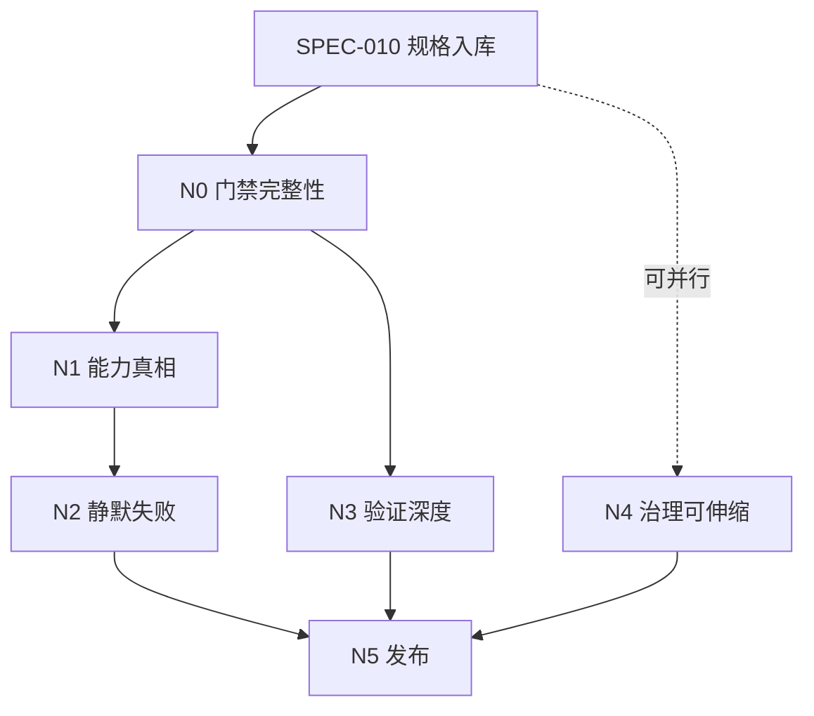

# llmrust SPCC 0.1.4 项目规格

> **文档编号**：`LLMRUST-SPCC-014`  
> **状态**：`ACTIVE SSOT — 已由 SPEC-010 合入主干；0.1.3 规格转为只读历史档案`  
> **目标版本**：`llmrust 0.1.4`  
> **审计基线**：GitHub `main` @ `f4eccb4e4843011e70fd33d37cc661fc1e4866e0`  
> **规格版本**：`0.1`（初版编制）  
> **编制日期**：`2026-08-04`；**最近修订**：`2026-09-11`（SPEC-010 入库，回合里程碑编号回填）  
> **编制依据**：0.1.3 发布后全量审计（REV-001，Issue #190）+ 架构师侧独立复审（新增 N-1…N-7）  
> **母规范**：`docs/spcc.md`（通用 SPCC 方法论 v1.0）  
> **前序规格**：`docs/SPCC-0.1.3.md`（0.1.3 已封板，INC+M0–M5 全部 DONE）  
> **仓库路径**：`docs/SPCC-0.1.4.md`

本文件是 llmrust 0.1.4 的项目级 SPCC 草案。Owner 批准并由 `SPEC-010` 合入主干后，它取代 `docs/SPCC-0.1.3.md` 成为 SSOT；0.1.3 规格转为**只读历史档案**，不再接受修改（含勘误 —— 0.1.3 的遗留勘误在本文 §0.5 继承登记）。

本文同时约束人类与 AI agent。任何参与者都不得以"自动生成""只是重构""顺手修复""先让 CI 绿"为理由绕过任务边界。

---

## 0.5 规格勘误表

0.1.3 的 `E-001`…`E-005` 已随该版本封板归档，不在本表重复。本表自 0.1.4 起重新编号。

| 编号 | 日期 | 事实 | 处置 | 责任任务 |
|---|---|---|---|---|
| `E-101` | 2026-08-04 | 审计发现 `docs/SPCC-0.1.3.md` 的行数存在两种口径：GitHub API 报 1422 行，本地 `wc -l` 报 1421 行，差异源于文件末行无换行符，非内容差异。此前架构师签发的状态 PR 指令曾以 API 口径给出预期行数，造成执行侧复核困惑。 | 本规格起，所有行数类断言**一律以本地 `wc -l` 为唯一口径**，指令与门禁均须注明口径 | `GOV-003` |
| `E-102` | 2026-08-04 | 架构师侧曾拟将 `src/providers/google.rs:646` 的 `msg.tool_calls.as_ref().unwrap()` 列为生产段 panic 风险，取证 L630-660 后证伪：该行位于 `Role::Assistant if msg.tool_calls.as_ref().is_some_and(\|c\| !c.is_empty())` 守卫臂内（L638），不可能 panic。**已主动撤回，不列入任何任务。** | 登记为架构师侧正向先例（先取证后断言）；不产生任务 | 无 |
| `E-103` | 2026-08-04 | 0.1.3 期内架构师侧累计七起错误，其中三起（ARC-002 求和笔误、§11.1.2 行级计数误述、REV-001 表行不存在）同属一类：**未当场取证即陈述事实性细节**。执行侧两次熔断（远端分支截断、REV-001 行缺失）判断均正确。系统可靠性目前主要由执行侧纪律兜底。 | 建立针对架构师自身的门禁：签发指令须附取证 blob SHA | `GOV-003` |

---

## 0. 文档权威、适用范围与状态

### 0.1 适用范围

本规格覆盖：

- 0.1.3 发布后全量审计（REV-001）认定的 15 项发现与架构师独立复审的 7 项新增发现的处置；
- Provider 能力声明从文档态转为**机器可读、编译期强制**的代码态；
- 门禁自身完整性（双向检查、退出码、负例准入）；
- 静默失败面的系统性消除；
- 验证深度从 local-fixture 推进到真实上游端点；
- 治理载体的可伸缩性（SPCC 状态区拆分、一致性 CI 化）；
- 0.1.4 的阶段、任务依赖、允许范围与验收标准；
- 明确划出必须推迟到 0.2.0 的破坏性变更。

### 0.2 权威顺序

沿用 0.1.3 §0.2，不作修改：

1. Owner 对目标、范围和风险的书面裁定；
2. 母规范 `docs/spcc.md`；
3. 本规格最新已批准版本；
4. `docs/CONTRACTS.md` 与已批准的专用协议规格；
5. 公开 API 测试、契约测试与 wire fixtures；
6. 代码实现；
7. README、示例、能力表和注释。

**0.1.4 新增一条**：当 `Provider::capabilities()` 的运行时返回值、`llmrust.capabilities.json` 与 `docs/CAPABILITIES.md` 三者冲突时，以 `CAP-004` 建立的一致性门禁裁定为准；在该门禁上线前，以代码实现为准并立即开勘误。理由见 §1.4。

### 0.3 规格变更

沿用 0.1.3 §0.3。规格变更使用 `SPEC-01x` 任务 ID（0.1.3 用到 `SPEC-004`，本版从 `SPEC-010` 起编号以避免歧义）。

### 0.4 状态词

沿用 0.1.3 §0.4 与 §11.1.1 的九态状态机，不作修改。

---

## 1. 项目定位与 0.1.4 成功定义

### 1.1 项目定位

沿用 0.1.3 §1.1，不作修改。

### 1.2 0.1.4 的性质：递归改进版本

0.1.3 是"补基建"版本 —— 六项 Added 中五项是工程能力。**0.1.4 是"补元基建"版本**：修的不是缺陷，是"让缺陷得以存在的机制"。

审计结论是本版的编制前提，逐字引用：

> 已知 15 项 + 新增 7 项共 22 项发现，**不是 22 个独立缺陷，而是 3 个结构性根因的 22 个投影**。逐条修完，下个版本会长出新的一批。

因此 0.1.4 **不按发现清单开卡**，按根因开里程碑。每张任务卡必须同时消化多项发现，且必须回答 §1.5 的递归改进三问。

三个根因与其投影：

| 根因 | 表述 | 投影的发现 |
|---|---|---|
| `R-A` 能力声明无代码载体 | 能力矩阵活在 Markdown 里，代码不知道它存在；每个 Provider 靠人手写检查 | `F-C1`≡`FND-R1`、`N-1`、Gemini cache token 缺口、README/CAPABILITIES 漂移风险 |
| `R-B` 门禁单向且自身无验证 | 门禁只防膨胀不防蒸发；门禁自身失效时报告一切正常 | `N-4`、`N-5`、`F-E1`、REL-003 截断事故、`FND-003` 退出码盲区 |
| `R-C` 错误信息在边界处被丢弃 | 解析失败、构建失败、上游指示在跨层时被静默降级 | `F-B2`(×3)、`F-A2`、`F-D2`、`F-B1`、`FND-R3`、`N-2`、`N-3` |

另有一项**非根因但优先级最高**的独立风险，见 §1.4。

### 1.3 0.1.4 目标

| ID | 目标 | 可验证结果 |
|---|---|---|
| `G-11` | 让门禁自身可信 | 所有数值门禁双向；所有调外部进程的门禁检查退出码；每个 guard 有 negative test 证明它会红 |
| `G-12` | 让能力缺口不可能被静默吞掉 | `Provider::capabilities()` 存在并被统一入口消费；能力矩阵三处一致由 CI 保证 |
| `G-13` | 消除已知静默失败面 | 解析失败、client 构建失败、上游 `Retry-After` 均不再被无声丢弃 |
| `G-14` | 把验证从自证推进到他证 | 能力矩阵中标注为 `verified` 的格子有真实上游端点证据与核验日期 |
| `G-15` | 让治理载体不依赖记忆 | SPCC 状态区拆分为独立小文件；三处一致性由 CI 测试而非人肉规则保证 |
| `G-16` | 零破坏发布 | 相对 0.1.3 无任何 public API / Serde 破坏；`cargo-semver-checks` 以 0.1.3 为 baseline 全绿 |

### 1.4 最高优先级的独立风险：验证深度

`docs/CAPABILITIES.md` 的 7×13 能力矩阵，绝大部分格子的验证层级是 `local-fixture verified (2026-08-02)` —— **用自己写的 fixture 验证自己写的解析器**。真实上游端点验证属 `E2E-001`，0.1.3 期内未完成。

后果是可判定的：若某 Provider 的实际 wire format 与团队理解不一致，现有 **380 个测试全部会通过**，因为 fixture 就是按那个理解写的。`F-B1`（`FINISH_REASON_UNSPECIFIED => FinishReason::Stop`，把"未指定"当成"正常结束"）正是这类问题的实证样本 —— fixture 不会报警，只有真实端点会。

**裁定**：`E2E-002` 的优先级高于本版绝大多数代码修复。理由：在真实端点证据到位前，任何"修好了"的结论仍然是自证。

### 1.5 递归改进三问（本版新增，强制）

自 0.1.4 起，**每张任务卡的 DoD 必须显式回答三问**，缺答即不满足 §12.1 Definition of Ready：

1. **机制问**：什么机制让这个缺陷得以存在？（不接受"作者疏忽""忘了写"作为答案 —— 若答案是人的失误，说明真实答案是"该机制依赖人不失误"）
2. **门禁问**：修复后，同类缺陷再次出现时，哪个自动化检查会拦住它？该检查是否有 negative test 证明它会红？
3. **同族问**：本仓库还有几处同族实例？是否在本卡一并消化？若不消化，转出到哪张卡或哪条技术债？

三问的答案写入实现 PR 正文，架构师逐条核验。**只修实例不修机制的 PR 一律 REJECT。**

### 1.6 0.1.4 非目标

以下内容明确不进入 0.1.4：

- **任何破坏性变更**。0.1.4 是 patch 版本，semver baseline 为 0.1.3，`cargo-semver-checks` 红灯不得以任何理由覆盖；
- 给 `Provider` trait 添加**无默认实现**的方法（breaking → 0.2.0，见 §5.3）；
- 为 `Role`、`Message`、`Usage` 等公共类型补 `#[non_exhaustive]`（对穷尽匹配的下游同样是破坏 → 0.2.0）；
- 新增 Provider；
- 热点文件的大规模拆分搬迁（23 张 `ARC-001`/`ARC-002` 卡继续封存）；
- fuzz harness 与覆盖率基础设施（`N-7`，记技术债）；
- 以性能为目的的重写或运行时更换。

发现非目标需求时记录到 0.2 候选清单，不得夹入本版 PR。

---

## 2. 治理结构与权限

### 2.1 三权分立

沿用 0.1.3 §2.1（Owner / 架构师 / 执行者），并追加两条本版新增约束：

- **架构师签发的任何含事实性细节的指令（行号、行数、SHA、文件内容片段），必须附带本次取证的 blob SHA 与取证时间。** 无取证 SHA 的指令，执行侧有权直接退回，退回不计为执行侧延误。依据 `E-103`。
- **架构师与执行者不得共用 GitHub 账号。** 0.1.3 期内两方共用 `bishuan`，导致 REL-003 截断事故无法定性归属，且 PR 自审受 GitHub `Can not approve your own pull request` 限制。本项须由 Owner 在 `SPEC-010` 前完成身份分离（双账号或 bot 身份），否则 `SPEC-010` 保持 `BLOCKED`。

### 2.2 安全事故 Break-glass

沿用 0.1.3 §2.2。

### 2.3 熔断条件

沿用 0.1.3 §2.3 全部五条红线，并明确追加：

- **红线⑤（远端状态与指令前提不符）在 0.1.3 期内被触发两次，两次执行侧判断均正确。** 本版确认该机制有效，不得弱化。执行侧因红线熔断而暂停，视为正确履职，不得追责。
- **新增红线⑥**：当架构师指令引用的代码位置、行号或文本在实际仓库中不存在或不匹配时，执行侧**不得自行推断意图或代为新增内容**，必须熔断并要求架构师重新取证。

---

## 3. 审计基线与版本处置

### 3.1 已知基线

| 项 | 值 | 取证 |
|---|---|---|
| 主干 | `f4eccb4e4843011e70fd33d37cc661fc1e4866e0` | PR #199 squash merge @ 2026-08-03T14:03:58Z |
| 已发布版本 | `0.1.3`，crates.io created 09:31:06Z，`yanked=false`，`trustpub_only=true` | crates.io API |
| Rust 代码 | 19,513 行 / 41 文件 | 本地 `wc -l` |
| 测试函数 | 380 个 `#[test]` | 本地 grep |
| 依赖 | 192 packages | `Cargo.lock` |
| 生产段 `unwrap()` | 全仓 1 处，已证伪（见 `E-102`），**实际风险 0 处** | `google.rs:630-660` |
| 生产段 `expect()` | 3 处，全在 `proxy/mod.rs`（L506 静态头、L537/543 信号处理器），均可接受 | 逐处阅读 |
| 热点台账 | 3327 / 1884 / 1524 / 1483 / 1455 / 1132 / 1080，threshold 800 | **0.1.3 编制时快照**（`2026-08-04`）；**现行清单与阈值以 `tests/hotspot_ledger.json` 为唯一事实源**（自 `#209` 起：`threshold = 500`，11 个条目，且**双向覆盖**——凡 `src/**/*.rs` ≥ 阈值必须登记） |

### 3.2 0.1.3 的质量定位（编制前提）

本版编制不建立在"0.1.3 质量差"的前提上。审计定位逐字引用：

> 工程纪律 / 供应链 / 发布链：**优秀**，超出该规模项目应有水平。  
> 架构抽象层级：**中等** —— 唯一的实质短板。  
> 22 项发现中**零 P0、零 P1**。

**0.1.4 的任务不是补救，是抬高抽象层级，使既有的高纪律不再依赖人工反复执行。** 任何把本版描述为"修 bug 版本"的表述均属定性错误。

### 3.3 版本处置原则

- 0.1.3 **不 yank**。它是一个正常可用的发布，全部 22 项发现均为 P2/P3。
- 0.1.4 为 patch 版本，semver baseline 为 0.1.3。
- 0.1.4 发布后，CI 的 `cargo-semver-checks` baseline 切换至 0.1.4。

---

## 4. 架构职责与内部依赖允许清单

沿用 0.1.3 §4 全部分层、允许边与禁止边，仅追加一条：

- **新增允许边**：`lib.rs`（客户端入口层）→ `providers::capabilities`（能力裁决模块）。这是 `CAP-003` 把能力检查从各 Provider 上移到统一入口的必要边，须同步写入 `tests/architecture_guard.rs` 的允许清单。
- 除此之外，0.1.4 **不新增任何依赖边**。`GRD-004` 修复 `F-E1` 的扫描器绕过缺陷后，架构守卫的判定强度会提高，既有代码若因此暴露未登记的依赖边，按勘误处理而非扩大允许清单。

---

## 5. Rust 公开 API 与契约演进

### 5.1 基本规则

沿用 0.1.3 §5.1。

### 5.2 Rust 特有红线

沿用 0.1.3 §5.2。

### 5.3 0.1.4 类型演进策略（本版核心约束）

0.1.4 是 patch 版本，**相对 0.1.3 零破坏**是硬约束。这直接决定了 `CAP-002` 的形态：

**允许（0.1.4 内做）**：

- 新增 `Capabilities` 类型及其配套枚举。该类型**必须从诞生起就标注 `#[non_exhaustive]`** —— 否则以后每次新增能力项都是破坏性变更，等于把 `R-A` 的债换个地方欠。此为不可协商项。
- 给 `Provider` trait 添加 `fn capabilities(&self) -> Capabilities`，**必须带默认实现**。默认实现返回"全部未知"，并在被调用时发出一次性 `tracing::warn!` 提示该 Provider 未声明能力。
- 在 `LmrsClient` 入口消费 `capabilities()` 做统一裁决。此为行为变更而非 API 变更 —— 但**属于公开行为变更，必须在 CHANGELOG 与 `docs/CONTRACTS.md` 同 PR 记录**。

**禁止（推迟到 0.2.0）**：

- 移除 `capabilities()` 的默认实现（breaking：下游自定义 Provider 编译失败）；
- 给 `Role`、`Message`、`Usage`、`FinishReason`、`ChatResponse`、`StreamChunk`、`ToolChoice`、`Content`、`ContentPart`、`ResponseFormat`、`ThinkingConfig` 补 `#[non_exhaustive]`（`N-6`）；
- 给 `Role` 枚举新增 `Developer` 变体（OpenAI 已在推该角色，但加变体即破坏）。

**技术债登记（`N-6` 全文）**：`src/types.rs` 26 个公共类型中仅 `ChatRequest`(L592) 与 `EmbeddingRequest`(L833) 标注了 `#[non_exhaustive]`。`FinishReason::Other(String)` 与 `Usage` 的全 `Option` + `serde(default)` 提供了部分逃生口，但 `Role` 是纯 4 变体枚举，在 0.1.x 生命周期内被 semver gate 冻死。此项**必须在 0.2.0 一次性解决**，不得再分散到后续 patch。

### 5.4 Semver 门禁

- 0.1.4 开发期：`cargo-semver-checks` 以 crates.io 0.1.3 发布物为 baseline；
- 相对 0.1.3 不允许任何破坏，**不得以"CI 其他项全绿"覆盖 semver 红灯**；
- baseline crate 下载后的 `EXPECTED_SHA256` 校验保持启用，**该常量不得在本版任何任务中修改**；
- 0.1.4 发布后 baseline 切换至 0.1.4。

---

## 6. Provider 能力、错误与流式契约

### 6.1 字段处理三态

沿用 0.1.3 §6.1 的 `Mapped` / `Unsupported` / `NotApplicable` 三态，并**强化其可执行性**：

0.1.3 已规定"禁止静默忽略已设置字段"，但该规定**没有代码载体**，靠每个 Provider 作者手工遵守，结果是 Ollama 的 `tools` 被静默吞掉（`N-1`）、Ollama 缺 `warn_if_unsupported_n`（`F-C1`≡`FND-R1`）。

自 0.1.4 起，三态**必须通过 `Provider::capabilities()` 机器声明**，由统一入口而非各 Provider 实现强制。文档规定与代码声明二选一时，以代码声明为准。

### 6.2 Provider 能力声明（本版重写）

沿用 0.1.3 §6.2 的五级验证层级（`implemented` / `verified` / `model_dependent` / `unsupported` / `passthrough_only`），并新增三条：

- 五级层级**必须在 `Capabilities` 类型中建模**，不得只存在于 Markdown 表格；
- `verified` 级别**必须附核验日期与证据类型**（`local-fixture` 或 `live-endpoint`）。`local-fixture verified` 不得在 README 中呈现为无限定的 ✅；
- 能力声明的三处载体 —— `Provider::capabilities()` 运行时返回值、`llmrust.capabilities.json`、`docs/CAPABILITIES.md` 表格 —— **任一漂移则 CI 红**（`CAP-004`）。

### 6.3 静默失败禁令（本版新增）

**在跨层边界丢弃错误信息，一律视为契约违反**，不因"实践中不会发生"而豁免。已知实例：

| 位置 | 现状 | 归属任务 |
|---|---|---|
| `anthropic.rs:316`、`google.rs:648`、`anthropic_proxy.rs:384` | `.unwrap_or_else(\|_\| json!({}))` 吞掉解析错误 | `ERR-001` |
| `http.rs:71` | `builder.build().unwrap_or_else(\|_\| Client::new())` 丢弃 connect_timeout(30s)、timeout(120s)、pool_max_idle(32)、tcp_keepalive(30s)、`no_proxy()` 及全部 custom_headers，且**无 warn**（对比同函数 L56/L63 处理无效 header 时有 warn） | `ERR-001` |
| `router.rs:301`、`router.rs:342` | `error_kind = "api_error"` 硬编码，丢失真实错误分类 | `ERR-002` |
| `retry.rs` 全域 | 从不读取上游 `Retry-After`（全仓 grep `retry.?after` 零命中）；`backoff()` L74-89 为纯本地指数+jitter；叠加 `should_retry()` L57-69 对 429 明确不重试，导致 429 场景从不消费上游明示等待窗口 | `ERR-004` |
| `google.rs:692` | `"FINISH_REASON_UNSPECIFIED" => FinishReason::Stop`，把"未指定"当成"正常结束" | `ERR-003` |
| `proxy/mod.rs:439/443` | 校验只查 trim 后为空，存储时不 trim，二者不一致 | `ERR-005` |

**判定标准**：错误可以被降级处理，但不可以被降级到"调用方无从察觉"。降级必须留下 `tracing` 痕迹，且痕迹中不得包含 prompt、response 或凭证内容。

### 6.4 Usage 契约 / 6.5 成功流状态机 / 6.6 错误流 / 6.7 最低契约测试矩阵

沿用 0.1.3 §6.4–§6.7，不作修改。

---

## 7. Proxy 安全与线协议

沿用 0.1.3 §7 全部条款。0.1.4 对 proxy 的唯一改动是 `ERR-005`（`F-D2` 输入校验一致性），不触碰 §7.1 默认安全、§7.2 `/health` 契约与 §7.3 代理契约的任何既有行为。

---

## 8. 文档、能力元数据与可观察性

### 8.1 文档同 PR

沿用 0.1.3 §8.1。

### 8.2 能力元数据（本版强化）

`llmrust.capabilities.json` 自 0.1.4 起从"随手维护的元数据文件"升级为**被门禁保护的契约**，与 `docs/api-inventory.json` 同等地位。

参照系已在仓库内存在且被验证有效：`tests/api_freeze.rs` 消费 `docs/api-inventory.json`，断言 API 分类边界，且改分类去放行变更会导致门禁失败（fail-closed）。`CAP-004` 必须复用该模式，不得另起炉灶。

### 8.3 日志红线

沿用 0.1.3 §8.3。**特别提示 `ERR-001`/`ERR-002`**：本版要求把此前被吞掉的错误暴露出来，实现时必须确保暴露的是错误种类与位置，**不得连带把上游响应体、prompt 或凭证写入日志**。这是本版最容易踩的红线。

---

## 9. CI、供应链与发布门禁

### 9.1 PR 必过门禁

沿用 0.1.3 §9.1 全部十一项门禁，并新增两项：

| 门禁 | 最低要求 | 引入任务 |
|---|---|---|
| Guard integrity | 每个 guard 有 negative test；所有数值门禁双向；所有调外部进程的门禁检查退出码 | `GRD-001`…`GRD-003` |
| Capability consistency | `Provider::capabilities()` == `llmrust.capabilities.json` == `docs/CAPABILITIES.md` 三者一致 | `CAP-004` |

### 9.2 门禁完整性通用规则（本版新增，硬约束）

三条规则适用于**现有及未来的所有门禁**，无例外：

1. **数值门禁一律双向。** 判定条件必须是 `current != expected` 而非 `current > expected`。缩水与膨胀同等对待，两者都须走架构师授权的 truth correction 流程。适用于：热点文件行数台账、SPCC 行数、crate 打包文件数、公开 API 项数。

   > 依据（`N-5`）：`tests/architecture_guard.rs:126` 目前只有 `if current > expected`。台账自身记录了该漏洞的后果，`anthropic.rs` 条目原话：`The guard stayed green because 1483 <= 1484 (the current > baseline check could not see the drift).` REL-003 远端分支 SPCC 被砍掉约 640 行仍能存活，是完全相同的病。

2. **调外部进程的门禁必须先查退出码。** 任何 `Command::...output()` 之后必须 `assert!(output.status.success())`，并将 stderr 写入失败信息。

   > 依据（`N-4`）：`tests/package_guard.rs:16` 调 `.output()` 后从不检查 `output.status`。若 `cargo package --list` 失败，stdout 为空 → 循环零次迭代 → violations 为空 → **断言通过，测试绿**。一个本该拦截".env 被打进 crate"的门禁，在自身执行失败时会报告一切正常。

3. **每个 guard 必须配 negative test。** 该测试须构造应当触发门禁的输入，断言门禁确实失败。**没有 negative test 的 guard 不算门禁，只算装饰。** 本条从 0.1.3 `CI-003` 的单卡要求提升为所有门禁的准入条件：新增 guard 若无 negative test，PR 一律 REJECT。

### 9.3 发布包允许内容 / 9.4 Tag-only 发布 / 9.5 豁免

沿用 0.1.3 §9.2–§9.4。`security/exemptions.toml` 的四字段强制（task/reason/owner/review_on）保持，当前为空，本版不得新增豁免。

---

## 10. 任务、分支、PR 与合并纪律

沿用 0.1.3 §10 全部条款（开工条件、分支与并行、diff 与大文件、PR 必填内容、评审与合并），并追加：

- **PR 必填内容新增一项**：§1.5 递归改进三问的逐条回答。缺答即不满足 DoR。
- **架构师指令必填一项**：取证 blob SHA 与取证时间（依据 `E-103`）。

---

## 11. 0.1.4 阶段与任务清单

### 11.1 状态机与更新责任

#### 11.1.1 任务状态

沿用 0.1.3 §11.1.1 的九态表，不作修改。架构师负责决定并写入状态；执行者提供实现证据，不得编辑 SPCC。

#### 11.1.2 GitHub Milestone 结构

0.1.4 设六个 Milestone。每个任务 Issue 只能属于一个 Milestone；实现 PR 使用 `Refs #N`，状态 PR 使用 `Closes #N`。

> **编号已回填（SPEC-010 入库，2026-09-11）**：六个 Milestone 已由 Owner 在 GitHub 创建，编号 **`#8`–`#13`**（见下表"编号"列）。自本规格入库起，任务 Issue 的 `milestone` 字段**可以填写**（此前留空的约束解除）；每个任务 Issue 仍只能属于一个 Milestone。

| Milestone | 编号 | 目标 | 完成/总数 | 进度 | 当前状态 | 下一任务 | 退出判据 |
|---|---|---:|---:|---:|---|---|---|
| `0.1.4 / N0 Guard Integrity` | `#8` | 让门禁自身可信 | 0/4 | 0% | `PLANNED` | `GRD-001` | 四项 DONE；所有 guard 有 negative test 且双向 |
| `0.1.4 / N1 Capability Truth` | `#9` | 能力声明进入代码并被门禁保护 | 0/6 | 0% | `PLANNED` | —（待 N0） | 三处一致门禁上线且负例可红；**且 `CAP-007`（能力表机读化 + `CAPABILITIES.md` 由表生成）完成** |
| `0.1.4 / N2 Silent Failure` | `#10` | 消除已知静默失败面 | 0/5 | 0% | `PLANNED` | —（待 N1） | 五项 DONE；§6.3 表格全部清空 |
| `0.1.4 / N3 Evidence Depth` | `#11` | 验证从自证推进到他证 | 0/3 | 0% | `PLANNED` | —（待 N0） | 能力矩阵 `verified` 格子有 live-endpoint 证据 |
| `0.1.4 / N4 Governance Scale` | `#12` | 治理载体不依赖记忆 | 0/3 | 0% | `PLANNED` | —（可与 N1 并行） | 状态区拆分完成且一致性 CI 化 |
| `0.1.4 / N5 Release` | `#13` | 审计并发布 0.1.4 | 0/3 | 0% | `PLANNED` | —（待 N0–N4） | crates.io / docs.rs / GitHub tag 三方一致 |

进度只按 `DONE / 总任务数` 计算。任何 P0/P1 回归把状态改回 `BLOCKED`，即使百分比已达 100%。



**为什么 N0 必须最先做**：后续所有里程碑的验收都依赖门禁给出的绿灯。若门禁本身是 fail-open 或单向的，N1–N4 的"全绿"不构成证据。**先修验收机制，再修被验收物** —— 这是本版递归改进的第一原则。

**为什么 N3 与 N1 并行而非串行**：`E2E-002` 需要真实端点预算与 Owner 授权，前置周期长，不应被 N1 的代码工作阻塞。且 N3 的产出（真实端点行为证据）是 N1 `CAP-004` 中 `verified` 格子的输入 —— 两者交汇于 N5 前的对账。

#### 11.1.3 任务状态登记表

表头沿用 0.1.3 §11.1.3 的 8 列：`ID | Milestone | 状态 | 前置 | Issue | 实现 PR | Merge SHA | 状态 PR`

| ID | Milestone | 状态 | 前置 | Issue | 实现 PR | Merge SHA | 状态 PR |
|---|---|---|---|---|---|---|---|
| `SPEC-010` | 治理（不计入任务数） | `DONE` | Owner 批准本规格（~~账号身份分离~~ **该准入条件经 Owner 2026-09-10 令作废**，不再作为阻塞） | #201 | #206 | `ce1de1f` | 本 PR |
| `GRD-001` | N0 | `PLANNED` | `SPEC-010` | — | — | — | — |
| `GRD-002` | N0 | `PLANNED` | `SPEC-010` | — | — | — | — |
| `GRD-003` | N0 | `PLANNED` | `GRD-001`,`GRD-002` | — | — | — | — |
| `GRD-004` | N0 | `PLANNED` | `GRD-003` | — | — | — | — |
| `CAP-002` | N1 | `PLANNED` | N0 DONE | — | — | — | — |
| `CAP-003` | N1 | `PLANNED` | `CAP-002` | — | — | — | — |
| `CAP-004` | N1 | `PLANNED` | `CAP-003` | — | — | — | — |
| `CAP-005` | N1 | `PLANNED` | N0 DONE | #211 | — | — | — |
| `CAP-006` | N1 | `PLANNED` | `CAP-005` | #212 | — | — | — |
| `CAP-007` | N1 | `PLANNED` | `CAP-006` | #213 | — | — | — |
| `ERR-001` | N2 | `PLANNED` | N1 DONE | — | — | — | — |
| `ERR-002` | N2 | `PLANNED` | `ERR-001` | — | — | — | — |
| `ERR-003` | N2 | `PLANNED` | N1 DONE | — | — | — | — |
| `ERR-004` | N2 | `PLANNED` | `ERR-001` | — | — | — | — |
| `ERR-005` | N2 | `PLANNED` | N1 DONE | — | — | — | — |
| `E2E-002` | N3 | `PLANNED` | N0 DONE + Owner 预算授权 | — | — | — | — |
| `FIX-001` | N3 | `BLOCKED` | 平台侧 401 定性；**2026-08-31 硬时限** | — | — | — | — |
| `DOC-003` | N3 | `PLANNED` | `CAP-004` | — | — | — | — |
| `GOV-001` | N4 | `PLANNED` | `SPEC-010` | — | — | — | — |
| `GOV-002` | N4 | `PLANNED` | `GOV-001` | — | — | — | — |
| `GOV-003` | N4 | `PLANNED` | `SPEC-010` | — | — | — | — |
| `RC-002` | N5 | `PLANNED` | N0–N4 DONE | — | — | — | — |
| `REL-004` | N5 | `PLANNED` | `RC-002` GO + Owner 授权 | — | — | — | — |
| `REL-005` | N5 | `PLANNED` | `REL-004` | — | — | — | — |

#### 11.1.4 合并后状态回证账本

表头沿用 0.1.3 §11.1.4 的 8 列：`任务 | Issue | 实现 PR / 外部动作 | CI run | Merge SHA / 动作时间 | 状态 PR | Milestone 进度 | 架构师裁定`

（本表在任务合并后逐行追加，草案阶段为空。）

| 任务 | Issue | 实现 PR / 外部动作 | CI run | Merge SHA / 动作时间 | 状态 PR | Milestone 进度 | 架构师裁定 |
|---|---|---|---|---|---|---|---|
| `SPEC-010` | #201 | #206（规格入库 + 0.1.3 转只读档案） | Security Gates `34563594670` / CI `34563594613`（均 SUCCESS，main 推送） | `ce1de1f` @ 2026-09-11T04:48:41Z | 本 PR | 不计数（治理任务） | 待架构师核验 |

> **SPEC-010 回证（逐条，机器产出）**：
> ① 主干存在 `docs/SPCC-0.1.4.md`（+858）；② `docs/SPCC-0.1.3.md` 仅头部 +4/−0（只读声明），**正文一字未改**；
> ③ 六个 Milestone 编号 `#8`–`#13` 已由 Owner 创建并回填（见 §11.1.2）；
> ④ §14 映射表在库（见 §14；行数由架构师核验其"22 项发现"覆盖断言）。
> **前置条件变更披露**：原前置含"§2.1 账号身份分离"，该条件经 **Owner 2026-09-10 令作废**（不再作为阻塞）；
> §11.1.3 该行已同步标注，**请架构师/Owner 在核验时确认此变更**。

**硬规则（沿用 0.1.3，不得弱化）**：状态 PR 必须同时更新 §11.1.2 Milestone 计数、§11.1.3 任务状态与引用、§11.1.4 回证账本。**三处不一致直接 REJECT。**

> **本版改进**：该规则在 0.1.3 期内完全靠人肉执行，而它保护的正是出事的地方。`GOV-002` 将其转为 CI 测试。在 `GOV-002` 上线前，本规则仍靠人执行，架构师核验时须逐处点名确认，不得笼统声称"三处已更新"。

---

### 11.2 治理任务 — `SPEC-010`

#### `SPEC-010` — 0.1.4 规格入库与治理面初始化

- **初始状态/依赖/分支**：`PLANNED`；Owner 批准本规格 + §2.1 账号身份分离完成；`spec/SPEC-010-spcc-014`。
- **任务目标**：将本规格合入主干成为 SSOT，把 0.1.3 规格转为只读档案，建立 0.1.4 治理面。
- **允许范围**：新增 `docs/SPCC-0.1.4.md`；在 `docs/SPCC-0.1.3.md` 头部追加"已封板，只读档案，后继规格见 SPCC-0.1.4"声明（**仅头部声明，正文一字不改**）；`AGENTS.md` 与 `docs/PROJECT_MAP.md` 中指向 SPCC 的引用更新。
- **禁止范围**：任何 `src/**` 改动；修改 0.1.3 规格正文；在本卡夹带任何实现。
- **执行步骤**：① 合入本规格；② 0.1.3 规格加只读头；③ 更新引用；④ Owner 在 UI 创建六个 Milestone；⑤ 回填 §11.1.2 Milestone 编号；⑥ 建立 22 项发现到任务的映射（见 §14）。
- **DoD**：主干存在 `docs/SPCC-0.1.4.md`；0.1.3 规格正文 diff 为零（仅头部 +N/−0）；六个 Milestone 编号已回填；§14 映射表覆盖全部 22 项发现，无遗漏无重复。
- **回证**：合并 SHA；`git diff` 证明 0.1.3 正文未改；Milestone 列表截图或 API 输出；映射表计数核对。
- **递归三问**：机制 —— 0.1.3 规格封板后无后继载体，新发现无处登记；门禁 —— `GOV-002` 上线后由 CI 保证状态区一致；同族 —— 无。

---

### 11.3 Milestone N0 — 门禁完整性

**入口**：`SPEC-010` DONE。  
**出口**：四项任务 DONE；仓库内所有 guard 双向、fail-closed、且各自有 negative test。  
**硬约束**：本阶段**只碰 `tests/**` 与 CI 配置，不碰 `src/**`**。若某 guard 收紧后暴露出生产代码问题，登记为发现并转入相应里程碑，不在本阶段修。

#### `GRD-001` — 数值门禁双向化

- **初始状态/依赖/分支**：`PLANNED`；`SPEC-010`；`task/GRD-001-bidirectional-guards`。
- **任务目标**：把所有数值型门禁从单向 `>` 改为双向 `!=`，使文件缩水与内容蒸发同样触发失败。
- **允许范围**：`tests/architecture_guard.rs`、`tests/hotspot_ledger.json`、新增 SPCC 行数守卫、`tests/package_guard.rs` 中的计数逻辑、相应 negative test fixtures。
- **禁止范围**：`src/**`；调整台账基线数值以"让 CI 先绿"；把 threshold 放宽。
- **执行步骤**：① 定位所有数值比较（现已知 `architecture_guard.rs:126`）；② 改判定为 `current != expected`；③ 台账缩水时的失败信息须明确提示"若为有意缩减，须架构师授权 truth correction"；④ 新增 SPCC 行数守卫，**以本地 `wc -l` 为口径**（依据 `E-101`）；⑤ 为每条判定写 negative test：人为把某热点文件删若干行、人为把 SPCC 删若干行，断言 CI 失败。
- **DoD**：热点文件净减少、SPCC 行数减少两类负例均失败；正常构建全绿；台账数值未被调整以迁就实现；失败信息含 truth correction 指引；§1.5 三问已答。
- **回证**：负例命令与关键错误输出、绿色 CI run、`git diff` 证明台账基线值未变。
- **消化发现**：`N-5`；REL-003 截断事故的机制层根因。

#### `GRD-002` — 外部进程门禁 fail-closed

- **初始状态/依赖/分支**：`PLANNED`；`SPEC-010`；`task/GRD-002-guard-exit-code`。
- **任务目标**：使任何依赖外部进程输出的门禁，在该进程失败时判定为失败而非通过。
- **允许范围**：`tests/package_guard.rs`、其他调用 `Command` 的测试、CI glue、negative test fixtures。
- **禁止范围**：`src/**`；用 `|| true` 或忽略错误的方式"修复"；扩大 package allowlist。
- **执行步骤**：① 全仓检索 `.output()` / `.status()` 调用点；② 每处补 `assert!(output.status.success())` 并把 stderr 纳入失败信息；③ negative test：注入一个必然失败的 cargo 调用（如指向不存在的 manifest），断言门禁失败而非静默通过。
- **DoD**：`cargo package --list` 失败时门禁红；stderr 出现在失败输出中；正常路径不受影响；`FND-003` 退出码盲区实证关闭；§1.5 三问已答。
- **回证**：注入失败的负例输出、正常路径绿色 run、检索命令与全部命中点清单。
- **消化发现**：`N-4`、`FND-003`。

#### `GRD-003` — 全门禁 negative test 准入

- **初始状态/依赖/分支**：`PLANNED`；`GRD-001`,`GRD-002`；`task/GRD-003-guard-negative-tests`。
- **任务目标**：为仓库内每一个 guard 建立 negative test，并把"无 negative test 不得合入新 guard"写成可执行准入检查。
- **允许范围**：`tests/**` 全部 guard 测试文件、`.github/workflows/ci.yml`、`docs/CONTRACTS.md` 门禁章节、negative fixtures。
- **禁止范围**：`src/**`；为凑数写不会真正触发门禁的假负例；修改 `EXPECTED_SHA256`。
- **执行步骤**：① 清点全部 guard（architecture、package、api_freeze、response_freeze、provider_contract_freeze、agent_docs_validation、secrets、semver、release preflight）；② 逐个补 negative test；③ 结转 0.1.3 `CI-003` 未完成的三项：A `CI-002`→#196 allowlist 失效期、B `FND-003` 退出码盲区（已由 `GRD-002` 消化，此处只核验）、C 发布可见性轮询 300s → 60×10s；④ 建立准入检查：新增 guard 文件若无对应 negative test，CI 失败。
- **DoD**：每个 guard 有至少一条 negative test 且该测试在 guard 被人为削弱时会红；准入检查本身有 negative test；`CI-003` 三项结转全部关闭；`EXPECTED_SHA256` 未被修改；§1.5 三问已答。
- **回证**：guard 清单与对应 negative test 映射表、逐条负例输出、绿色 CI run。
- **消化发现**：0.1.3 `CI-003` 全部结转项。

#### `GRD-004` — 架构守卫扫描器绕过修复

- **初始状态/依赖/分支**：`PLANNED`；`GRD-003`；`task/GRD-004-import-scanner`。
- **任务目标**：修复架构守卫的逐行前缀扫描可被绕过的缺陷，使依赖边判定不可规避。
- **允许范围**：`tests/architecture_guard.rs`、negative fixtures、§4 允许清单的同步登记。
- **禁止范围**：`src/**`；为让守卫通过而修改生产代码的 import 写法；扩大允许清单以吸收新暴露的边。
- **执行步骤**：① 复现绕过：`architecture_guard.rs:91` 的 `trimmed.starts_with("use ")` 对块注释内 import、多行 import、`pub use`、宏内 import 等形式判定不准；② 改为更稳健的解析；③ negative test 覆盖每种绕过形态；④ 若收紧后暴露既有未登记依赖边，**登记为发现并上报架构师裁定，不得自行扩大允许清单**。
- **DoD**：全部已知绕过形态被拦截且各有 negative test；新暴露的依赖边（若有）已逐条裁定；§4 允许清单与实际一致；§1.5 三问已答。
- **回证**：各绕过形态的负例输出、收紧前后的依赖边差异清单、架构师逐条裁定记录。
- **消化发现**：`F-E1`。

---

### 11.4 Milestone N1 — 能力真相

**入口**：N0 全部 DONE（门禁可信后方可依赖其绿灯）。  
**出口**：三项任务 DONE；能力声明有代码载体，三处一致由 CI 保证。  
**硬约束**：全程零 breaking。`cargo-semver-checks` 相对 0.1.3 必须全绿，不得以任何理由覆盖。

#### `CAP-002` — `Capabilities` 类型与 `Provider::capabilities()`

- **初始状态/依赖/分支**：`PLANNED`；N0 DONE；`task/CAP-002-capabilities-type`。
- **任务目标**：为能力声明建立机器可读的代码载体，且不破坏任何下游。
- **允许范围**：新增 `src/providers/capabilities.rs`；`src/providers/mod.rs` 的 trait 定义；`src/lib.rs` 的 re-export；`docs/api-inventory.json` 同步；契约测试。
- **禁止范围**：移除默认实现；修改任何既有类型的字段或变体；改动 `LmrsClient` 行为（留给 `CAP-003`）。
- **执行步骤**：① 定义 `Capabilities`，**标注 `#[non_exhaustive]`**（§5.3 不可协商项）；② 建模 §6.2 五级验证层级，`verified` 携带核验日期与证据类型；③ 给 `trait Provider` 加 `fn capabilities(&self) -> Capabilities`，**带默认实现**，默认返回"全部未知"并发一次性 warn；④ 为全部 7 个 Provider 实现真实声明，逐项以代码行号为证据；⑤ 同步 `docs/api-inventory.json`；⑥ 跑 semver 检查确认零破坏。
- **DoD**：`cargo-semver-checks` 相对 0.1.3 零破坏；`Capabilities` 已 `#[non_exhaustive]`；7 个 Provider 全部实现且每项声明附代码证据；默认实现的 warn 有测试覆盖；下游自定义 Provider 不实现该方法仍可编译（用一个测试内的最小 Provider 证明）；§1.5 三问已答。
- **回证**：semver 报告、7 个 Provider 声明与代码行号对照表、最小下游 Provider 编译通过证明。
- **消化发现**：`R-A` 根因的载体建设（不直接关闭具体发现）。

#### `CAP-003` — 统一入口能力裁决

- **初始状态/依赖/分支**：`PLANNED`；`CAP-002`；`task/CAP-003-capability-dispatch`。
- **任务目标**：把能力检查从各 Provider 上移到 `LmrsClient` 统一入口，一次性消化全部已知能力缺口。
- **允许范围**：`src/lib.rs` 派发路径、`src/providers/capabilities.rs`、`src/providers/ollama.rs`、`src/providers/mod.rs` 中 `warn_if_unsupported_n` 的迁移、`docs/CONTRACTS.md`、`CHANGELOG.md`、契约测试。
- **禁止范围**：改变任何**已支持**路径的行为；新增 Provider；把 `Unsupported` 用作偷懒的兜底（每处 Reject 须有能力声明依据）。
- **执行步骤**：① 在入口实现 `Reject`（返回 `LlmError::Unsupported`）/ `Warn`（一次性 tracing）/ `Pass` 三种裁决；② 把 `warn_if_unsupported_n` 从六处调用点（`anthropic.rs:788/896`、`compat.rs:618/655`、`google.rs:831/945`）上移，定义处 `providers/mod.rs:126` 相应调整；③ **Ollama 的 `tools` 改为显式 Reject**，与同文件 reasoning 的处理（`ollama.rs:215/290`，注释写明 fails BEFORE any network call）保持一致；④ 补 Gemini cache token 声明；⑤ 每条裁决路径配契约测试。
- **DoD**：Ollama 传 `tools` 返回 `Unsupported` 而非静默丢弃；Ollama 的 `n>1` 有 warn；六处手工调用点已上移且行为等价；已支持路径行为零变化（由既有 380 测试全绿证明）；公开行为变更已写入 CHANGELOG 与 CONTRACTS；§1.5 三问已答。
- **回证**：迁移前后 grep 对照、Ollama tools/n 的正负例测试输出、全量测试绿色 run、CHANGELOG diff。
- **消化发现**：`F-C1`≡`FND-R1`、`N-1`、Gemini cache token 缺口。

#### `CAP-004` — 能力矩阵三处一致门禁

- **初始状态/依赖/分支**：`PLANNED`；`CAP-003`；`task/CAP-004-capability-freeze`。
- **任务目标**：使 `Provider::capabilities()`、`llmrust.capabilities.json` 与 `docs/CAPABILITIES.md` 三者任一漂移即 CI 红。
- **允许范围**：新增 `tests/capability_freeze.rs`；`llmrust.capabilities.json`；`docs/CAPABILITIES.md`；`README.md` 与 `README.zh-CN.md` 的能力矩阵段落；生成脚本。
- **禁止范围**：`src/**` 的行为改动；通过放宽断言让漂移通过；把文档表格改成手写以规避校验。
- **执行步骤**：① **复用 `tests/api_freeze.rs` 消费 `docs/api-inventory.json` 的既有 fail-closed 模式**，不另起炉灶；② 断言运行时 `capabilities()` == JSON 声明；③ 文档表格从 JSON 生成并断言一致；④ README 的 ✅ 仅允许用于 `implemented=true`，`local-fixture verified` 须在表内显式标注验证层级（§6.2）；⑤ negative test：改 JSON 不改代码、改代码不改 JSON、改文档表格，三种漂移各断言 CI 红。
- **DoD**：三类漂移负例全部失败；正常路径绿；README L134 矩阵的每个 ✅ 可追溯到 `implemented=true`；验证层级在文档中可见；§1.5 三问已答。
- **回证**：三类负例输出、生成脚本与产物 diff 为零的证明、绿色 CI run。
- **消化发现**：`R-A` 根因闭环；README 能力宣称跑在验证前面的问题。

#### `CAP-005` — 缓存断点发送能力

- **初始状态/依赖/分支**：`PLANNED`；`N0 DONE`；待建（建议 `task/CAP-005-cache-control`）。
- **任务目标**：使请求侧能表达"在稳定前缀末尾打缓存断点 + TTL 档位"，并在 wire 层真实出现 `cache_control`（Anthropic 系拿到缓存价的**唯一**途径）。
- **允许范围**：`src/types.rs`（`ChatRequest` 策略字段、`ContentPart` 块级 `cache_control`）；`src/providers/anthropic.rs`（`system` 放开为字符串**或**内容块数组）；相关序列化与测试。
- **禁止范围**：价格表（→ `CAP-006`）；服务商目录（→ `CAP-006`）；`CAPABILITIES.md` 生成（→ `CAP-007`）；任何破坏性变更（§1.6）。
- **执行步骤**：① 加请求级缓存策略字段（**非破坏**：`Option` + 默认值）；② `system` 放开为块数组；③ 内容块挂 `cache_control`；④ wire 层断言（序列化/抓包）；⑤ 负例三条：断点超 **4** / 对 `CacheMode::Auto` 载体发点（须拒或响亮忽略并 `warn`）/ 有缓存读价却无 `cache_spec`；⑥ 真实端点取证（§1.4）。
- **DoD**：wire 层真出现 `cache_control`；既有调用零改动编译通过；**负例三条各自证明会红**；既有 provider 零回归；真实端点"第二轮回读 `cached_tokens > 0`"附原始读数；§1.5 三问已答。
- **回证**：序列化断言/抓包输出、负例红/绿对照、真实端点读数、CI run。
- **消化发现**：`#205` R1；"能力靠运行时字符串表达"的根因支。

#### `CAP-006` — 缓存价列 + 官方服务商目录

- **初始状态/依赖/分支**：`PLANNED`；`CAP-005`；待建。
- **任务目标**：让**成本可算**（缓存价进入定价模型）、**官方接入可声明**（两维目录：`ModelSpec` + `AccessPath`）。
- **允许范围**：`src/pricing.rs`（`cache_read_price` / `cache_write_price_5m` / `cache_write_price_1h`，后两者 `Option`）；目录数据与生成物；`estimate_cost` 缓存价路径与算例测试。
- **禁止范围**：断点发送本体（→ `CAP-005`）；机读能力表与 `CAPABILITIES.md` 生成（→ `CAP-007`）；第三方转售/托管/聚合路径（Owner"只支持官方"令）。
- **执行步骤**：① 定价补三档缓存价（**绝对价 + 显式币种**，禁止 per-1k 旧口径混用）；② 建两维目录（模型 × 接入路径）；③ 只接官方端点与官方网关；④ 数据门（字段齐全/价格非负/能力与价格自洽）；⑤ 负例：有缓存读价却无 `cache_spec` 必红。
- **DoD**：缓存价算例单测（按**各家官方值**，非固定倍率）；目录数据门全绿且负例红；既有 provider 零回归；§1.5 三问已答。
- **回证**：算例输出、数据门负例红/绿、CI run。
- **§1.6 口径裁定（2026-09-11，架构师/审核官裁定，读法 (a)）**：§1.6 非目标的「**新增 Provider**」指**新增协议族 / 新增 `src/providers/*.rs` 实现文件**；**不含**"既有协议 + 目录数据行"。

  | 本卡**允许** | 本卡**禁止** |
  |---|---|
  | 服务商目录数据行（`protocol` + `base_url` + `key_env` + 模型清单） | 新写 `src/providers/<vendor>.rs` |
  | 复用既有协议适配器（`openai` / `anthropic` / …） | 新开协议族（除非**单独立卡 + Owner 修订 §1.6**） |

  **依据**：`#205` 已写明"协议少、服务商多"——多数厂商是 `(协议 × base_url × 密钥 × 模型表)` 的**数据组合**，不是新实现；Owner 令要求支持这些厂商，指向的是**接入覆盖**，而非每厂商一个 provider 文件。
  **转出项**：**OpenCode Zen** 若确需**新协议变体**（`zen`），须**单独开卡并修订 §1.6**，**不塞进本卡**。
- **消化发现**：`#205` R2 + R3。

#### `CAP-007` — 能力表机读化 + `CAPABILITIES.md` 由表生成

- **初始状态/依赖/分支**：`PLANNED`；`CAP-006`；待建。
- **任务目标**：把"能力真相"从**散文**变成**机器可读**：每模型机读行 + `CAPABILITIES.md` 由表生成（人工改动即红）。**本卡进 N1 退出判据。**
- **允许范围**：机读表（`context_window` / `max_output` / `lifecycle` / 价格含缓存价 / 缓存规格 / `reasoning` / `tool_calling`）；生成器；`docs/CAPABILITIES.md` 生成物。
- **禁止范围**：新增厂商接入逻辑（→ `CAP-006`）；把文档表格改回手写以规避校验。
- **执行步骤**：① 定机读行 schema；② 生成器产 `CAPABILITIES.md`（复用 `CAP-004` 的 fail-closed 生成模式，不另起炉灶）；③ 断言"表 → 文档"单向一致；④ 负例：手工改文档一个字符必红；表内自相矛盾（有读价无缓存规格）必红。
- **DoD**：机读表字段齐全；`CAPABILITIES.md` 由生成器产出且人工改动即红；表内自洽负例红；既有 provider 零回归；§1.5 三问已答。
- **回证**：生成脚本与产物 diff、两类负例红/绿、CI run。
- **消化发现**：`#205` R4；与 `E-103`（未当场取证即陈述事实性细节）同源。

---

### 11.5 Milestone N2 — 静默失败消除

**入口**：N1 DONE。  
**出口**：五项任务 DONE；§6.3 的静默失败清单全部清空。  
**硬约束**：本阶段把此前被吞掉的错误暴露出来，**§8.3 日志红线是本阶段最容易踩的红线** —— 暴露错误种类与位置，不得连带写入响应体、prompt 或凭证。

#### `ERR-001` — 解析与构建失败不再静默

- **初始状态/依赖/分支**：`PLANNED`；N1 DONE；`task/ERR-001-no-silent-swallow`。
- **任务目标**：消除四处把失败降级为空值且无痕迹的写法。
- **允许范围**：`src/providers/anthropic.rs:316`、`src/providers/google.rs:648`、`src/proxy/anthropic_proxy.rs:384`、`src/providers/http.rs:71` 及其邻近上下文；相应测试。
- **禁止范围**：改变成功路径行为；把错误升级为 panic；在日志中写入响应体或凭证。
- **执行步骤**：① 三处 `.unwrap_or_else(|_| json!({}))` 改为保留错误种类的降级 + `tracing::warn!`；② `http.rs:71` 的 `builder.build().unwrap_or_else(|_| Client::new())` 至少补 warn，并评估是否应改为向上传播错误 —— 该回退会丢弃 `connect_timeout`(30s)、`timeout`(120s)、`pool_max_idle_per_host`(32)、`tcp_keepalive`(30s)、`no_proxy()` 及全部 custom_headers；③ 对照同函数 L56/L63 的既有 warn 写法保持风格一致；④ 每处配触发降级的测试，断言 warn 发出且不含敏感内容。
- **DoD**：四处均有可观测痕迹；测试断言日志不含响应体/prompt/凭证；成功路径行为零变化；`http.rs` 的处置结论（warn 或传播）有书面理由；§1.5 三问已答。
- **回证**：四处 diff、触发降级的测试输出、日志脱敏断言。
- **消化发现**：`F-B2`（三处）、`N-3`。

#### `ERR-002` — 错误分类与消息保真

- **初始状态/依赖/分支**：`PLANNED`；`ERR-001`；`task/ERR-002-error-classification`。
- **任务目标**：消除硬编码错误分类与失实的截断注释。
- **允许范围**：`src/router.rs:301`、`src/router.rs:342`、错误消息截断逻辑及其注释（含 `mod.rs` L1141-1143 一带）、相应测试。
- **禁止范围**：改变错误类型的公开形状；把注释改对但逻辑不改。
- **执行步骤**：① `error_kind = "api_error"` 硬编码改为反映真实分类；② `FND-R3`：错误消息 ≤200 截断未全覆盖，逐条补齐覆盖面；③ 修正 L1141-1143 失实注释 —— **注释与实现不符时改实现或改注释须明确二选一并说明理由**；④ 补边界测试。
- **DoD**：`error_kind` 反映真实分类且有测试；截断在所有路径生效并有边界测试（恰好 200、201、含多字节字符）；注释与实现一致；§1.5 三问已答。
- **回证**：分类映射表、截断边界测试输出、注释 diff 与理由。
- **消化发现**：`F-A2`、`FND-R3`。

#### `ERR-003` — Gemini finish reason 语义修正

- **初始状态/依赖/分支**：`PLANNED`；N1 DONE；`task/ERR-003-finish-reason`。
- **任务目标**：修正把"未指定"当作"正常结束"的语义映射。
- **允许范围**：`src/providers/google.rs:692` 及其映射函数、`docs/CONTRACTS.md` 相应段落、fixtures、测试。
- **禁止范围**：给 `FinishReason` 加变体（breaking，§5.3 禁止）；改动其他 Provider 的映射。
- **执行步骤**：① `"FINISH_REASON_UNSPECIFIED" => FinishReason::Stop` 改为映射到 `FinishReason::Other(...)` 逃生口；② **补负例测试**：断言 `UNSPECIFIED` 不再产出 `Stop`；③ 检索其他 Provider 是否有同族映射错误（同族问）；④ 文档同步。
- **DoD**：`UNSPECIFIED` 不再映射为 `Stop`；负例测试存在且在回退实现时会红；`FinishReason` 变体集合未变（semver 绿）；同族检索结论已记录；§1.5 三问已答。
- **回证**：映射前后对照、负例测试输出、semver 报告、同族检索命令与结果。
- **消化发现**：`F-B1`（含 REV-001 中的漂移拉平）。

#### `ERR-004` — 消费上游 `Retry-After`

- **初始状态/依赖/分支**：`PLANNED`；`ERR-001`；`task/ERR-004-retry-after`。
- **任务目标**：让重试与 failover 决策消费上游明示的等待窗口。
- **允许范围**：`src/providers/retry.rs`（`backoff()` L74-89、`should_retry()` L57-69）、错误类型中承载 retry-after 的字段（**须为非破坏性新增**）、`src/router.rs` 的 failover 决策、`docs/CONTRACTS.md`、测试。
- **禁止范围**：改变 `should_retry` 对 429 交给 Router 做 failover 的既有设计（该设计有详尽注释与理由，本卡不推翻）；破坏错误类型形状；无上限等待。
- **执行步骤**：① 从上游响应头解析 `Retry-After`（支持秒数与 HTTP-date 两种格式）；② 以非破坏方式承载该信息；③ `backoff()` 在有上游指示时优先采用，并设置合理上限防止恶意超长值；④ Router failover 时把该信息纳入决策；⑤ 测试覆盖：无头、秒数头、date 头、超长值截断、格式非法。
- **DoD**：五类输入均有测试；上限保护生效；429 场景下等待窗口来源可观测；`should_retry` 既有设计未被推翻；semver 绿；§1.5 三问已答。
- **回证**：五类测试输出、semver 报告、决策路径的 tracing 样例（脱敏）。
- **消化发现**：`N-2`。

#### `ERR-005` — Proxy 输入校验一致性

- **初始状态/依赖/分支**：`PLANNED`；N1 DONE；`task/ERR-005-auth-token-trim`。
- **任务目标**：消除校验与存储对空白处理不一致的缺陷。
- **允许范围**：`src/proxy/mod.rs:439`（`panic!("PRX-002: auth token must not be empty or whitespace-only")` 一带）与 `:443` 存储路径、测试。
- **禁止范围**：改变 `/health` 契约；改变认证的常数时间比较（`subtle_constant_time_eq` L516-518）；放宽认证强度。
- **执行步骤**：① 使校验与存储对 trim 的处理一致；② 明确"带前后空白的 token"的处置（拒绝或规范化，二选一并说明理由）；③ 补测试：纯空白、前导空白、尾随空白、正常 token；④ 确认该修复不干扰 `FIX-001` 的 Moonshot 401 排查（二者存在干扰关系，见 `FIX-001`）。
- **DoD**：四类输入行为明确且有测试；处置理由书面记录；认证强度未降低；§1.5 三问已答。
- **回证**：四类测试输出、与 `FIX-001` 干扰关系的排除说明。
- **消化发现**：`F-D2`。

---

### 11.6 Milestone N3 — 验证深度

**入口**：N0 DONE + Owner 预算授权。  
**出口**：三项任务 DONE；能力矩阵中标注 `verified` 的格子有真实上游证据。  
**发布原则**：本阶段是 0.1.4 唯一能把"自证"变成"他证"的环节。**未完成 N3 不得进入 N5。**

#### `E2E-002` — 真实端点 smoke matrix（`E2E-001` 结转）

- **初始状态/依赖/分支**：`PLANNED`；N0 DONE + Owner 预算授权；`task/E2E-002-live-smoke`。
- **任务目标**：用低额度真实调用发现 local fixture 无法覆盖的上游协议漂移。
- **允许范围**：独立手动/定时 workflow、E2E harness、脱敏操作文档、`docs/E2E-SMOKE.md`；不进入普通 fork PR secret 上下文。
- **禁止范围**：打印 prompt/response/key；高额度模型；无限重试；**用 mock 冒充真实覆盖**（此为本卡硬红线）；把不稳定 E2E 代替本地契约测试。
- **执行步骤**：① 按能力矩阵为各 Provider 选 chat/stream/tools/usage/reasoning/embeddings 子集；② 固定最小输入与最大 token；③ 结果只记录状态/计数/错误种类；④ 配置预算与并发上限；⑤ **重点验证 `ERR-003` 修正后的 finish reason 在真实 Gemini 上的取值分布**；⑥ 覆盖 `FIX-002` 的 O-1 真实端点缺口。
- **DoD**：支持路径成功；`Unsupported` 路径符合契约；失败日志脱敏；fork 无 secret；连续两次手动 run 结果一致或有已解释的上游波动；**每个在 `CAP-004` 中标注 `verified` 的格子有对应 live-endpoint 证据与日期**；§1.5 三问已答。
- **回证**：run URL、工具/模型标识、时间、脱敏汇总、费用上限内证明、verified 格子与证据的映射表。
- **消化发现**：`E2E-001` 结转、`FIX-002`(O-1)、§1.4 最高优先级风险。

#### `FIX-001` — Moonshot 401 定性与处置

- **初始状态/依赖/分支**：`BLOCKED`；平台侧 401 定性；`task/FIX-001-moonshot-401`。
- **时限**：**2026-08-31 平台日落硬时限。** 该日期不可协商，逾期则该 Provider 的相关路径必须降级声明。
- **任务目标**：查明 Moonshot 401 的真实原因并给出处置。
- **允许范围**：Moonshot 相关配置与端点路径、诊断脚本（不入库）、`docs/CAPABILITIES.md` 相应格子。
- **禁止范围**：**密钥零泄露为硬红线** —— 任何形式的密钥回显、日志、截图、issue 正文均禁止；把 401 归因为"平台问题"而不取证。
- **执行步骤**：① **先排除 `ERR-005` 干扰项**（token trim 不一致可能表现为 401，须先确认 `ERR-005` 已合入或明确排除）；② 用脱敏方式复现；③ 区分密钥失效、端点变更、鉴权头格式、平台日落四种可能；④ 按定性结果处置：可修则修，不可修则在能力矩阵中降级声明并在 `DOC-003` 同步。
- **DoD**：401 原因有一手证据；处置已执行；能力矩阵与实际一致；全程零密钥泄露（由 gitleaks 全历史扫描证明）；§1.5 三问已答。
- **回证**：脱敏复现记录、定性结论与证据、gitleaks 扫描输出、能力矩阵 diff。
- **消化发现**：`FIX-001`（0.1.3 结转）。

#### `DOC-003` — 文档与验证层级刷新

- **初始状态/依赖/分支**：`PLANNED`；`CAP-004`；`task/DOC-003-doc-refresh`。
- **任务目标**：消除文档中的失实示例与验证层级误导。
- **允许范围**：`src/lib.rs:40` 文档示例、`README.md`、`README.zh-CN.md`、`docs/CAPABILITIES.md`、`CHANGELOG.md`。
- **禁止范围**：改动 `src/**` 的可执行代码；用措辞模糊掩盖验证层级差异。
- **执行步骤**：① `lib.rs:40` 的文档示例使用 `deepseek/deepseek-chat`（已停用），替换为现行有效模型；② 全仓检索其他失实示例（同族问）；③ README 能力矩阵标注验证层级，`local-fixture` 与 `live-endpoint` 明确区分；④ CHANGELOG 记录 0.1.4 全部行为变更。
- **DoD**：文档示例全部可执行（由 doctest 证明）；验证层级在 README 可见；同族检索结论已记录；`RUSTDOCFLAGS=-D warnings cargo doc` 全绿；§1.5 三问已答。
- **回证**：doctest 输出、同族检索命令与结果、README diff。
- **消化发现**：`F-A1`、§1.4 中"能力宣称跑在验证前面"的文档侧。

---

### 11.7 Milestone N4 — 治理可伸缩

**入口**：`SPEC-010` DONE。可与 N1 并行。  
**出口**：三项任务 DONE；状态区拆分完成，一致性由 CI 保证，架构师指令有取证门禁。  
**背景**：0.1.3 期内两次熔断表层原因不同，但背景相同 —— `docs/SPCC-0.1.3.md` 单文件 1421 行 / 147 KB，超出单次工具读取窗口（实测读到 63% 被截断），导致凭压缩记忆写指令、前提为假。M3、M4 复盘已两次建议小文件化，两次未执行。**本版不再推迟。**

#### `GOV-001` — SPCC 状态区小文件化

- **初始状态/依赖/分支**：`PLANNED`；`SPEC-010`；`task/GOV-001-state-split`。
- **任务目标**：把变更最频繁的状态区从最大的文件里拆出来。
- **允许范围**：新增 `docs/state/milestones.md`、`docs/state/tasks.md`、`docs/state/ledger.md`；`docs/SPCC-0.1.4.md` 中 §11.1.2–§11.1.4 改为指向这三个文件的引用；`AGENTS.md`、`docs/PROJECT_MAP.md` 引用更新。
- **禁止范围**：改动 SPCC 的规范性条款（§0–§10、§12–§16）；在拆分 PR 中夹带状态值变更 —— **拆分必须是纯搬迁，内容逐字一致**。
- **执行步骤**：① 三张状态表逐字搬迁到独立文件；② SPCC 中保留章节标题与指向链接；③ 验证搬迁前后三表内容 diff 为零（用脚本逐字比对，不靠肉眼）；④ 更新所有引用点。
- **DoD**：三个状态文件各自可被单次工具调用完整读取（**每个文件 `wc -l` < 300**）；搬迁内容逐字一致（脚本证明）；引用点全部更新；SPCC 规范性条款零改动；§1.5 三问已答。
- **回证**：逐字比对脚本输出、三文件 `wc -l`、引用点检索结果、SPCC 规范区 diff 为零的证明。
- **消化发现**：两次熔断的共同背景；M3/M4 复盘的两次未执行建议。

#### `GOV-002` — 状态三处一致性 CI 化

- **初始状态/依赖/分支**：`PLANNED`；`GOV-001`；`task/GOV-002-state-consistency-ci`。
- **任务目标**：把"三处不一致直接 REJECT"从人肉规则变成 CI 测试。
- **允许范围**：新增 `tests/state_consistency.rs`；`docs/state/**`；CI glue；negative fixtures。
- **禁止范围**：`src/**`；放宽断言以容忍已有不一致（若发现存量不一致，须先修数据再上门禁）。
- **执行步骤**：① 解析三个状态文件；② 断言 Milestone 计数 == 任务表中该 Milestone 的 DONE 数；③ 断言每个 DONE 任务在回证账本中有对应行；④ 断言任务表引用的 Issue/PR 编号格式合法；⑤ negative test：人为制造计数不符、DONE 无回证、格式非法三类，各断言 CI 红。
- **DoD**：三类负例全部失败；当前主干数据通过校验（若不通过，先修数据）；该测试自身有 negative test（`GRD-003` 准入要求）；§1.5 三问已答。
- **回证**：三类负例输出、主干数据校验通过的 run、与 `GRD-003` 准入检查的对接证明。
- **消化发现**：0.1.3 §11.1.4 与 §12.2 中完全靠人肉执行的硬规则。

#### `GOV-003` — 架构师指令取证门禁

- **初始状态/依赖/分支**：`PLANNED`；`SPEC-010`；`task/GOV-003-instruction-evidence`。
- **任务目标**：为架构师自身建立门禁，使"未取证即陈述事实"不可通过。
- **允许范围**：`docs/SPCC-0.1.4.md` §2.1 与 §10；`.github/pull_request_template.md`；新增状态 PR 模板；`AGENTS.md` 中的架构师职责段落。
- **禁止范围**：`src/**`；把该规则写成建议而非强制。
- **执行步骤**：① 把"含事实性细节的指令必须附取证 blob SHA 与取证时间"写成签发格式强制项；② 状态 PR 模板增加"base blob SHA"必填字段；③ 明确执行侧退回权：无取证 SHA 可直接退回且不计延误；④ 明确行数口径为本地 `wc -l`（`E-101`）；⑤ 把 0.1.3 的七起架构师侧错误（其中三起同属未取证即断言）写入 `docs/` 下的复盘档案作为依据。
- **DoD**：签发格式强制项已入规格；PR 模板含必填字段；退回权明确；行数口径统一；复盘档案含七起错误与两起执行侧正确熔断的记录；§1.5 三问已答。
- **回证**：规格 diff、模板 diff、复盘档案链接。
- **消化发现**：`E-101`、`E-103`；架构师侧七起错误的机制层根因。

---

### 11.8 Milestone N5 — 审计与发布

**入口**：N0–N4 全部 DONE，无开放 P0/P1。  
**出口**：0.1.4 由受保护 tag 流水线发布；crate、docs.rs、GitHub tag、版本元数据与 hash 一致。  
**发布原则**：沿用 0.1.3 —— 发布动作不是"试试看"；`REL-005` 开始前所有判断必须完成。

#### `RC-002` — 0.1.4 发布候选独立审计

- **初始状态/依赖/分支**：`PLANNED`；N0–N4 DONE；`task/RC-002-release-audit`。
- **任务目标**：在版本变更前以只读方式重新审计所有退出条件。
- **允许范围**：全仓只读、GitHub/registry 只读；新增 `docs/release/RC-0.1.4-AUDIT.md`。
- **禁止范围**：修代码；降低门禁；修改版本；忽略红灯后继续。
- **执行步骤**：① 逐 Milestone 对账；② 核对全部 STATE 记录；③ 重跑本地/CI 命令；④ 检查豁免与技术债；⑤ package 列表 / secret / semver / E2E；⑥ **逐项核验 §14 映射表中 22 项发现的处置状态**，未关闭项须有明确转出去向；⑦ **核验 §1.5 三问在每张已合并卡的 PR 中均有回答**。
- **DoD**：无开放 P0/P1；无 `MERGED_PENDING_STATE`；Issue/Milestone/SPCC 一致；22 项发现处置状态全部有据；三问覆盖率 100%；结论为 GO 或明确 NO-GO 并建立修复任务。
- **裁定**：只有架构师可给 GO 建议，只有 Owner 可授权进入 `REL-004`。

#### `REL-004` — 0.1.4 版本与发布元数据

- **初始状态/依赖/分支**：`PLANNED`；`RC-002` GO + Owner 授权；`task/REL-004-version-014`。
- **任务目标**：完成版本号、CHANGELOG、能力元数据与兼容性说明的一致更新。
- **允许范围**：`Cargo.toml` version、`CHANGELOG.md`、`llmrust.capabilities.json` version、`docs/COMPATIBILITY-0.1.4.md`、`RELEASE_CHECKLIST.md`。
- **禁止范围**：夹带任何实现变更；`--allow-dirty`；手工本地发布。
- **执行步骤**：① 版本号四处一致（Cargo.toml / CHANGELOG / capabilities.json / 文档）；② CHANGELOG 完整记录本版全部行为变更，**特别标注 `CAP-003` 引入的能力裁决属公开行为变更**；③ 新增兼容性说明，明确"0.1.4 不要求源码迁移"；④ 预检脚本全绿。
- **DoD**：四处版本一致由门禁校验；CHANGELOG 覆盖全部行为变更；兼容性说明存在；semver 相对 0.1.3 零破坏。

#### `REL-005` — 受保护 tag 发布与发布后验证

- **初始状态/依赖/分支**：`PLANNED`；`REL-004`；`task/REL-005-publish-014`。
- **任务目标**：从受保护 tag 发布 0.1.4 并完成三方一致性验证。
- **允许范围**：tag 创建、release workflow 触发、发布后核验记录。
- **禁止范围**：命令行 `--token`；`--allow-dirty`；手工兜底发布；跳过任何 gate。
- **执行步骤**：① 创建受保护 tag；② 流水线发布（Trusted Publishing）；③ **发布后可见性轮询按 `GRD-003` 结转项 C 改为 60×10s**；④ 核验 crates.io / docs.rs / GitHub tag 三方一致；⑤ 记录 crate hash 与 provenance。
- **DoD**：三方一致；`yanked=false`；`trustpub_only=true`；docs.rs 构建成功；crate hash 已记录；无手工旁路。
- **回证**：run URL、crate hash、三方核验输出、tag object SHA。

---

## 12. 全局 Definition of Ready / Done

### 12.1 Definition of Ready

沿用 0.1.3 §12.1 全部七条，**追加一条**：

- §1.5 递归改进三问已在任务卡中预先回答（机制问、门禁问、同族问）。

### 12.2 Definition of Done

沿用 0.1.3 §12.2 全部条款，**追加两条**：

- 实现 PR 正文含 §1.5 三问的逐条回答，且架构师已逐条核验；
- 本卡消化的发现已在 §14 映射表中标记关闭，未消化的同族实例已明确转出去向。

"代码已写完""本地测试通过""CI 曾经绿过"均不等于 Done。**"缺陷实例已修复"同样不等于 Done —— 必须回答机制是否已被门禁化。**

---

## 13. 任务执行令模板

沿用 0.1.3 §13 模板全部字段，**追加两节**：

```markdown
## 递归改进三问（0.1.4 起必填，见 §1.5）
1. 机制问：什么机制让这个缺陷得以存在？（不接受"作者疏忽"）
2. 门禁问：同类缺陷再次出现时，哪个自动化检查会拦住它？该检查有 negative test 吗？
3. 同族问：本仓库还有几处同族实例？本卡是否一并消化？未消化的转出到哪里？

## 架构师取证声明（0.1.4 起必填，见 §2.1）
- 本指令引用的代码位置取自 blob SHA：`<sha>`
- 取证时间：`<ISO-8601>`
- 行数口径：本地 `wc -l`
```

Issue body 必须包含完整执行令；不得只链接外部对话或要求执行者"参考之前讨论"。

---

## 14. 审计发现到任务映射

全部 22 项发现（REV-001 统一表 15 项 + 架构师独立复审 7 项）的处置去向。**`RC-002` 须逐项核验本表。**

| 发现 | 来源 | 级别 | 根因 | 处置任务 | 状态 |
|---|---|---|---|---|---|
| `F-C1` ≡ `FND-R1` | REV-001 交集 | P2 | `R-A` | `CAP-003` | 待开工 |
| `N-1` Ollama 吞 tools | 架构师复审 | P2 | `R-A` | `CAP-003` | 待开工 |
| Gemini cache token 缺口 | REV-001 | P3 | `R-A` | `CAP-003` | 待开工 |
| `N-5` 热点门禁单向 | 架构师复审 | P2 | `R-B` | `GRD-001` | 待开工 |
| `N-4` package_guard fail-open | 架构师复审 | P2 | `R-B` | `GRD-002` | 待开工 |
| `FND-003` 退出码盲区 | REV-001 | P2 | `R-B` | `GRD-002` | 待开工 |
| `F-E1` 扫描器可绕过 | REV-001 | P2 | `R-B` | `GRD-004` | 待开工 |
| `CI-002`→#196 allowlist 失效期 | 0.1.3 结转 | P2 | `R-B` | `GRD-003` | 待开工 |
| 发布可见性轮询 300s | 0.1.3 结转 | P3 | `R-B` | `GRD-003` / `REL-005` | 待开工 |
| `F-B2`（3 处） | REV-001 | P2 | `R-C` | `ERR-001` | 待开工 |
| `N-3` http.rs 静默回退 | 架构师复审 | P2 | `R-C` | `ERR-001` | 待开工 |
| `F-A2` error_kind 硬编码 | REV-001 | P2 | `R-C` | `ERR-002` | 待开工 |
| `FND-R3` 截断未全覆盖 + 注释失实 | REV-001 | P2 | `R-C` | `ERR-002` | 待开工 |
| `F-B1` FINISH_REASON_UNSPECIFIED | REV-001 | P2 | `R-C` | `ERR-003` | 待开工 |
| `N-2` 无 Retry-After | 架构师复审 | P2 | `R-C` | `ERR-004` | 待开工 |
| `F-D2` trim 不一致 | REV-001 | P2 | `R-C` | `ERR-005` | 待开工 |
| `FND-R2` | REV-001 | P2 | `R-C` | 已开 #198（FIX-R2）→ **已修 #202 @ `fec5651`（main 推送 CI 全绿）**；核验并入 `ERR-002` | 已修 · 待核验 |
| `E2E-001` 未完成 | 0.1.3 结转 | — | §1.4 | `E2E-002` | 待开工 |
| `FIX-002`(O-1) 真实端点未覆盖 | 0.1.3 结转 | P2 | §1.4 | `E2E-002` | 待开工 |
| `FIX-001` Moonshot 401 | 0.1.3 结转 | P2 | 外部 | `FIX-001` | `BLOCKED` |
| `F-A1` lib.rs:40 示例失效 | REV-001 | P3 | 文档 | `DOC-003` | 待开工 |
| `N-6` 缺 non_exhaustive | 架构师复审 | P3 | `R-A` | **转出 0.2.0**（breaking） | 转出 |
| `N-7` 无 fuzz/coverage | 架构师复审 | P3 | — | **转出技术债** | 转出 |
| `FND-R4`…`R8` | REV-001 | P3 | 杂项 | **转出技术债** | 转出 |
| `FND-R9` | REV-001 | P3 | — | **记录不修**（已裁定） | 关闭 |

**计数核对**：统一表 15 项 + 新增 7 项，交集 1 项（`F-C1` ≡ `FND-R1`）→ 唯一发现 21 项，加 0.1.3 结转 4 项（`E2E-001`、`FIX-001`、`FIX-002`、`CI-003` 三结转合一）→ 本表覆盖全部。`SPEC-010` 须复核此计数。

---

## 15. 转出清单

### 15.1 转出 0.2.0（破坏性变更，必须一次性做）

| 项 | 依据 | 说明 |
|---|---|---|
| `Provider::capabilities()` 移除默认实现 | §5.3 | 使能力声明成为编译期强制，而非可选 |
| 公共类型补 `#[non_exhaustive]` | `N-6` | 11 个未标注类型，含 `Role`、`Message`、`Usage`、`FinishReason` 等 |
| `Role` 新增 `Developer` 变体 | `N-6` | OpenAI 已在推该角色 |
| 热点文件拆分 | `ARC-001`×9 + `ARC-002`×14 | 23 张卡保持封存，0.2.0 统一评估 |

**0.2.0 的这四项必须在同一个大版本内完成**，不得再分散。理由：每次 breaking 都要求下游迁移一次，分散做等于让下游迁移四次。

### 15.2 转出技术债

| 项 | 依据 | 建议时机 |
|---|---|---|
| SSE 解析 fuzz harness | `N-7` | `compat.rs:332 parse_sse_line`、`stream_state.rs` 是纯字节流处理外部输入，属 fuzz 教科书目标 |
| 代码覆盖率可见性 | `N-7` | 380 测试但无覆盖率数据；docs.rs 的 78.01% 是文档覆盖率 |
| `FND-R4`…`R8` | REV-001 | 逐项评估，不打包 |

---

## 16. 相位复盘模板

沿用 0.1.3 §16 模板。**0.1.4 追加要求**：每个 Milestone 复盘必须回答"本阶段是否引入了新的、依赖人不失误的机制？"若答案为是，须在下一阶段前门禁化。

### 0.1.3 结项复盘要点（继承登记）

- 架构师侧错误共七起，其中三起同属"未当场取证即陈述事实性细节"（`E-103`）；
- 执行侧熔断正面先例两起：远端分支截断、REV-001 表行不存在 —— 两次判断均正确；
- 架构师侧正面先例一起：`google.rs:646` 主动撤回（`E-102`）；
- 治理缺陷：架构师与执行侧共用账号，事故无法定性归属（§2.1 已列为 `SPEC-010` 阻断条件）；
- `REL-003A` 合并标题/body 未逐字执行 `--subject/--body-file`；
- PR #199 执行侧两行越界（方向正确且为内部一致性所必需，已采纳不阻塞）。

---

## 附录 A：本轮不可回退的项目原则

1. **先修验收机制，再修被验收物。** 门禁不可信时，任何"全绿"都不是证据。
2. **只修实例不修机制的 PR 一律 REJECT。** §1.5 三问是硬闸门。
3. **没有 negative test 的 guard 不算门禁，只算装饰。**
4. **数值门禁一律双向。** 蒸发与膨胀同等危险。
5. **错误可以降级，不可以降级到调用方无从察觉。**
6. **能力声明以代码为准，文档从代码生成。**
7. **`local-fixture verified` 不是 verified。** 自证不能替代他证。
8. **架构师陈述事实性细节必须当场取证。** 压缩记忆不是证据。
9. **0.1.4 零破坏。** semver 红灯不得以任何理由覆盖。
10. **breaking 变更攒到 0.2.0 一次性做。** 不让下游迁移多次。

---

## 附录 B：生效动作

本规格为 `DRAFT`。生效需依次完成：

1. **Owner 批准本规格**（目标、非目标、六个 Milestone 划分、22 项发现的处置去向）；
2. **Owner 完成 GitHub 账号身份分离**（§2.1，`SPEC-010` 的阻断条件）；
3. **Owner 在 GitHub UI 创建六个 Milestone**（架构师无该工具）；
4. 架构师签发 `SPEC-010` 执行令（含取证 blob SHA）；
5. 执行侧完成 `SPEC-010`，本规格入库成为 SSOT；
6. `docs/SPCC-0.1.3.md` 转为只读档案。

在第 5 步完成前，**不得创建任何 0.1.4 实现分支**。
